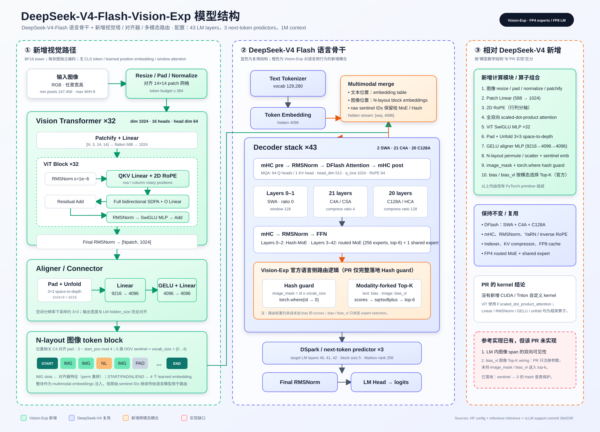

# DeepSeek-V4-Flash-Vision-Exp 模型结构、ViT、Token Block 与 MoE 技术分析

本文基于以下三类资料交叉分析：

- [Vision-Exp `config.json`](https://huggingface.co/deepseek-ai/DeepSeek-V4-Flash-Vision-Exp/blob/main/config.json)
- [DeepSeek 官方参考推理代码](https://huggingface.co/deepseek-ai/DeepSeek-V4-Flash-Vision-Exp/tree/main/inference)
- [vLLM Vision 支持提交 `30e526f`](https://github.com/tacos8me/vllm/commit/30e526f4992cfaa63e3f71f9bdac3e53628701ad)
- [Qwen2-VL Transformers 文档](https://huggingface.co/docs/transformers/model_doc/qwen2_vl)
- [Qwen2.5-VL 官方模型说明](https://huggingface.co/Qwen/Qwen2.5-VL-7B-Instruct)
- [Qwen3-VL Transformers 文档](https://huggingface.co/docs/transformers/model_doc/qwen3_vl)

> 用户消息中没有出现独立 PR URL。这里将公开 issue #54561 所链接的单提交实现 `30e526f` 视作所指 PR/预 PR 分支。如果目标不是该提交，需要用实际 PR URL 重新核对差异。



## 文档导读

本文回答五个核心问题：

1. Vision-Exp 在 DeepSeek-V4-Flash 上增加了哪些结构？
2. DeepSeek ViT 从图像到 `[N, 1024]` 特征的 forward 如何执行？
3. 它与 Qwen2-VL、Qwen2.5-VL、Qwen3-VL 的 ViT 有何差异？
4. Aligner 输出为何还要转换成特殊的 N-layout token block？
5. 图像 token 进入语言模型后，Hash-MoE 和普通 MoE 如何路由？

## 结论

Vision-Exp 不是重新设计语言模型，而是在 DeepSeek-V4-Flash 上增加一个原生 ViT 和 aligner，并让图像 token 深度参与原有语言主干的 MoE 路由。语言侧的 DFlash attention、mHC、稀疏 indexer、KV compressor 和 FP4 MoE 没有换代。

相对文本版 DeepSeek-V4-Flash，真正新增的模型计算路径是：

`image → resize/pad/normalize → 14×14 patchify → 32-layer ViT → 3×3 space-to-depth → GELU aligner → N-layout image block → LM embedding stream`

此外，官方参考模型新增两处语言侧耦合：图像位置使用 `bias_vl` 选择 MoE experts；OOV 图像 sentinel 在 Hash-MoE 的 `tid2eid` 查表前用 `torch.where` 映射为合法 token id。需要注意：公开 vLLM 提交 `30e526f` 完整落地了后者，却只创建/加载了 `bias_vl` 参数，没有将 `image_mask` 和 `bias_vl` 接入 Top-K，因此模态化 expert selection 在该提交中尚未真正生效。该实现也没有新增 CUDA/Triton kernel。

## 1. 配置解读

### 1.1 语言骨干

| 项目 | Vision-Exp | 结构含义 |
|---|---:|---|
| `hidden_size` | 4096 | LM residual / embedding 宽度 |
| `num_hidden_layers` | 43 | 43 个主干 decoder layer |
| `num_hash_layers` | 3 | layers 0–2 使用 Hash-MoE |
| `n_routed_experts` | 256 | routed experts 总数 |
| `num_experts_per_tok` | 6 | 每 token 激活 6 个 routed experts |
| `n_shared_experts` | 1 | 每层 1 个 shared expert |
| `moe_intermediate_size` | 2048 | 单 expert 中间宽度 |
| `num_attention_heads` | 64 | Q heads |
| `num_key_value_heads` | 1 | MQA：共享单 KV head |
| `head_dim` | 512 | 每 head 总维度 |
| `qk_rope_head_dim` | 64 | 其中 RoPE 维度 |
| `q_lora_rank` / `o_lora_rank` | 1024 / 1024 | Q/O 低秩路径 |
| `max_position_embeddings` | 1,048,576 | 1M context |

`compress_ratios` 一共有 46 项：前 43 项对应主干层，后 3 项对应 next-token predictor。主干分布为：

- layers 0–1：`ratio=0`，SWA-only；
- 21 层：`ratio=4`，C4A / CSA；
- 20 层：`ratio=128`，C128A / HCA；
- predictor 3 层：`ratio=0`。

注意 Hash-MoE 与 attention 类型是两个正交维度。前三层的 FFN 是 Hash-MoE，但 layer 2 的 attention 已经是 C4A。

### 1.2 新增视觉模块

| 项目 | 值 | 结构含义 |
|---|---:|---|
| `vision_n_layers` | 32 | ViT blocks |
| `vision_dim` | 1024 | patch embedding / ViT hidden width |
| `vision_n_heads` | 16 | head dim = 64 |
| `vision_inter_dim` | 2816 | ViT SwiGLU 中间宽度 |
| `vision_patch_size` | 14 | 14×14 RGB patch |
| `vision_downsample_ratio` | 3 | aligner 的 3×3 space-to-depth |
| `vision_max_n_token` | 384 | 每图最大 LM token budget |
| `vision_min_pixels` | 147,456 | 小图放大阈值 |
| `vision_max_wh_ratio` | 8 | 最大宽高比 |

视觉塔没有 CLS token、learned positional embedding 或 window attention。它对单张图的所有 patch 做全双向 attention，并通过 2D RoPE 编码 patch 的行列坐标。

### 1.3 DSpark / predictor 差异

文本版 `DeepSeek-V4-Flash` 的公开配置是 `num_nextn_predict_layers=1`；Vision-Exp 为 3，并新增 `dspark_block_size=5`、`dspark_target_layer_ids=[40,41,42]`、`dspark_markov_rank=256` 等字段。这是 Vision-Exp 检查点的另一处结构差异，但它不是视觉编码算子本身。

## 2. 图像如何进入语言模型

1. 图像转 RGB，按 token budget 求解目标尺寸，执行 resize 或 pad，并归一化到 BF16。
2. 图像拆成 `[Npatch, 3, 14, 14]`，展平为 588 维后线性映射到 1024。
3. 经过 32 个 pre-norm ViT block：`RMSNorm → QKV → 2D RoPE → full SDPA → O proj → residual → RMSNorm → SwiGLU MLP → residual`。
4. Aligner 将 ViT feature map pad 到 3 的倍数，通过 `unfold(kernel=3,stride=3)` 做 space-to-depth，把 9 个相邻 patch 拼成 9216 维；再做 `Linear(9216,4096) → GELU → Linear(4096,4096)`。
5. 对齐器输出按 N-layout 重排，插入一个由五类 sentinel 构成的 token block：`IMAGE_START / IMAGE_PAD / IMAGE / IMAGE_NEW_LINE / IMAGE_END`。
6. `IMAGE` 位置使用视觉 features；其余四类位置使用 learned embeddings。整块替换对应图像 placeholder 的文本 embedding。

特殊点是 sentinel id 等于 `vocab_size + {0..4}`，也就是超出普通词表。它们不访问 embedding table，却必须继续传入语言模型，因为 MoE routing 和参考 attention visibility 会读取这些原始 id。

## 3. DeepSeek ViT 的完整 Forward 流程

### 3.1 符号与输入 Shape

设预处理后的图像宽高都能被 patch size 14 整除：

```text
H = 14 × n_h
W = 14 × n_w
N = n_h × n_w
```

图像被拆成：

```text
[3, H, W]
→ [n_h, n_w, 3, 14, 14]
→ [N, 3, 14, 14]
```

其中 `N` 是进入 ViT 的 patch token 数量。

### 3.2 Patch Embedding

每个 RGB patch 的元素数是：

```text
3 × 14 × 14 = 588
```

DeepSeek 没有直接使用 `Conv2d`，而是先 patchify，再使用带 bias 的 Linear：

```text
[N, 3, 14, 14]
→ flatten
→ [N, 588]
→ Linear(588, 1024)
→ [N, 1024]
```

数学上，它与 `kernel_size=stride=14` 的非重叠二维卷积非常接近，但输入已经由预处理器显式切成 patch。

### 3.3 二维 RoPE 表

Vision hidden size 为 1024，head 数为 16，因此：

```text
head_dim = 1024 / 16 = 64
```

每个 patch 有 `(row, column)` 二维坐标。DeepSeek 为行、列各生成 16 个频率：

```text
row frequencies:    16
column frequencies: 16
合计:                32
```

最终：

```text
cos: [N, 1, 32]
sin: [N, 1, 32]
```

中间的 `1` 会广播到 16 个 attention heads。RoPE 只作用于 Q/K，不作用于 V。

### 3.4 单个 Vision Block

32 个 block 都是 pre-norm 结构：

```text
x
├─ RMSNorm
├─ QKV Linear
├─ 2D RoPE(Q, K)
├─ Full Bidirectional SDPA
├─ O Linear
└─ Residual Add

x
├─ RMSNorm
├─ SwiGLU MLP
└─ Residual Add
```

#### RMSNorm

Vision RMSNorm 的 epsilon 固定为 `1e-6`，不是语言模型配置中的 `1e-20`：

$$
\operatorname{RMSNorm}(x)
=w\odot\frac{x}{\sqrt{\operatorname{mean}(x^2)+10^{-6}}}
$$

归一化在 FP32 中计算，再转换回输入 dtype。

#### QKV 投影

```text
[N, 1024]
→ Linear(1024, 3072)
→ q, k, v 各 [N, 1024]
→ reshape
→ q, k, v 各 [N, 16, 64]
```

#### 2D RoPE

每个 head 的 64 维被分成两个 32 维分量：

```text
q1, q2: [N, 16, 32]
```

旋转为：

$$
q'=[q_1\cos-q_2\sin,\ q_2\cos+q_1\sin]
$$

K 执行相同操作，V 保持不变。

#### 全局双向 Attention

```text
[N, 16, 64]
→ transpose
→ [16, N, 64]
```

Attention score 形状是 `[16, N, N]`。没有 causal mask，也没有 window mask，因此一张图中的任意 patch 都能看到该图的全部 patch。不同图片不会互相 attention；官方参考实现和公开 PR 都是一张图片一次调用 ViT。

#### SwiGLU MLP

```text
[N, 1024]
→ Linear(1024, 5632)
→ split gate/up，各 [N, 2816]
→ SiLU(gate) × up
→ Linear(2816, 1024)
→ [N, 1024]
```

其中 `5632 = 2 × 2816`。

### 3.5 32 层之后

```text
[N, 1024]
→ Final Vision RMSNorm
→ [N, 1024]
```

DeepSeek 只使用最后一层 ViT 特征，没有 Qwen3-VL 式的多层 DeepStack 输出。

### 3.6 Aligner / Connector

Aligner 首先恢复二维 feature map：

```text
[N, 1024]
→ [n_h, n_w, 1024]
→ [1024, n_h, n_w]
```

随后将右侧和底部 pad 到 3 的倍数，并执行：

```text
F.unfold(kernel_size=3, stride=3)
```

每个输出位置拼接 3×3 共 9 个相邻 ViT features：

```text
9 × 1024 = 9216
```

令：

$$
M=\left\lceil\frac{n_h}{3}\right\rceil
  \left\lceil\frac{n_w}{3}\right\rceil
$$

则 shape 流程为：

```text
[N, 1024]
→ Pad + Unfold
→ [M, 9216]
→ Linear(9216, 4096)
→ GELU
→ Linear(4096, 4096)
→ [M, 4096]
```

视觉 token 数约缩减到 ViT patch 数的 `1/9`，输出宽度与语言模型 hidden size 4096 完全对齐。

## 4. 与 Qwen 系列 ViT 的差异

这里的 Qwen 系列特指 Qwen2-VL、Qwen2.5-VL 和 Qwen3-VL。三个版本之间也存在明显差异，不能笼统视为同一个 ViT。

### 4.1 总览

| 维度 | DeepSeek-V4 Vision | Qwen2-VL | Qwen2.5-VL | Qwen3-VL |
|---|---|---|---|---|
| 输入 | 单图 | 图像+视频 | 图像+视频 | 图像+视频 |
| Patch embedding | 14×14 展平 + Linear | 3D Conv | 3D Conv | 3D Conv |
| 时间 patch | 无 | 有 | 有 | 有 |
| Norm | RMSNorm | LayerNorm | RMSNorm | LayerNorm |
| Vision FFN | SwiGLU | QuickGELU MLP | SwiGLU | SiLU MLP，非门控 |
| Attention | 每层全局双向 | 每帧全局 | 大部分 window，少数 full | 全局 |
| Vision 位置 | 纯 2D RoPE | 2D RoPE | 2D RoPE + 动态时间处理 | learned absolute + 2D RoPE |
| Patch merge | 3×3，约压缩 9 倍 | 2×2，约压缩 4 倍 | 2×2 | 2×2 |
| 多层特征 | 无 | 无 | 无 | DeepStack |
| LLM 空间/时间位置 | 普通 1D LM position + N-layout | MRoPE | 增强 MRoPE | Interleaved-MRoPE |
| 与 LLM 耦合 | sentinel、Hash-MoE、`bias_vl`、图像可见性 | 主要是 embedding 替换 | 主要是 embedding 替换 | embedding + DeepStack 多层注入 |

### 4.2 Patch Embedding：2D Linear 与 3D Conv

DeepSeek：

```text
[N, 3, 14, 14]
→ flatten 588
→ Linear(588, 1024)
```

Qwen2/2.5/3-VL：

```text
Conv3d(
  kernel=(temporal_patch_size, 14, 14),
  stride=(temporal_patch_size, 14, 14)
)
```

因此 Qwen 从 patch embedding 开始就统一处理图像和视频；DeepSeek 当前 ViT 只定义二维图像路径。

### 4.3 Attention：全局与窗口化

- DeepSeek：所有 32 层都对单张图的全部 patch 做全局双向 attention。
- Qwen2-VL：通过 `cu_seqlens` 把多图/多帧打包，每个图或帧内部做全局 attention。
- Qwen2.5-VL：大多数 block 使用 window attention，`fullatt_block_indexes` 指定少数全局层，因而更适合高分辨率和长视频。
- Qwen3-VL：重新使用全局 vision attention，同时通过 DeepStack 提取多层特征。

DeepSeek 的全局 attention 复杂度随 patch 数近似为 `O(N²)`；它通过每图最多约 384 个 LM token 和 3×3 aligner 压缩控制后续成本。Qwen2.5 则更侧重从 attention 本身降低高分辨率开销。

### 4.4 Norm 与 FFN

DeepSeek 和 Qwen2.5-VL 都采用：

```text
RMSNorm + SwiGLU
```

Qwen2-VL 使用：

```text
LayerNorm + Linear → QuickGELU → Linear
```

Qwen3-VL 使用：

```text
LayerNorm + Linear → SiLU → Linear
```

所以仅从 ViT block 的局部结构看，DeepSeek 与 Qwen2.5-VL 最接近。

### 4.5 Connector：3×3 与 2×2

DeepSeek 将 9 个相邻 patch features 拼接：

```text
9 × 1024 = 9216
→ 4096 → GELU → 4096
```

Qwen 通常将 2×2 共 4 个 features 拼接：

```text
4 × vision_dim
→ merger MLP
→ LLM hidden size
```

DeepSeek 压缩更激进，LLM 视觉序列更短；Qwen 保留更多空间细节，但消耗更多 LLM token。

### 4.6 LLM 中的位置表达

Qwen 系列会把图像/视频网格的时间、高度、宽度继续编码到 LLM 的 MRoPE position IDs 中。Qwen3-VL 还增加 learned vision position embedding 和 DeepStack。

DeepSeek 没有使用 Qwen 式的 LLM T/H/W MRoPE。它依赖：

1. ViT 内的 2D RoPE；
2. 特殊 N-layout 保留局部二维邻接；
3. `IMAGE_NEW_LINE` 表示行边界；
4. 官方参考实现中的图像 span 双向可见性。

### 4.7 与语言模型的耦合程度

Qwen 的主路径可以近似理解为“视觉 embedding 替换 image placeholder”。DeepSeek 更深耦合：原始 OOV sentinel IDs 继续进入语言模型，并影响 Hash-MoE、普通 MoE 的视觉 bias、C4 对齐以及 attention visibility。因此 DeepSeek Vision 不是纯 embedding splice。

## 5. Token Block 与 N-layout

### 5.1 五类 Sentinel

| 类型 | Token ID | Embedding 来源 | 含义 |
|---|---:|---|---|
| `IMAGE_START` | `vocab_size+0` | learned | 图像开始 |
| `IMAGE_PAD` | `vocab_size+1` | learned | 空间/C4 对齐 |
| `IMAGE` | `vocab_size+2` | Aligner feature | 真正视觉内容 |
| `IMAGE_NEW_LINE` | `vocab_size+3` | learned | 图像行结束 |
| `IMAGE_END` | `vocab_size+4` | learned | 图像结束 |

所有真实视觉位置的原始 ID 都是同一个 `IMAGE` sentinel，但各位置的 `[4096]` embedding 来自不同图像区域。

### 5.2 N-layout 是什么

假设 Aligner 输出一个 `2×3` 网格：

```text
A  B  C
D  E  F
```

普通 row-major 是：

```text
A, B, C, D, E, F
```

N-layout 按两行成组、逐列交织：

```text
A, D, B, E, C, F
```

扫描轨迹近似：

```text
A ↓ D ↗ B ↓ E ↗ C ↓ F
```

其核心目的不是帮助已经结束的 ViT，而是让后续 C4 compressor 的连续 4-token 分组尽量对应一个二维局部块：

```text
[A, D, B, E]

对应：
A B
D E
```

若使用 row-major，连续四个 token 更容易全部来自同一水平行。

### 5.3 行结束与奇数行 Padding

每个逻辑图像行末尾追加 `IMAGE_NEW_LINE`。如果行数为奇数，则补一整行 `IMAGE_PAD`，保证可以两行一组交织。

例如：

```text
A B C D NL
E F G H NL
I J K L NL
P P P P P
```

序列化后：

```text
A E B F C G D H NL NL
I P J P K P L P NL P
```

### 5.4 `perm` 如何重排 Features

Aligner 默认输出 row-major：

```text
[A, B, C, D, E, F]
```

N-layout 所需顺序为：

```text
[A, D, B, E, C, F]
```

因此构造：

```text
perm = [0, 3, 1, 4, 2, 5]
```

然后：

```python
embeds = aligner_output[perm]
block[types == IMAGE] = embeds
```

`perm` 只是索引重排，没有可学习参数。

### 5.5 为什么要做位置相关的 C4 对齐

前导 padding 为：

```python
compress_pad = 3 - start_pos % 4
```

目标是让第一个真实图像网格 token 落在全局位置的 4-token 边界。

例如图像前已有 10 个 token：

```text
position 10: IMAGE_PAD
position 11: IMAGE_START
position 12: A
```

`12 % 4 == 0`，因此 C4 可以从 `[A,D,B,E]` 这样的局部块开始，不会把前一段文本或 `IMAGE_START` 混入同一个压缩组。

末尾也会在必要时追加 2 个 PAD，使图像主体长度成为 4 的倍数。

### 5.6 最终 Token Block

完整结构为：

```text
[position-dependent leading PAD]
IMAGE_START
[N-layout IMAGE / NEW_LINE / PAD body]
[optional tail PAD]
IMAGE_END
```

Embedding 路径和 raw ID 路径同时保留：

```text
Embedding：IMAGE 位置使用视觉 features，其余结构 token 使用 learned vectors
Raw IDs：五类 OOV sentinel 继续进入语言模型，用于 image mask、MoE 和可见性
```

## 6. MoE 与 Hash-MoE 处理

### 6.1 普通 MoE

每层有 256 个 routed experts，每个 token 选择 6 个，另有 1 个 shared expert 始终执行。

对 token hidden state `h∈R^4096`：

$$
z=W_{gate}h\in\mathbb{R}^{256}
$$

Vision-Exp 使用：

$$
s=\sqrt{\operatorname{softplus}(z)}
$$

文本和图像共享同一份 `W_gate`，但选择专家时使用不同 bias：

$$
\hat{s}_{t,e}=
\begin{cases}
s_{t,e}+bias^{vl}_e,&t\text{ 是图像 token}\\
s_{t,e}+bias^{text}_e,&t\text{ 是文本 token}
\end{cases}
$$

然后：

```text
expert_ids = TopK(selection_scores, 6)
```

最终 routing weights 从未加 bias 的原始 `s` 中 gather、归一化并乘 `routed_scaling_factor=1.5`。所以 `bias/bias_vl` 只改变“选谁”，不直接改变“选中后占多大权重”。

### 6.2 Hash-MoE

Layers 0–2 的文本 token 不通过动态 Top-K 选 expert IDs，而是查固定表：

```text
tid2eid: [vocab_size, 6]

token_id
→ tid2eid[token_id]
→ 6 个固定 expert IDs
```

例如：

```text
tid2eid[“苹果”的 token id]
= [7, 19, 42, 88, 130, 201]
```

“苹果”在不同上下文中仍选择同一组专家，但六个专家的混合权重可以随当前 hidden state 改变。换言之：

```text
expert 集合：token ID 决定
expert 权重：上下文 hidden state 决定
```

### 6.3 图像 Token 为什么不能直接 Hash

有两个原因：

1. `tid2eid` 只有 `vocab_size` 行，而图像 sentinel 是 `vocab_size+0..4`，直接查表越界。
2. 所有真实图像 patch 都使用同一个 `IMAGE` ID；若按 ID 固定路由，天空、文字、人脸、汽车等完全不同的视觉区域都会选择同一组专家。

因此官方实现让前三层按模态分叉：

```text
文本 token
→ tid2eid[token_id]

图像 token
→ TopK(scores + bias_vl, 6)
```

即文本保留确定性 Hash 路由，图像改走内容相关的动态路由。

### 6.4 Branch-free Hash Guard

先生成：

```python
image_mask = input_ids >= vocab_size
safe_ids = torch.where(image_mask, 0, input_ids)
hash_indices = tid2eid[safe_ids]
```

图像位置临时查 `tid2eid[0]`，随后用动态视觉 Top-K 覆盖：

```python
vl_indices = (scores + bias_vl).topk(6).indices
indices = torch.where(
    image_mask.unsqueeze(-1),
    vl_indices,
    hash_indices,
)
```

这样避免 `if image_mask.any()` 和 `nonzero()` 产生数据相关分支或动态 shape，更适合 `torch.compile` 与 CUDA Graph。

### 6.5 43 层中的完整路由分布

```text
Layers 0–2：
  文本 → Hash table
  图像 → dynamic TopK(scores + bias_vl)

Layers 3–42：
  文本 → dynamic TopK(scores + bias)
  图像 → dynamic TopK(scores + bias_vl)

所有层：
  6 个 routed experts 加权求和
  + 1 个 shared expert
```

### 6.6 不要和 Attention Indexer 混淆

模型中有两种容易被称为“路由”的机制：

| 机制 | 选择对象 | 输出 |
|---|---|---|
| DFlash Indexer | 从历史上下文选择 KV token | 最多 `index_topk=512` 个位置 |
| MoE Router | 从 FFN experts 中选计算分支 | 256 中选择 6 个 experts |

本文的 `Hash-MoE`、`bias_vl` 都属于第二种，与 sparse attention 的 Indexer 无关。

### 6.7 N-layout 与 MoE 如何串联

```text
ViT + Aligner
→ 二维视觉 feature 网格
→ N-layout token block
→ 进入 43 层语言模型
→ Attention 更新每个图像 token 的 hidden state
→ MoE 根据 raw sentinel mask 和 hidden state 选择 experts
```

N-layout 回答“图像 token 在序列中如何排列”；MoE 回答“排好后的每个 token 交给哪些 FFN experts”。

## 7. 相对 DeepSeek-V4 的新增算子

### 7.1 模型数学结构新增

| 新增项 | 具体算子 | 是否已有通用 primitive |
|---|---|---|
| 图像预处理 | resize、pad、normalize、reshape/permute | 是 |
| Patch embedding | flatten + dense Linear `588→1024` | 是 |
| 视觉位置编码 | 2D RoPE，分别用行/列坐标旋转 Q/K | RoPE primitive 类似，但 2D 组织方式新增 |
| 视觉 attention | 全双向 scaled-dot-product attention | 是；与 LM 的稀疏 DFlash 不同 |
| 视觉 FFN | `Linear → split → SiLU(gate)×up → Linear` | 是，SwiGLU |
| 空间下采样 | pad + `unfold(3,stride=3)` / space-to-depth | 是 |
| Aligner | `Linear 9216→4096 → GELU → Linear 4096→4096` | 是；GELU 是该连接器的新激活 |
| 图像 block | N-layout permute/scatter + 4 类 learned sentinel embedding | 是 |
| Hash-MoE 保护 | `image_mask` + `torch.where(sentinel→0)` | 是；控制/索引语义新增 |
| 模态路由 | text 用 `bias`，image 用 `bias_vl`，再做 top-k | 官方模型新增；公开 PR 只注册参数，尚未接通 Top-K |

`bias_vl` 只改变 expert 的选择次序；最终 routing weights 仍从未加 bias 的原始 scores 计算。因此它不是第二套 router，也没有新增一条 router GEMM。

### 7.2 PR 实现层新增

提交 `30e526f` 新增的主要运行时路径为：

- `vision.py`：ViT、2D RoPE、SDPA、SwiGLU、aligner；
- `mm_preprocess.py`：resize solver、patchify、token 数公式、N-layout 和 position-dependent C4 padding；
- `vision_model.py`：多模态 wrapper、视觉 embedding 编码与注入；
- NVIDIA `model.py`：`bias_vl` 参数、image mask、hash lookup guard；
- registry / input validation：注册多模态架构，并允许 `vocab_size+0..4` sentinel ids。

但从该提交的实际数据流看，`image_mask` 只用于把 OOV sentinel 映射为 0 后再进入 `tid2eid`；随后调用 fused/MegaMoE Top-K 时并未传入 `bias_vl`，非 Hash 层也仍使用原有 `e_score_correction_bias`。因此提交说明中宣称的 modality-forked expert selection 与代码并不一致。这应作为独立正确性缺口，而不是已完成能力。

该提交没有添加 `.cu`、Triton kernel 或新的 `torch.ops`。视觉塔使用 `F.scaled_dot_product_attention`，其余部分由常规 PyTorch op 组成。换言之，“新增算子”是新的算子组合与语义路径，不是新的底层自定义 kernel ABI。

## 8. 不应误判为新增的 V4 算子

以下模块属于 DeepSeek-V4 本身，Vision-Exp 直接复用：

- mHC（manifold-constrained Hyper-Connections）；
- DFlash 混合 attention：SWA、C4A/CSA、C128A/HCA；
- sparse indexer、top-k sparse indices；
- C4/C128 token-level KV compressor、inverse RoPE、FP8 KV cache；
- FP4 routed MoE、shared expert、sqrtsoftplus/noaux routing；
- YaRN 1M-context RoPE。

## 9. PR 的已知正确性缺口

DeepSeek 参考实现通过 `get_image_visible` 让 `[IMAGE_START, IMAGE_END]` 内的图像 tokens 在每个 LM layer 中双向可见。公开 vLLM 提交仍使用 causal attention，尚未实现这一语义。

补齐它不是简单去掉 causal mask：需要为 prefill 扩宽 sparse-index matrix（SWA 128 再加最多 384 个图像 token）、携带逐 token 的左右可见边界和 image mask，并调整稀疏索引构建 kernel。因而图中将其标为“参考实现已有、PR 未实现”，不能把它算成该 PR 已落地的新算子。

另一处缺口是 `bias_vl`：官方 `Gate.forward` 对普通 MoE 使用 `scores + where(image_mask, bias_vl, bias)` 选择 Top-K；对 Hash-MoE 则让文本 token 继续查 `tid2eid`，图像 token 改走 `(scores + bias_vl).topk()`。提交 `30e526f` 没有实现这两条 Top-K 分支。

## 10. 部署/集成注意点

- 检查点的 `architectures` 仍写 `DeepseekV4ForCausalLM`，与文本模型相同；提交采用单独的 `DeepseekV4VForConditionalGeneration`，因此需要 `--hf-overrides` 选择架构，尚非开箱即用的最终方案。
- 图像 block 前导 pad 为 `3 - start_pos % 4`，同一图片在 prompt 不同位置会产生不同长度，常规 per-item multimodal cache 不安全；提交强制走整段 prompt 的 uncached processor。
- Vision tower 和 aligner 权重为 BF16；语言非 expert 权重仍按 FP8 配置，routed experts 为 FP4。

## 11. 常见理解误区

### 误区一：N-layout 是 ViT 内部的 attention layout

不是。ViT 已按普通二维 patch grid 完成全局 attention；N-layout 发生在 Aligner 之后，作用于送入语言模型的 token 顺序。

### 误区二：所有图像 token 都是同一个 embedding

它们的 raw ID 都是 `vocab_size+2`，但 `IMAGE` 位置的 embedding 分别来自不同 Aligner features，因此内容不同。

### 误区三：Hash-MoE 完全不看上下文

Hash 表固定 expert IDs，但最终 weights 仍从当前 hidden-state router scores 中取得，因此权重可以随上下文改变。

### 误区四：`bias_vl` 是第二个视觉 Router

不是。文本和图像共享同一个 `W_gate`；`bias_vl` 只是 Top-K 前的视觉专家选择偏置，没有第二次 Router GEMM。

### 误区五：公开 PR 已完整支持官方视觉 MoE 路由

不是。提交 `30e526f` 已创建 `bias_vl` 并实现 Hash OOB guard，但没有把 `bias_vl/image_mask` 接入 fused Top-K。该缺口必须与官方参考模型设计分开描述。

## 12. 总结

DeepSeek-V4-Flash-Vision-Exp 的设计重点不是堆叠一个更复杂的 ViT，而是用紧凑的视觉路径与 V4 语言骨干深度耦合：

1. 32 层 `RMSNorm + global 2D-RoPE attention + SwiGLU` ViT 提取单图特征；
2. 3×3 Aligner 将 9 个 patch 合并为一个 4096 维 LM token，显著缩短序列；
3. N-layout 以两行交织方式排列视觉 token，使 C4 分组尽量覆盖二维局部区域；
4. 五类 OOV sentinel 同时承载图像结构、模态标识和 C4 对齐信息；
5. 前三层让文本使用 Hash-MoE、图像使用视觉动态 Top-K；后续层通过 `bias/bias_vl` 区分文本与视觉专家倾向；
6. 相比 Qwen，DeepSeek 更强调短视觉序列、N-layout 与 V4 MoE/压缩 attention 的协同；Qwen 更强调统一图像视频编码、MRoPE、高视觉 token 容量和 Qwen3 的 DeepStack。

从工程实现看，公开 vLLM 提交已覆盖 ViT、Aligner、预处理、token block 和 Hash 越界保护，但仍缺少官方图像 span 双向可见性以及 `bias_vl` Top-K wiring。评估或合入该实现时，这两项应作为核心正确性检查点。
