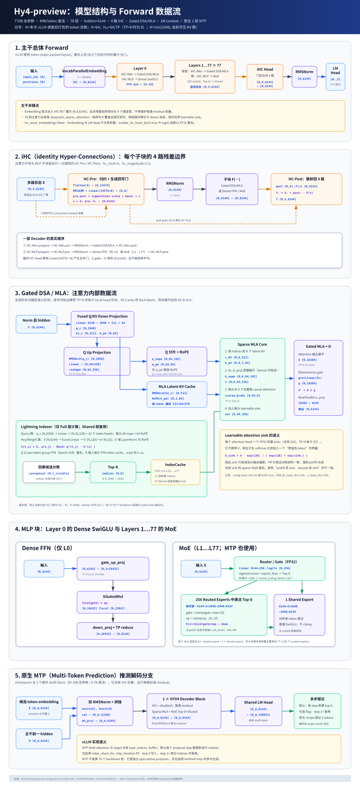

# Hy4-preview 模型结构与 forward 分析



## 1. 结论概览

Hy4-preview 是一个 decoder-only、稀疏激活的 MoE causal LM。主干共有 78 层、hidden size 为 6144。第 0 层使用 dense SwiGLU FFN，之后 77 层使用 256 routed experts + 1 shared expert 的 MoE；每个 token 选择 8 个 routed experts，同时始终经过 shared expert。官方给出的主干规模为 770B 总参数、49B/token 激活，另有 1 个原生 MTP 层，约 10B 总参数、0.7B 激活。

它不是简单的“MLA + MoE”。单层还叠加了四个关键结构：

1. 4 路 iHC 残差流；
2. DSA lightning indexer 与 top-2048 token selection；
3. 跨层 IndexCache；
4. elementwise gated MLA 与每头 learnable attention sink。

下文使用 `N` 表示 vLLM 一次 forward 中打包后的 token 总数。训练语义常写成 `[B,S,D]`，vLLM 推理实现通常把前两维折叠为 `[N,D]`。

## 2. 顶层 forward

主干数据流是：

```text
input_ids [N]
  → VocabParallelEmbedding
  → hidden [N,6144]
  → 78 × DecoderLayer
  → iHC Head: [N,4,6144] → [N,6144]
  → RMSNorm
  → LM Head
  → logits [N_s,120832]
```

`N_s` 是真正送去计算 logits 的采样行数；decode 时通常对应当前活跃 request，prefill 时可由 vLLM 的 logits 选择策略缩减。Embedding 与 LM Head 不共享权重，因为 `tie_word_embeddings=false`。LM Head 权重保持模型 dtype，但 `enable_lm_head_fp32=true` 让 logits 投影以 FP32 累加。

第 0 个 decoder layer 的 MLP 是 dense FFN，层 1 到 77 的 MLP 是 MoE。所有 78 层的 attention type 都是 `deepseek_sparse_attention`。

## 3. iHC：四路残差不是四倍 hidden 的普通 Transformer

`hc_mult=4`。Embedding 初始输出 `[N,6144]` 在第一次进入 iHC 时广播为 `[N,4,6144]`。每个 attention 子块和 MLP 子块分别有一套 HC-Pre/HC-Post。

设输入为 `X ∈ R[N,4,6144]`。

### HC-Pre

1. 展平通道：`X_flat: [N,24576]`；
2. 对 `X_flat` 计算 RMS 比例；
3. `Linear(24576, 8)` 生成 4 个 pre logits 和 4 个 post logits；
4. 两组 logits 经可学习 scale/base 和 sigmoid 得到门值；
5. pre 门对四路状态做加权归约：

```text
x = Σ_i pre_i · X_i          # [N,6144]
post = 2.0 · sigmoid(...)    # [N,4]
```

### HC-Post

子块 `F` 接收单路的 `[N,6144]`，输出仍是 `[N,6144]`。随后把输出按 post gate 散射回四个残差通道：

```text
Y_i = X_i + post_i · F(x)    # Y: [N,4,6144]
```

因此 iHC 的本质是“多路长期残差记忆 + 每个子块前的动态读取 + 子块后的动态写回”。最终 `HYV4HCHeadLayer` 再根据四路联合状态生成 4 个合并门，将 `[N,4,6144]` 归并成 `[N,6144]`；不是固定求和或平均。

## 4. Gated DSA / MLA 注意力块

### 4.1 Q 与 latent KV 压缩

RMSNorm 后输入 `X: [N,6144]`。vLLM 把 `q_a_proj` 与 `kv_a_proj_with_mqa` 合并成一次 GEMM：

```text
X [N,6144]
  → fused_qkv_a_proj
  → q_c  [N,2048]
  → kv_c [N,512]
  → k_pe [N,64]
```

Query 路径：

```text
q_c [N,2048]
  → RMSNorm
  → q_b_proj
  → q [N,64,256]
  = q_nope [N,64,192] + q_pe [N,64,64]
```

只对 `q_pe` 和 `k_pe` 的 64 维施加 RoPE。配置中的 `head_dim=64` 是 Transformers 配置为 RoPE slice 设置的值，不是完整 QK head dimension；完整的 `qk_head_dim=192+64=256`，而 `v_head_dim=256`。

KV Cache 保存的是每 token 的 `[kv_c(512), k_pe(64)]`，即 576 个元素，而不是保存展开后的 64 头 `K[64,256]` 与 `V[64,256]`。`kv_b_proj` 在逻辑上从 512 维 latent 恢复每头的 `k_nope[192]` 和 `v[256]`；优化 kernel 可以把该投影吸收到 attention 计算里。

按官方推荐的 TP=8：每卡有 8 个 query heads，局部 query 为 `[N,8,256]`，局部 attention 输出展平后是 `[N,2048]`。latent KV 是 MQA 风格、跨 query heads 共享。

### 4.2 Lightning Indexer

只有 IndexCache 的 Full 层真正构建 indexer。Indexer 的 query 来自 `q_c`：

```text
q_c [N,2048] → [N,32,128]
```

每个 index head 的 128 维由 64 维 nope 与 64 维 RoPE 组成。Key 与每头权重来自 attention 输入 `X` 的 fused projection：

```text
X [N,6144] → k^I [N,128] + w^I [N,32]
```

其打分公式沿用 DSA：

```text
I(t,s) = Σ_j w(t,j) · ReLU(q^I(t,j) · k^I(s))
```

对每个 query token，从所有因果可见的历史位置里选 top-`K`，其中 `K=min(2048,L_visible)`，生成 `topk_indices [N,K]`。主注意力只读取这些位置的 latent KV，所以核心 attention 从 `O(L²)` 降为 `O(LK)`。Indexer 自身仍是轻量的 `O(L²)`；vLLM 里 Q 使用 block size 128 的 per-token group FP8，K 写入独立的 FP8 index cache。

### 4.3 IndexCache 的精确层模式

Hy4 checkpoint 的 `indexer_types` 不是简单从第 0 层开始每四层一个 Full，而是：

```text
Full layers = {0, 1, 5, 9, 13, ..., 77}
```

共 21 个 Full 层，剩余 57 个 Shared 层复用最近的前序 Full 层写入的 `topk_indices_buffer`。也就是 backbone 中 73.1% 的层跳过 indexer forward，但它们仍执行自己的 sparse MLA core attention。

### 4.4 Sparse MLA、attention sink 与 elementwise gate

对选中的 K 个位置，逻辑上的数据形状为：

```text
selected latent: c_KV [N,K,512], k_pe [N,K,1,64]
expanded:        k_nope [N,K,64,192], v [N,K,64,256]
scores/probs:    [N,64,K]
attention out:   [N,64,256] → flatten [N,16384]
```

每个 head 还有一个 FP32 learnable sink 标量。sink 不携带 value，等价于在 softmax 分母中放入一个 value 为 0 的伪 token。PR 中的 FlashMLA sparse kernel 实际应用：

```text
A_sink = A · exp(LSE) / (exp(LSE) + exp(sink_h))
```

因此 sink 只会调节每个 head 输出的有效幅度。PR 特别强制 prefill 也走支持 sink 的 sparse MQA 路径，否则 dense prefill backend 会忽略 sink，造成 prefill/decode 数值语义不一致。

最后是 elementwise gated MLA：

```text
gate = sigmoid(linear_gate(X))   # [N,64×256]
A' = A ⊙ gate                    # [N,16384]
out = o_proj(A')                 # [N,6144]
```

这不是 headwise gate；配置明确为 `gating_type="elementwise"`，所以每个 head 的每个 value channel 都有独立门值。

## 5. Dense FFN

只出现在 Layer 0：

```text
[N,6144]
  → gate_up_proj
  → [N,2×18432]
  → SiLU(gate) × up
  → [N,18432]
  → down_proj
  → [N,6144]
```

TP=8 时，column-parallel 的 gate/up 局部输出为 `[N,4608]`，SiluAndMul 后为 `[N,2304]`；down projection 后做 TP reduce，恢复全局 `[N,6144]`。

## 6. MoE

Layer 1…77 都使用 MoE。Router 是 `Linear(6144,256)`，参数和输出 logits 都是 FP32。vLLM 的 fused MoE 配置为 sigmoid scoring、Top-8、top-k 概率归一化，再乘 `routed_scaling_factor=2.827`，同时使用可学习 `expert_bias` 纠正专家选择。

每个 routed expert 是 intermediate size 2048 的 SwiGLU：

```text
6144 → (gate 2048, up 2048)
gate = clamp(gate, max=10)
up   = clamp(up, -10, 10)
SiLU(gate) × up → 2048 → down_proj → 6144
```

对 N 个 token 路由后，各专家收到 `[M_e,6144]`，且 `Σ_e M_e = 8N`。Top-8 routed outputs 按 router 权重聚合。

另有 1 个 shared expert，结构同样是 `6144 → 2×2048 → 2048 → 6144`，但它对所有 token 激活，不使用 routed expert 的 SwiGLU clamp。shared expert 输出与 routed aggregate 相加。

模型总参数之所以达到 770B，主要来自 77 层 × 256 个 routed experts；每 token 只激活其中 8 个，再加 shared expert、attention 和 iHC，因此激活参数约 49B。

## 7. MTP 推测解码

Hy4 checkpoint 含 1 个 native MTP draft block。输入是候选 token embedding 与 target backbone 的 previous hidden state：

```text
embedding E [N_d,6144] → RMSNorm
previous H  [N_d,6144] → RMSNorm
cat(E,H) [N_d,12288]
  → eh_proj [N_d,6144]
  → 1 × HYV4DecoderLayer（iHC disabled，普通 residual）
  → final RMSNorm
  → shared LM head
  → draft logits [N_d,120832]
```

MTP block 使用 sparse MLA 与 MoE，但 checkpoint 没有 MTP 的 iHC pre/post 参数，因此 vLLM 显式关闭 iHC。它不是 backbone 的第 79 层，而是 speculative proposer。官方 vLLM recipe 设置 `num_speculative_tokens=3`：MTP 连续提出候选 token，再由 target model 验证。

MTP attention 与 target model 共享 `topk_indices_buffer`，但“共享 buffer”不等于默认跨 proposal step 复用 indices。按 PR 的 proposer 逻辑，默认每个 draft step 都运行 indexer；仅当 draft config 显式启用 `index_share_for_mtp_iteration=true` 时，第 0 个 draft step 计算并写入 indices，后续 draft steps 才跳过 indexer并复用该 buffer。Hy4 发布的 `config.json` 没有设置这个可选字段。

## 8. 推理实现中最值得注意的点

- 推荐 TP=8，但结构图同时给出了全局 shape；换 TP 时只有 head/column-parallel 的局部维度变化。
- `num_key_value_heads=8` 是配置兼容字段；Hy4 主 attention 的关键存储形态是 MLA latent MQA，不能按普通 GQA KV cache 来理解。
- Shared IndexCache 层没有 indexer module，对应 checkpoint 的 indexer 权重会被 vLLM 跳过加载。
- Learnable sink 是模型结构的一部分，不是可有可无的 serving 优化；不支持 sink 的 backend 会改变模型数值语义。
- vLLM 将 `q_a_proj + kv_a_proj_with_mqa`、`wk + weights_proj`、`gate_proj + up_proj` 分别做 packed/fused projection，减少 kernel launch 和读带宽。

## 参考资料

- [Hugging Face 模型卡](https://huggingface.co/tencent/Hy4-preview)
- [Hy4-preview config.json](https://huggingface.co/tencent/Hy4-preview/raw/main/config.json)
- [vLLM PR #54160](https://github.com/vllm-project/vllm/pull/54160)
- [PR 中的 Hy4 model.py（精确提交）](https://github.com/vllm-project/vllm/blob/184421eaca3e9d2e536317611c17f3bd455cab41/vllm/models/hy_v4/nvidia/model.py)
- [PR 中的 Hy4 attention.py（精确提交）](https://github.com/vllm-project/vllm/blob/184421eaca3e9d2e536317611c17f3bd455cab41/vllm/models/hy_v4/nvidia/attention.py)
- [PR 中的 Hy4 hc.py（精确提交）](https://github.com/vllm-project/vllm/blob/184421eaca3e9d2e536317611c17f3bd455cab41/vllm/models/hy_v4/nvidia/hc.py)
- [PR 中的 Hy4 moe.py（精确提交）](https://github.com/vllm-project/vllm/blob/184421eaca3e9d2e536317611c17f3bd455cab41/vllm/models/hy_v4/nvidia/moe.py)
- [PR 中的 Hy4 mtp.py（精确提交）](https://github.com/vllm-project/vllm/blob/184421eaca3e9d2e536317611c17f3bd455cab41/vllm/models/hy_v4/nvidia/mtp.py)
- [DeepSeek-V3.2 DSA 论文](https://arxiv.org/abs/2512.02556)
- [IndexCache 论文](https://arxiv.org/abs/2603.12201)
