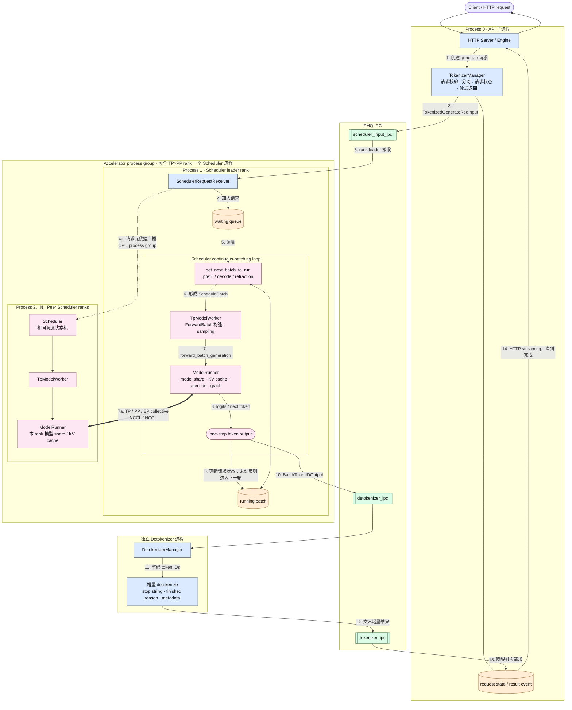
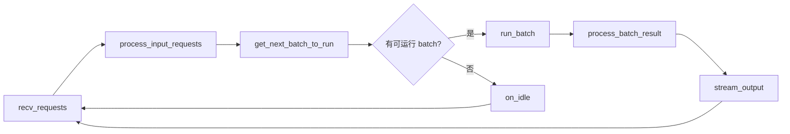
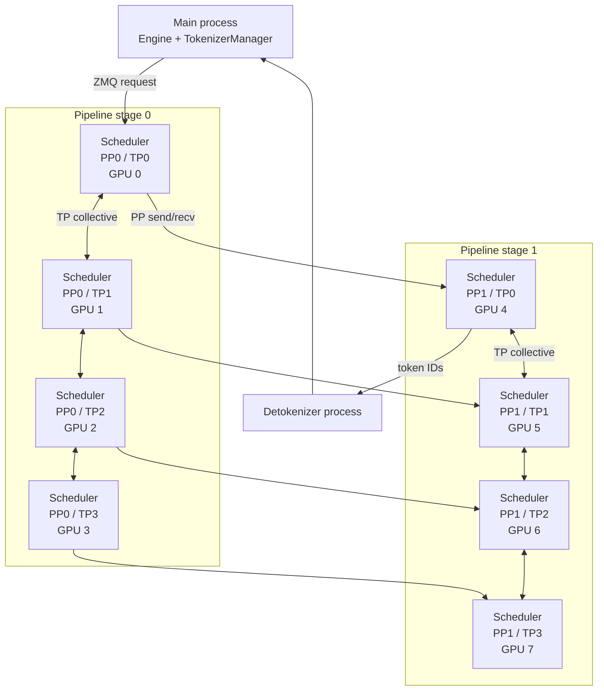
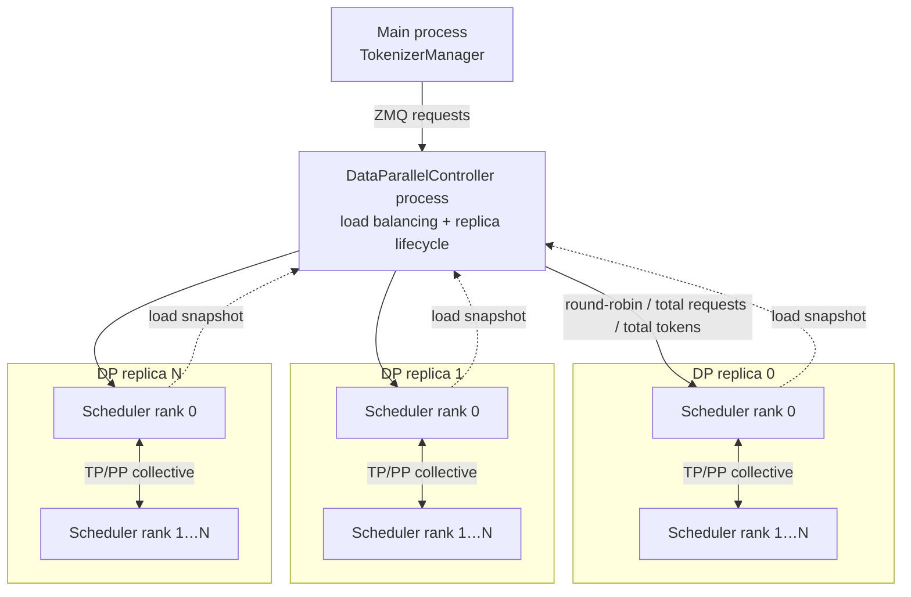
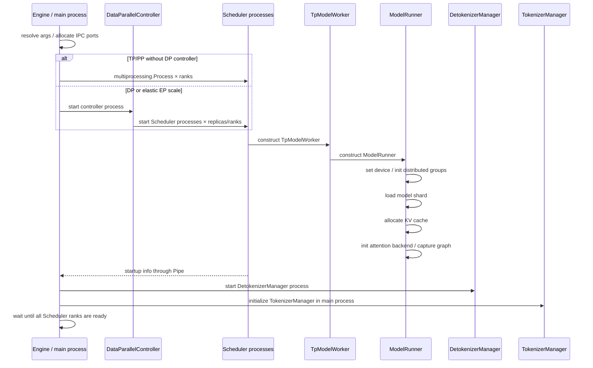

# SGLang 主体架构与多进程协作流程

本文基于 SGLang 当前代码结构，梳理标准 Python Server 模式下的主体组件、进程边界、请求执行链，以及 TP、PP、DP 场景中的进程协作方式。

> 结论先行：SGLang 没有独立命名为 `EngineCore` 或 `MultiExecutor` 的核心类。它以 **Scheduler 进程**作为主要运行单元，并在每个 Scheduler 进程内组合 `TpModelWorker` 和 `ModelRunner`。主进程负责协议处理和分词，独立的 Detokenizer 进程负责增量反分词；跨进程控制消息主要通过 ZMQ，模型并行计算通过 NCCL/HCCL 等设备通信完成。

## 1. 核心概念

| 层级 | SGLang 组件 | 主要职责 | 与 vLLM 的近似关系 |
|---|---|---|---|
| 服务入口 | `Engine`、HTTP Server | 参数解析、端口分配、拉起和监控子进程、暴露 API | `LLMEngine` 外围服务层 |
| 请求前端 | `TokenizerManager` | 分词、请求状态、异步结果匹配、流式响应 | Input processor + client/request manager |
| DP 控制面 | `DataParallelController` | 在多个 DP replica 之间做请求路由和负载均衡 | DP executor/controller |
| 推理核心 | `Scheduler` | continuous batching、请求队列、KV cache 调度、prefill/decode、抢占和输出组织 | `EngineCore` 的调度部分 |
| Rank 执行层 | `TpModelWorker` | 将调度批次转换为执行批次、调用模型、采样、管理 target/draft runner | `Worker` |
| 模型执行层 | `ModelRunner` | 模型 shard、KV pool、attention backend、graph、forward stream | `ModelRunner` |
| 输出后端 | `DetokenizerManager` | 增量反分词、stop string 处理、生成文本片段 | Output processor |

对象包含关系不是独立进程关系：

```text
Scheduler OS process
└── Scheduler
    └── TpModelWorker
        └── ModelRunner
            ├── model shard
            ├── KV cache / allocator
            ├── attention backend
            ├── CUDA/NPU graph runner
            └── sampler / logits processor
```

## 2. 标准请求的多进程协作主图

下面以标准 Python Server、单个 tokenizer worker、单个 detokenizer worker 为主路径。TP/PP 扩展时，加速器侧会出现多个同构 Scheduler 进程。



### 图中需要特别注意的边界

1. `Engine`、HTTP Server 和 `TokenizerManager` 默认在主进程内，不持有模型权重。
2. `Scheduler`、`TpModelWorker`、`ModelRunner` 是同一 OS 进程里的不同对象，不通过 ZMQ 相互调用。
3. 每个 TP/PP rank 对应一个 Scheduler 进程；每个进程持有本 rank 的模型 shard 和 KV cache。
4. 对外入口 rank 从 ZMQ 接收 tokenized request，再把请求元数据广播到并行组的其他 rank。
5. rank 间的模型张量使用 NCCL、HCCL 或相应设备 collective 通信，而不是 ZMQ。
6. 只有需要对外输出的 leader 路径把 token IDs 发送给 Detokenizer，避免每个 rank 重复输出。

## 3. Scheduler 的单步循环

Scheduler 是最接近 vLLM `EngineCore` 的组件。它的普通循环可以抽象为：



启用 overlap schedule 时，调度线程会在设备执行上一批次的同时准备下一批次，并使用结果队列延后处理上一批结果；核心状态机仍然是“接收请求 → 选批 → 执行 → 更新请求”。

## 4. TP / PP 进程拓扑

未启用 DP Controller 时，`Engine._launch_scheduler_processes()` 按 TP、PP rank 创建进程：

```text
Scheduler process 数量（全局）≈ tp_size × pp_size
```

例如 `--tp-size 4 --pp-size 2` 的逻辑结构：



### TP rank 如何获得一致请求

入口 rank 执行以下流程：

1. 从 `scheduler_input_ipc` 非阻塞读取请求。
2. 使用 CPU process group 的 `broadcast_pyobj` 将请求列表发给其他 TP/CP ranks。
3. 所有 Scheduler rank 执行相同的请求状态更新和 batch 决策。
4. ModelRunner forward 阶段使用设备 collective 组合各模型 shard 的计算结果。

PP 场景还会在相邻 pipeline stage 之间传递请求元数据和中间激活。

## 5. DP + TP / PP 拓扑

当 `dp_size > 1`，或者弹性 EP scale 模式要求控制器时，Engine 先创建 `DataParallelController`，不再直接把来自 TokenizerManager 的普通请求交给单一 Scheduler 组。



`DataParallelController` 的职责是：

- 拉起各 DP replica 的 Scheduler 进程组；
- 保存活跃 replica 和 ZMQ worker socket；
- 按 round-robin、total requests、total tokens 等策略选择 replica；
- 转发控制请求；
- 读取各 Scheduler leader 发布的 load snapshot；
- 支持部分弹性 EP 扩缩容流程。

它本身不加载模型，也不执行 forward。

## 6. 进程之间传递什么

| 通道 | 发送方 → 接收方 | 主要内容 |
|---|---|---|
| ZMQ scheduler input | TokenizerManager → Scheduler leader，或 → DataParallelController | tokenized request、abort、权重更新、profiling 等控制消息 |
| CPU process group | Scheduler leader → peer Scheduler ranks | Python 请求对象和调度元数据广播 |
| NCCL/HCCL | ModelRunner rank ↔ ModelRunner rank | TP/PP/EP 模型张量、激活和 collective |
| ZMQ detokenizer input | Scheduler output leader → DetokenizerManager | `BatchTokenIDOutput`、embedding output、控制消息 |
| ZMQ tokenizer input | DetokenizerManager → TokenizerManager | 增量文本、finish reason、logprob 和请求 metadata |
| multiprocessing Pipe | Scheduler 子进程 → Engine 启动端 | 启动完成信息、进程 PID、模型能力和内存信息 |
| shared memory | 部分多模态、load snapshot、快速广播路径 | 大对象或低开销状态共享 |

## 7. 启动时序



## 8. 重要实现变体

本文主图描述标准 Python Server 路径。实际部署还存在以下变体：

- **多 tokenizer/detokenizer worker**：增加 `MultiTokenizerRouter`、TokenizerWorker 和 DetokenizerRouter，输入输出按 HTTP worker IPC 路由。
- **Rust Server 模式**：Rust server 替代 Python API Server、TokenizerManager 和 DetokenizerManager，Scheduler 内部仍承担核心调度与模型执行。
- **Ray 模式**：Scheduler 使用 Ray Actor 启动，不再直接使用本机 `multiprocessing.Process`，但 Scheduler → TpModelWorker → ModelRunner 的对象层级不变。
- **PD disaggregation**：prefill 和 decode Scheduler 分属不同实例，通过 transfer engine 传输 KV cache；单实例内部的 Scheduler/Worker/Runner 结构仍然成立。
- **Speculative decoding**：TpModelWorker 外可能包裹 target/draft worker，或维护多个 ModelRunner；它们通常仍位于对应 Scheduler 进程内。
- **多模态 encoder**：可能增加独立 encoder worker/process，不改变语言模型 Scheduler 进程组的主链。

## 9. 核心源码索引

| 内容 | 代码位置 |
|---|---|
| Engine 及子进程启动 | `python/sglang/srt/entrypoints/engine.py` |
| HTTP Server 启动入口 | `python/sglang/srt/entrypoints/http_server.py` |
| TokenizerManager | `python/sglang/srt/managers/tokenizer_manager.py` |
| DetokenizerManager | `python/sglang/srt/managers/detokenizer_manager.py` |
| DataParallelController | `python/sglang/srt/managers/data_parallel_controller.py` |
| Scheduler 及事件循环 | `python/sglang/srt/managers/scheduler.py` |
| Scheduler 请求广播 | `python/sglang/srt/managers/scheduler_components/request_receiver.py` |
| Scheduler ZMQ 通道 | `python/sglang/srt/managers/scheduler_components/ipc_channels.py` |
| TpModelWorker | `python/sglang/srt/managers/tp_worker.py` |
| ModelRunner | `python/sglang/srt/model_executor/model_runner.py` |
| 并行通信组 | `python/sglang/srt/distributed/parallel_state.py` |
| 跨进程 IO 数据结构 | `python/sglang/srt/managers/io_struct.py` |

## 10. 总结

SGLang 的主体结构可以概括为：

```text
Engine / TokenizerManager
        │  ZMQ
        ▼
[DataParallelController]
        │  ZMQ 路由
        ▼
Scheduler process group
        └── Scheduler
            └── TpModelWorker
                └── ModelRunner
                    └── model shard + KV cache + graph
        │
        │  ZMQ token IDs
        ▼
DetokenizerManager
        │
        └── TokenizerManager → HTTP stream
```

从 vLLM 视角看，SGLang 没有把 `EngineCore → Executor → Worker` 做成完全对应的命名层级，而是将这些职责折叠进以 Scheduler 进程为中心的结构：

- `Scheduler` 承担 engine core 的请求和 batch 状态机；
- `TpModelWorker` 承担 rank 级 worker/executor 适配；
- `ModelRunner` 承担模型 shard 的实际执行；
- 多进程扩展由 Engine 或 DataParallelController 创建多个 Scheduler 进程完成。
