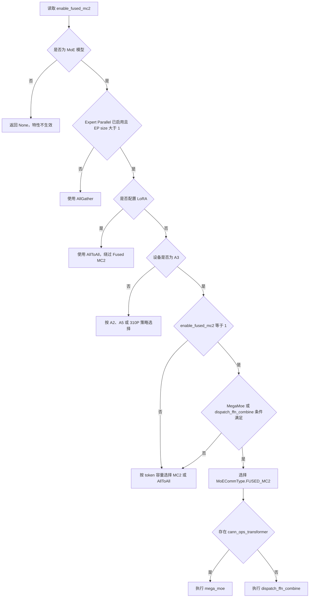

# vLLM-Ascend `enable_fused_mc2` 技术说明

> 分析基线：vLLM-Ascend commit `aa48bd687`（2026-08-12）。
>
> 本文基于当前仓库静态代码分析，重点说明 `VLLM_ASCEND_ENABLE_FUSED_MC2` / `additional_config.enable_fused_mc2` 的配置入口、运行时选择、算子实现、适用范围、限制和验证方法。随着 CANN 自定义算子及 vLLM-Ascend 演进，实际部署前应结合目标版本重新核对。

## 1. 核心结论

`enable_fused_mc2` 是面向 Ascend A3、MoE 模型和 Expert Parallel（EP）的通信-计算融合开关。它尝试把原本分离执行的 token dispatch、专家 FFN 和 token combine 替换为一个融合算子：

- 安装了 `cann_ops_transformer` 时使用 `mega_moe`；
- 未安装时使用 vLLM-Ascend 自定义算子 `dispatch_ffn_combine`。

普通 MoE MC2 路径大致为：

```text
TopK 路由
  -> token dispatch 通信
  -> GMM1
  -> 激活/量化
  -> GMM2
  -> token combine 通信
  -> 输出
```

Fused MC2 路径为：

```text
TopK 路由
  -> mega_moe / dispatch_ffn_combine
       |- dispatch
       |- 专家 FFN
       |- combine
       `- 通信计算重叠
  -> 输出
```

预期收益来自减少算子启动次数、中间张量和通信等待，并增强专家计算与通信的重叠。它不优化 Dense 模型，也不是普通 TP AllReduce 的开关。

需要特别注意：

1. 配置为 `1` 只是允许运行时选择 Fused MC2，不代表融合算子一定生效。
2. 当前代码只允许 `0` 和 `1`，旧发布说明中出现过的 mode 2 已不适用于当前版本。
3. 当前通信选择器只有在 A3 路径中会返回 `MoECommType.FUSED_MC2`。
4. Fused MC2 对权重布局、EP size、量化格式和 token 容量有强约束，必须做精度与性能 A/B 验证。

## 2. 配置入口与优先级

旧环境变量定义在 `vllm_ascend/envs.py`：

```python
"VLLM_ASCEND_ENABLE_FUSED_MC2": lambda: int(
    os.getenv("VLLM_ASCEND_ENABLE_FUSED_MC2", "0")
)
```

当前推荐使用 `additional_config`：

```bash
vllm serve MODEL \
  --enable-expert-parallel \
  --additional-config '{"enable_fused_mc2":1}'
```

旧环境变量仍可用：

```bash
export VLLM_ASCEND_ENABLE_FUSED_MC2=1
vllm serve MODEL --enable-expert-parallel
```

配置优先级为：

```text
additional_config.enable_fused_mc2
    >
VLLM_ASCEND_ENABLE_FUSED_MC2
    >
默认值 0
```

初始化逻辑位于 `vllm_ascend/ascend_config.py`：

```python
self.enable_fused_mc2 = self._get_config_value(
    additional_config,
    "enable_fused_mc2",
    "VLLM_ASCEND_ENABLE_FUSED_MC2",
    ascend_envs.VLLM_ASCEND_ENABLE_FUSED_MC2,
)
assert self.enable_fused_mc2 in (0, 1)
```

当前值语义：

| 值 | 含义 |
|---:|---|
| `0` | 禁止选择 Fused MC2，运行时使用 MC2、AllToAll 或 AllGather |
| `1` | 允许 A3 MoE EP 路径选择 Fused MC2 |
| `2` | 当前版本会触发断言失败 |

JSON 中的 `true` 在 Python 中等价于整数 `1`，当前实现通常可以接受，但为了明确配置语义，建议使用整数 `0/1`。

## 3. 完整运行时流程



### 3.1 通信实现注册

MoE 初始化时，`vllm_ascend/ops/fused_moe/moe_comm_method.py` 会在 `ep_size > 1` 时注册四种通信实现：

```python
ALLTOALL -> AlltoAllCommImpl
ALLGATHER -> AllGatherCommImpl
MC2 -> MC2CommImpl
FUSED_MC2 -> FusedMC2CommImpl
```

如果 EP size 为 1，只注册 AllGather。

### 3.2 每次 forward 动态选择

`vllm_ascend/ascend_forward_context.py::set_ascend_forward_context()` 在 forward 开始时调用 `select_moe_comm_method()`，把结果写入：

```python
forward_context.moe_comm_type
forward_context.moe_comm_method
```

之后每层 Routed Experts 从 forward context 获取对应实现。因此通信方式不是仅在进程启动时静态绑定，而是由当前硬件、并行配置和 token 数共同决定。

### 3.3 各硬件平台策略

| 平台 | 当前选择策略 |
|---|---|
| A3 | `enable_fused_mc2=1` 时尝试优先选择 Fused MC2 |
| A2 | 根据专家数、EP world size 和 token capacity 选择 MC2 或 AllGather |
| A5 | 根据 token capacity、world size 和 TopK 选择 MC2、AllGather 或 AllToAll |
| 310P | 固定使用 AllGather |

因此，当前版本在 A2、A5 或 310P 上设置该开关不会进入 `MoECommType.FUSED_MC2`，但配置层没有给出明显的“开关无效”提示。

## 4. A3 上的选择条件

A3 选择器的核心逻辑位于 `vllm_ascend/ascend_forward_context.py::_select_a3_moe_comm_method()`：

```python
if enable_fused_mc2 == 1:
    mega_moe_enable = (
        ep_world_size <= 64
        and _cann_megamoe_supported_by_config(vllm_config)
    )
    dispatch_ffn_combine_enable = ep_world_size <= 32
    if (_MEGA_MOE_SUPPORTED and mega_moe_enable) \
            or dispatch_ffn_combine_enable:
        return MoECommType.FUSED_MC2

if num_tokens <= mc2_tokens_capacity:
    return MoECommType.MC2
return MoECommType.ALLTOALL
```

真正选中 Fused MC2 至少需要：

1. 模型是 MoE；
2. 启用 `--enable-expert-parallel`；
3. EP group size 大于 1；
4. 没有被 LoRA 路径强制回退；
5. 设备为 A3；
6. `enable_fused_mc2 == 1`；
7. MegaMoe 或 `dispatch_ffn_combine` 的 EP 限制满足。

### 4.1 EP size 限制

| 融合算子 | 当前 EP size 上限 |
|---|---:|
| `mega_moe` | 64 |
| `dispatch_ffn_combine` | 32 |

超过限制后，运行时根据 token capacity 回退到普通 MC2 或 AllToAll。

### 4.2 MegaMoe 模型配置限制

`_cann_megamoe_supported_by_config()` 当前检查：

- `hidden_size` 必须在 `[1024, 8192]`；
- `hidden_size` 必须是 512 的整数倍；
- 显式识别 W8A8、W4A8 及对应 dynamic 变体；
- 未声明量化类型时允许继续，供非量化路径判断。

这些限制来自 CANN MegaMoe kernel 的 Cube tile 和权重接口约束。

## 5. Fused MC2 的实际算子路径

### 5.1 普通 MC2

普通 `MoECommMethod.fused_experts()` 实际仍由三个阶段构成：

```python
token_dispatch_output = token_dispatcher.token_dispatch(...)
mlp_output = _apply_mlp(...)
routed_out = token_dispatcher.token_combine(...)
```

MC2 在 dispatch/combine 中使用 NPU MoE 分发通信算子，但专家 FFN 仍是独立执行阶段。

### 5.2 CANN MegaMoe

当 Python 环境中存在 `cann_ops_transformer` 时：

```python
_MEGA_MOE_SUPPORTED = (
    importlib.util.find_spec("cann_ops_transformer") is not None
)
```

`FusedMC2CommImpl` 动态加载：

```python
from cann_ops_transformer.ops import (
    get_symm_buffer_for_mega_moe,
    mega_moe,
)
```

第一次执行时会为整个 EP group 协同分配 symmetric buffer。所有 rank 必须使用完全相同的 shape 参数，尤其是 `num_max_tokens_per_rank`，否则可能发生 HCCL 通信异常或远端错误。

随后一次调用 `mega_moe()` 完成路由、分发、专家计算和合并：

```python
out, expert_tokens = mega_moe(
    hidden_states,
    topk_ids,
    topk_weights,
    weight1,
    weight2,
    symmetric_buffer,
    ...,
)
```

### 5.3 `dispatch_ffn_combine`

没有安装 `cann_ops_transformer` 时调用项目自定义算子：

```python
torch.ops._C_ascend.dispatch_ffn_combine(
    x=hidden_states,
    weight1=w1,
    weight2=w2,
    expert_idx=topk_ids,
    probs=topk_weights,
    group=hccl_group,
    max_output_size=mega_moe_max_tokens,
    x_active_mask=mc2_mask,
    ...,
)
```

该算子同样把 token dispatch、两层专家 FFN 和 combine 合并为一次调用。

## 6. 权重预处理与 NZ 格式

当前 Fused MC2 算子要求专家权重使用 `FRACTAL_NZ` 布局。

非量化 Routed Experts 开启 Fused MC2 后会无条件执行：

```python
torch_npu.npu_format_cast(weight, ACL_FORMAT_FRACTAL_NZ)
```

因此：

```text
enable_fused_mc2=1
    -> 专家权重强制转换为 NZ
```

这条路径优先于一般的 `weight_nz_mode` 策略。即使 `weight_nz_mode=0`，融合算子需要的专家权重仍可能被强制转换成 NZ。

### 6.1 W8A8

W8A8 Dynamic MoE 会：

1. 转置并连续化 `w13_weight` 和 `w2_weight`；
2. 转成 FRACTAL_NZ；
3. 把浮点 scale 转换为融合算子所需的 INT64 scale；
4. MegaMoe/EPLB 场景下拆成 per-expert tensor list；
5. 保存 fused scale list 供专家迁移或融合算子使用。

### 6.2 W4A8

W4A8 MegaMoe 要求：

- 每个 INT8 byte 打包两个 INT4；
- 每个专家单独一个 FRACTAL_NZ tensor；
- weight scale 为符合算子接口的一维 per-expert tensor；
- 不能使用普通路径中“多个 INT4 打包成 INT32”的布局。

因此 W4A8 开关切换会影响权重后处理形式，而不只是改变 forward 中调用的算子名。

## 7. Token 对齐、mask 与容量

MoE 通信要求不同 rank 的通信 shape 一致。forward context 会：

1. 取得 DP ranks 中最大的 token 数；
2. 按 TP size 向上对齐；
3. 从预留 buffer 中构造 `mc2_mask`；
4. 将真实 token 标记为 `True`，padding token 标记为 `False`；
5. 把 mask 传给融合算子作为 active-token mask。

当前基础容量常量：

| 路径 | 每 rank token capacity |
|---|---:|
| MegaMoe | 4096 |
| `dispatch_ffn_combine` | 512 |
| 普通 MC2 | 512 |

`enable_prefill_mc2=true` 时，MC2 capacity 根据 `max_num_batched_tokens` 预留；否则优先根据 ACLGraph capture size 或 decode 请求规模计算。

### 7.1 `mega_moe_max_tokens`

`mega_moe_max_tokens` 控制路由后单 rank 可接收的最大 token 数。当前代码默认值为 `131072`：

```python
self.mega_moe_max_tokens = additional_config.get(
    "mega_moe_max_tokens", 131072
)
```

风险是双向的：

- 设置太小：专家负载倾斜时，超出容量的 token 可能被丢弃或跳过，直接影响精度；
- 设置太大：workspace 显存随容量线性增加，可能造成 OOM 或降低可用并发。

当前 `additional_config.md` 中仍有默认值 `65536` 的描述，与代码的 `131072` 不一致，应以目标版本代码为准。

## 8. 与其他特性的关系

| 特性 | 当前关系 |
|---|---|
| MoE | 必需；Dense 模型不适用 |
| Expert Parallel | 必需；EP size 为 1 时回退 AllGather |
| A3 | 当前真正选择 Fused MC2 的硬件路径 |
| `weight_nz_mode` | Fused MC2 专家权重会被强制转 NZ |
| `multistream_overlap_shared_expert` | 冲突；配置初始化时自动关闭后者 |
| hierarchy communication | 冲突；同时启用会报错 |
| LoRA | 不支持融合算子注入，运行时强制使用 AllToAll |
| ACLGraph | 可以组合，但必须验证 capture 与真实请求 |
| dynamic EPLB | 当前已有权重 list 和 fused scale 适配，部分非量化异常状态仍只打印警告 |
| MTP | 当前选择器未统一禁止，仓库已有 A3 MTP 测试配置启用该开关 |
| MiniMax M3 | 当前显式禁止启用 |

### 8.1 Shared Expert 多流冲突

当两者同时配置时：

```python
if enable_fused_mc2 == 1 and multistream_overlap_shared_expert:
    multistream_overlap_shared_expert = False
```

运行时给出 warning，而不是启动失败。原因是两种优化都要重组 routed/shared expert 的执行和事件同步路径。

### 8.2 Hierarchy communication 冲突

`enable_mc2_hierarchy_comm` 与 Fused MC2 同时开启会直接抛出 `ValueError`，必须二选一。

### 8.3 LoRA

Fused MC2 是单个融合 C++ 算子，当前无法在专家 FFN 中间注入 LoRA，因此 LoRA+EP 强制选择 AllToAll。

此外，MoE LoRA 的一处检查仍直接读取旧环境变量，而主体配置读取 `AscendConfig.enable_fused_mc2`。环境变量与 `additional_config` 不一致时可能出现错误拒绝，部署时不应同时配置相反的值。

## 9. PD、多 DP 与大 token 场景

历史版本曾把 Fused MC2 限定在 PD 分离的 D 节点。当前代码已没有这一统一平台门禁，仓库中的 external/internal DP、prefill/decode 配置也存在启用案例。

但是，多 DP、大 token 的 `kv_producer` 或 `kv_both` 场景仍有明确风险：

1. 不同 DP rank 的 token 数差异较大；
2. 为满足通信 shape 一致性产生大量 padding token；
3. padding token 或真实 token 路由集中到少数专家；
4. 某些 rank 的接收 token 超过专家容量；
5. 造成吞吐下降、通信等待，严重时发生 token 截断并影响精度。

因此 Fused MC2 不应作为所有 PD/DP 配置的无条件默认值，应根据请求长度分布、并发、DP size 和专家负载做 A/B 测试。

## 10. 适用与不适用场景

### 10.1 推荐尝试

- Ascend A3；
- 大型 MoE 模型；
- 已启用 EP；
- W8A8/W4A8 等明确支持的量化模型；
- EP size 不超过 32/64；
- 多卡通信占比较高；
- 专家路由相对均衡；
- 能够完成精度、吞吐和显存对比。

仓库中的典型使用模型包括 Qwen3/3.5 大型 MoE、GLM5/5.2、Kimi K2 系列、部分 DeepSeek W8A8/W4A8 模型及 Qwen3-VL MoE。

### 10.2 不建议直接启用

- Dense 模型；
- A2、A5 或 310P；
- 未启用 Expert Parallel；
- MoE LoRA；
- MiniMax M3；
- 专家负载高度倾斜且未调整容量；
- 多 DP、大 token、padding 比例高但未经验证；
- 只验证服务启动、没有验证首个真实请求和精度的部署。

## 11. 验证方法

### 11.1 A/B 启动

实验组：

```bash
vllm serve MODEL \
  --enable-expert-parallel \
  --additional-config '{"enable_fused_mc2":1}'
```

对照组：

```bash
vllm serve MODEL \
  --enable-expert-parallel \
  --additional-config '{"enable_fused_mc2":0}'
```

两组应保持模型、TP/DP/EP、ACLGraph、batch、prompt 和采样参数完全一致。

### 11.2 确认融合算子真实生效

不能只检查环境变量或服务启动日志。建议同时确认：

1. DEBUG 日志出现类似：

   ```text
   MoE comm method selected: ... method=MoECommType.FUSED_MC2
   ```

2. profiler trace 中出现：

   ```text
   mega_moe
   ```

   或：

   ```text
   dispatch_ffn_combine
   ```

3. trace 不再只是 dispatch、GMM1/GMM2、combine 的普通分离路径。

### 11.3 推荐测试矩阵

| 维度 | 建议取值 |
|---|---|
| 开关 | `0`、`1` |
| 执行模式 | eager、ACLGraph |
| 工作负载 | 短输入 decode、长输入 prefill、混合长度 |
| 并发 | 1、16、32、64 或业务典型值 |
| 并行 | 单 DP、多 DP、不同 EP size |
| 路由 | 普通输入、专家负载偏斜输入 |
| 指标 | 准确率、输出一致性、吞吐、TTFT、TPOT、显存 |

至少需要：

- `/v1/models` 返回成功；
- 一个真实权重文本请求返回非空输出；
- 多请求并发无 hang；
- 与关闭 Fused MC2 的结果满足预期精度阈值；
- profiler 能证明融合算子实际执行。

## 12. 当前代码中的注意点

以下结论来自静态代码审查，建议后续结合 NPU 实机测试确认。

### 12.1 环境变量注释部分过时

`envs.py` 注释仍描述 `dispatch_ffn_combine` 仅支持 W8A8、non-MTP、non-dynamic-EPLB，但当前代码已经增加 MTP 测试配置、dynamic EPLB 权重列表和 W4A8 MegaMoe 适配。判断实际支持范围时应以当前选择器、quant method 和 E2E 配置为准。

### 12.2 MegaMoe 选择与执行存在潜在错位

A3 选择器的逻辑是：

```text
MegaMoe 配置满足且 EP<=64
    或
dispatch_ffn_combine 的 EP<=32
        -> 选择 FUSED_MC2
```

但进入 `FusedMC2CommImpl.fused_experts()` 后，只要安装了 `cann_ops_transformer` 就无条件调用 `mega_moe`，没有再次检查 `_cann_megamoe_supported_by_config()`。

这意味着以下组合存在潜在风险：

- MegaMoe 不支持当前 hidden size 或量化类型；
- EP<=32 使 dispatch fallback 条件成立；
- 环境中又安装了 `cann_ops_transformer`；
- 最终仍进入 MegaMoe，而不是预期的 `dispatch_ffn_combine`。

W4A16 等未进入 MegaMoe quant settings 支持列表的格式尤其应实机验证。

### 12.3 配置来源不完全统一

主体路径读取：

```python
get_ascend_config().enable_fused_mc2
```

但 MoE LoRA 的保护检查仍直接读取：

```python
envs_ascend.VLLM_ASCEND_ENABLE_FUSED_MC2
```

因此迁移期间应避免同时设置互相冲突的环境变量和 `additional_config`。

### 12.4 文档默认值不一致

- 当前代码：`mega_moe_max_tokens=131072`；
- 当前配置文档部分内容：`65536`。

容量调优必须以实际运行版本代码和日志为准。

### 12.5 非 A3 配置缺少显式提示

A2/A5/310P 上设置 `enable_fused_mc2=1` 通常不会选择融合路径，但当前配置校验不会明确告知用户该配置无效。应通过 DEBUG 日志和 profiler 验证，而不能仅根据启动参数判断。

## 13. 建议配置策略

生产部署可采用以下原则：

```text
A3 + MoE + EP + 明确支持的 W8A8/W4A8
    -> 可以开启，并执行完整 A/B 验证

LoRA / MiniMax M3 / hierarchy communication
    -> 关闭

A2 / A5 / 310P / Dense / 未启用 EP
    -> 不配置，避免产生“已启用但未生效”的误判

多 DP、大 token、专家负载倾斜
    -> 先关闭建立基线，再逐级增加容量和并发验证
```

最重要的上线门槛不是“参数成功解析”，而是同时满足：

1. 运行时确实选择 `MoECommType.FUSED_MC2`；
2. profiler 中实际出现 `mega_moe` 或 `dispatch_ffn_combine`；
3. 与关闭状态相比精度符合要求；
4. 目标并发和输入长度下吞吐、TPOT 或显存确有收益；
5. 不出现 expert token overflow、通信 hang 或 HCCL symmetric-buffer 不一致。

## 14. 关键源码索引

| 主题 | 文件 |
|---|---|
| 环境变量定义 | `vllm_ascend/envs.py` |
| 配置迁移、取值校验与冲突处理 | `vllm_ascend/ascend_config.py` |
| 硬件与通信方式选择 | `vllm_ascend/ascend_forward_context.py` |
| 平台冲突校验 | `vllm_ascend/platform.py` |
| MC2/Fused MC2 实现 | `vllm_ascend/ops/fused_moe/moe_comm_method.py` |
| MegaMoe 动态加载与量化参数 | `vllm_ascend/ops/fused_moe/moe_utils.py` |
| 非量化 Routed Experts 权重处理 | `vllm_ascend/ops/fused_moe/routed_experts.py` |
| W8A8 Dynamic MoE 权重处理 | `vllm_ascend/quantization/methods/w8a8_dynamic.py` |
| W4A8 MoE 权重处理 | `vllm_ascend/quantization/methods/w4a8.py` |
| MoE LoRA 限制 | `vllm_ascend/lora/fused_moe.py` |
| 通信选择单元测试 | `tests/ut/test_ascend_forward_context.py` |

