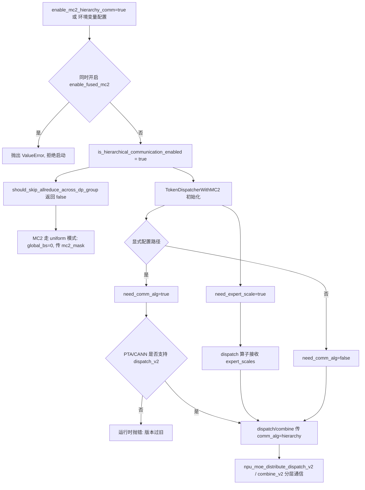

# vLLM-Ascend `enable_mc2_hierarchy_comm` 技术说明

> 分析基线：vLLM-Ascend commit `1475a92c3`（2026-08-07，分支 `rl-e2e`）。
>
> 本文基于当前仓库静态代码分析，重点说明 `additional_config.enable_mc2_hierarchy_comm` 的配置入口、触发路径、算子参数注入、版本约束、与相邻特性的交互、适用范围、限制和验证方法。随着 CANN 算子及 vLLM-Ascend 演进，实际部署前应结合目标版本重新核对。

## 1. 核心结论

`enable_mc2_hierarchy_comm` 是面向 MoE 模型 + Expert Parallel（EP）中 **MC2 通信**的分层（hierarchical）通信开关。它让 MC2 的 token dispatch / combine 算子采用"**节点内走 PCIE、跨节点走 ROCE**"的分层通信拓扑，从而减少跨机通信流量、提升多机场景下 MC2 通信性能。

- 这是传统 A2 方案（`HCCL_INTRA_PCIE_ENABLE=1 && HCCL_INTRA_ROCE_ENABLE=0`）的**显式配置化**，并额外向算子注入 `comm_alg="hierarchy"` 参数；
- 依赖较新的 PTA/CANN（必须支持 `npu_moe_distribute_dispatch_v2`）；
- 与 `enable_fused_mc2` **强互斥**（同时开启直接抛 `ValueError`）；
- 与"跳过跨 DP all-reduce"**不兼容**（分层通信要求各 rank token 数均匀）。

配置文档描述（`docs/source/user_guide/configuration/additional_config.md`）：

> `enable_mc2_hierarchy_comm` | bool | `False` | Enable dispatch/combine op inter-node communication by ROCE.

## 2. 配置入口与判定

配置解析（`vllm_ascend/ascend_config.py:269-270`）：

```python
# Enable dispatch/combine op inter-node communication by ROCE
self.enable_mc2_hierarchy_comm = additional_config.get("enable_mc2_hierarchy_comm", False)
```

配置方式：

```bash
vllm serve MODEL \
  --enable-expert-parallel \
  --additional-config '{"enable_mc2_hierarchy_comm": true}'
```

运行时判定 `is_hierarchical_communication_enabled()`（`vllm_ascend/utils.py:1077-1080`）存在**两条触发路径**：

```python
def is_hierarchical_communication_enabled():
    return (
        os.getenv("HCCL_INTRA_ROCE_ENABLE", "") == "0" and os.getenv("HCCL_INTRA_PCIE_ENABLE", "") == "1"
    ) or get_ascend_config().enable_mc2_hierarchy_comm
```

| 路径 | 方式 | 说明 |
|---|---|---|
| 环境变量（A2 传统方式） | `HCCL_INTRA_PCIE_ENABLE=1` 且 `HCCL_INTRA_ROCE_ENABLE=0` | 仅影响 `need_expert_scale` |
| 显式配置 | `additional_config.enable_mc2_hierarchy_comm=true` | 同时影响 `need_expert_scale` 与 `need_comm_alg` |

> **关键细节**：两条路径在 token dispatcher 中的影响范围不一致。环境变量路径只会让 dispatch 算子额外接收 `expert_scales`；只有显式配置才会额外传入 `comm_alg="hierarchy"`（见第 4 节）。

## 3. 完整运行时流程



## 4. 代码流程详解

### 4.1 Token dispatcher 中的参数注入

`TokenDispatcherWithMC2.__init__`（`vllm_ascend/ops/fused_moe/token_dispatcher.py:128/150`）：

```python
# token_dispatcher.py:128 —— 两条路径都生效
self.need_expert_scale = is_hierarchical_communication_enabled()
# token_dispatcher.py:150 —— 仅显式配置生效
self.need_comm_alg = get_ascend_config().enable_mc2_hierarchy_comm
```

### 4.2 dispatch 阶段注入（`token_dispatcher.py:227-234`）

```python
if self.need_expert_scale or self.a5_need_extra_args:
    stage1_kwargs.update({"expert_scales": topk_weights.to(torch.float32)})
if self.need_comm_alg:
    stage1_kwargs.update({"comm_alg": "hierarchy"})
```

### 4.3 combine 阶段注入（`token_dispatcher.py:337-338`）

```python
if self.need_comm_alg:
    stage3_kwargs.update({"comm_alg": "hierarchy"})
```

### 4.4 版本约束（`token_dispatcher.py:152-155`）

`comm_alg` 参数只有 `npu_moe_distribute_dispatch_v2`（`_v2` 算子）才支持：

```python
if not self.enable_dispatch_v2 and self.need_comm_alg:
    raise RuntimeError(
        "PTA and CANN version is too old to support mc2 hierarchy comm, please upgrade your version."
    )
```

## 5. 与其他逻辑的交互

### 5.1 与 `enable_fused_mc2` 强互斥

`vllm_ascend/platform.py:711-715`：

```python
if ascend_config.enable_mc2_hierarchy_comm and ascend_config.enable_fused_mc2:
    raise ValueError(
        "fused mc2 op cannot be used with hierarchy communication."
        "Please disable VLLM_ASCEND_ENABLE_FUSED_MC2 by setting it to 0."
    )
```

原因：Fused MC2 把 token dispatch、专家 FFN、combine 融合为单个 C++ 算子，无法再注入分层通信参数，必须二选一。

### 5.2 与"跳过跨 DP all-reduce"不兼容

`vllm_ascend/utils.py:1183-1184`：

```python
if is_hierarchical_communication_enabled():
    return False
```

分层通信要求各 rank token 数**均匀**（`global_bs=0`、传 `mc2_mask` 的 uniform 模式，见 `token_dispatcher.py:143-147` 注释），而"跳过跨 DP all-reduce"意味着各 rank token 数可能不同（`global_bs>0`、不传 mask）。二者矛盾，分层通信开启时强制不跳过 DP all-reduce。

### 5.3 与 `enable_prefill_mc2` 可共存

两者语义互补但存在张力：`enable_prefill_mc2` 放大 MC2 容量、帮助 prefill 满足 skip-allreduce 判定；而分层通信又强制不 skip-allreduce。多 DP / PD 场景需实测验证，见 `enable_prefill_mc2.md`。

## 6. 适用与不适用场景

### 6.1 推荐尝试

- 多机部署、跨机通信占比较高的 MoE EP 场景；
- A2 传统 `HCCL_INTRA_PCIE_ENABLE=1 && HCCL_INTRA_ROCE_ENABLE=0` 方案的显式替代；
- 已确认 PTA/CANN 支持 `npu_moe_distribute_dispatch_v2`。

### 6.2 不建议直接启用

- 未启用 Expert Parallel 或未走 MC2 通信路径（开关无意义）；
- 已启用 `enable_fused_mc2`（直接报错）；
- 依赖"跳过跨 DP all-reduce"的多 DP 场景（被强制关闭 skip-allreduce）；
- PTA/CANN 版本过旧（启动即抛 RuntimeError）；
- 单机部署（无跨节点 ROCE 收益）。

## 7. 验证方法

### 7.1 A/B 启动

实验组：

```bash
vllm serve MODEL \
  --enable-expert-parallel \
  --additional-config '{"enable_mc2_hierarchy_comm": true}'
```

对照组：相同参数但不带该配置，或显式 `"enable_mc2_hierarchy_comm": false`。

### 7.2 确认特性真实生效

1. DEBUG 日志确认走了 MC2 通信路径（`method=MoECommType.MC2`）；
2. profiler trace 中 dispatch/combine 算子为 `npu_moe_distribute_dispatch_v2` / `npu_moe_distribute_combine_v2` 且携带 `comm_alg="hierarchy"`；
3. 跨机流量对比：开启后应观察到跨节点 ROCE 流量下降、节点内 PCIE 流量上升。

### 7.3 推荐测试矩阵

| 维度 | 建议取值 |
|---|---|
| 开关 | `false`、`true` |
| 部署拓扑 | 单机多卡、两机、四机 |
| 工作负载 | decode 短输入、prefill 长输入 |
| 并行 | 不同 EP size、不同 TP/DP 组合 |
| 指标 | 吞吐、TPOT、通信算子耗时、跨机流量、精度一致性 |

## 8. 当前代码中的注意点

1. **两条触发路径不对称**：环境变量路径（`HCCL_INTRA_*`）只注入 `expert_scales`，不注入 `comm_alg="hierarchy"`；显式配置才两者都注入。生产环境应明确使用哪种方式，避免误以为二者等价。
2. **与 Fused MC2 硬冲突**：组合配置直接 `ValueError`，不是告警降级；DeepSeek-V3.2 的夜间测试配置显式写 `"enable_mc2_hierarchy_comm": false` 以避免歧义。
3. **强制 uniform token**：开启后 `should_skip_allreduce_across_dp_group` 恒为 False，`global_bs=0`，各 rank token 必须均匀，否则可能精度/通信异常。
4. **版本门槛**：`comm_alg` 依赖 `_v2` dispatch 算子，旧 PTA/CANN 下配置该开关会导致启动失败（而非降级）。

## 9. 建议配置策略

```text
多机 MoE + EP + MC2 路径 + 新版本 CANN/PTA
    -> 可以开启，并执行跨机流量与吞吐 A/B 验证

enable_fused_mc2 已启用
    -> 关闭，二者互斥

依赖 skip-allreduce 的多 DP / PD 场景
    -> 谨慎，分层通信会强制 uniform token

PTA/CANN 版本过旧
    -> 不开启，避免启动失败
```

## 10. 关键源码索引

| 主题 | 文件 |
|---|---|
| 配置解析 | `vllm_ascend/ascend_config.py:269-270` |
| 分层通信判定 `is_hierarchical_communication_enabled` | `vllm_ascend/utils.py:1077-1080` |
| skip-allreduce 强制关闭 | `vllm_ascend/utils.py:1183-1184` |
| 与 fused_mc2 冲突校验 | `vllm_ascend/platform.py:711-715` |
| dispatcher 参数注入 | `vllm_ascend/ops/fused_moe/token_dispatcher.py:128/150/227-234/337-338` |
| 版本约束检查 | `vllm_ascend/ops/fused_moe/token_dispatcher.py:152-155` |
| uniform/global_bs 选择 | `vllm_ascend/ops/fused_moe/token_dispatcher.py:143-147` |
| 单元测试 | `tests/ut/test_platform.py`、`tests/ut/ops/a2/test_token_dispatcher.py` |
| 端到端用例 | `tests/e2e/nightly/single_node/models/configs/DeepSeek-V3.2-W8A8-DCP.yaml` |
