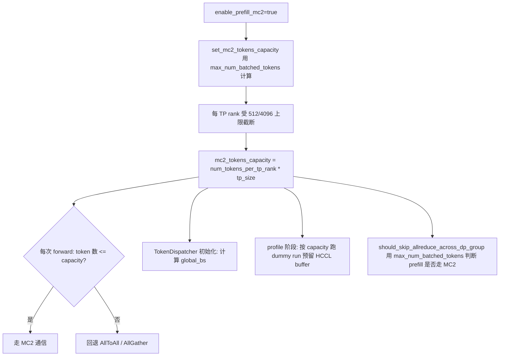

# vLLM-Ascend `enable_prefill_mc2` 技术说明

> 分析基线：vLLM-Ascend commit `1475a92c3`（2026-08-07，分支 `rl-e2e`）。
>
> 本文基于当前仓库静态代码分析，重点说明 `additional_config.enable_prefill_mc2` 的配置入口、容量计算逻辑、运行时流程、容量消费方、与相邻特性的交互、适用范围、限制和验证方法。文档明确标注这是一个**临时开关**：一旦 MC2 算子完善覆盖所有场景，该开关将被移除并默认开启。实际部署前应结合目标版本重新核对。

## 1. 核心结论

`enable_prefill_mc2` 调整 MC2 通信的 **token 容量预留规模**，使 prefill 阶段的大 batch 也能留在 MC2 通信路径上，而不是因 token 数超限回退到 AllToAll / AllGather。

- 默认（关闭）：`mc2_tokens_capacity` 按 **decode 为主**的规模计算（ACLGraph capture size 或 `max_num_reqs × uniform_decode_query_len`）；
- 开启：改用 **`max_num_batched_tokens`** 计算，容量覆盖 prefill 的单批 token 数；
- MC2 每 TP rank 有 512 token 的算子容量上限，capacity 会被该上限截断，因此 `max_num_batched_tokens` 的推荐上限约为 `tp_size × 512`；
- 关闭时 prefill 大 batch 会从 MC2 回退到 AllToAll（A3/A5）或 AllGather（A2），开启后能避免该回退。

配置文档描述（`docs/source/user_guide/configuration/additional_config.md`）：

> `enable_prefill_mc2` | bool | `False` | Whether to reserve mc2_token_capacity for prefill batches. When enabled, `max_num_batched_tokens` is used to calculate the mc2_token_capacity instead of the decode-only capacity. In this scenario, the recommended maximum value of `max_num_batched_tokens` is `tp_size * 512`. This is a temporary switch; once MC2 operators are complete for all scenarios, this switch will be removed and MC2 will be enabled by default.

## 2. 配置入口

配置解析（`vllm_ascend/ascend_config.py:153`）：

```python
self.enable_prefill_mc2 = bool(additional_config.get("enable_prefill_mc2", False))
```

配置方式：

```bash
vllm serve MODEL \
  --enable-expert-parallel \
  --max-num-batched-tokens 4096 \
  --additional-config '{"enable_prefill_mc2": true}'
```

无环境变量别名，默认 `False`。

## 3. MC2 容量常量与上限

`vllm_ascend/ascend_forward_context.py:43-46`：

| 常量 | 每 rank token 上限 |
|---|---:|
| `_MC2_TOKENS_PER_RANK_LIMIT` | 512 |
| `_DISPATCH_FFN_COMBINE_TOKENS_PER_RANK_LIMIT` | 512 |
| `_MEGA_MOE_TOKENS_PER_RANK_LIMIT` | 4096 |

`mc2_tokens_capacity` 是通信选择器的阈值：token 数 ≤ capacity 时选 `MC2`，否则 A3/A5 回退 `ALLTOALL`、A2 回退 `ALLGATHER`。

## 4. 容量计算逻辑

`set_mc2_tokens_capacity`（`vllm_ascend/ascend_forward_context.py:239-263`）：

```python
def set_mc2_tokens_capacity(vllm_config, max_num_reqs, uniform_decode_query_len):
    global _mc2_tokens_capacity
    if _mc2_tokens_capacity is not None:
        return
    if get_ascend_config().enable_prefill_mc2:
        max_num_tokens = vllm_config.scheduler_config.max_num_batched_tokens   # ← 开启后
    elif vllm_config.compilation_config.cudagraph_capture_sizes:
        max_num_tokens = vllm_config.compilation_config.max_cudagraph_capture_size  # ← 默认1
    else:
        max_num_tokens = max_num_reqs * uniform_decode_query_len                  # ← 默认2
    tp_size = vllm_config.parallel_config.tensor_parallel_size

    num_tokens_per_tp_rank = (max_num_tokens + tp_size - 1) // tp_size            # 按 TP 向上取整
    # 每 TP rank 再受算子容量上限约束
    if get_ascend_config().enable_fused_mc2:
        num_tokens_per_tp_rank = min(num_tokens_per_tp_rank,
            _MEGA_MOE_TOKENS_PER_RANK_LIMIT if _MEGA_MOE_SUPPORTED else _DISPATCH_FFN_COMBINE_TOKENS_PER_RANK_LIMIT)
    else:
        num_tokens_per_tp_rank = min(num_tokens_per_tp_rank, _MC2_TOKENS_PER_RANK_LIMIT)
    _mc2_tokens_capacity = num_tokens_per_tp_rank * tp_size
```

容量来源优先级：

| 场景 | `max_num_tokens` 来源 |
|---|---|
| `enable_prefill_mc2=true` | `max_num_batched_tokens` |
| 有 ACLGraph capture sizes（默认） | `max_cudagraph_capture_size`（decode 为主） |
| 无 capture（eager，默认） | `max_num_reqs × uniform_decode_query_len`（decode 为主） |

单次初始化（`_mc2_tokens_capacity is not None` 即返回），在 model runner 初始化时调用：v1 `worker/model_runner_v1.py:473`、v2 `worker/v2/model_runner.py:197`。

## 5. 完整运行时流程



## 6. capacity 的三个消费方

### 6.1 通信方式选择（每次 forward）

`select_moe_comm_method` 的 A3 路径（`ascend_forward_context.py:317-320`）：

```python
if num_tokens is None or num_tokens <= mc2_tokens_capacity:
    return MoECommType.MC2
return MoECommType.ALLTOALL
```

A2 / A5 同理（`ascend_forward_context.py:296-302`、`:334-338`）。`enable_prefill_mc2` 把阈值提高到能覆盖 `max_num_batched_tokens`，prefill 大 batch 不再超限。

典型用例：`tests/e2e/nightly/single_node/models/configs/GLM-5.1-W8A8-PrefillMC2.yaml`（TP16、`max_num_batched_tokens=4096`、普通 MC2 每 rank 上限 512 → capacity = 512×16 = 8192），4096 token 的 prefill 单批能覆盖在 MC2 容量内。

### 6.2 TokenDispatcher 的 `global_bs` 计算

`token_dispatcher.py:132-147`：

```python
tp_size = vllm_config.parallel_config.tensor_parallel_size
mc2_tokens_capacity = get_mc2_tokens_capacity()
num_tokens_per_tp_rank = mc2_tokens_capacity // tp_size
_max_global_bs = num_tokens_per_tp_rank * self.ep_world_size
self.global_bs = _max_global_bs if should_skip_allreduce_across_dp_group(vllm_config) else 0
```

### 6.3 HCCL buffer 预占用的 dummy run

v1 `worker/model_runner_v1.py:3508-3512`、v2 `worker/v2/model_runner.py:265-269`：

```python
mc2_tokens_capacity = get_mc2_tokens_capacity()
if self.max_num_tokens > mc2_tokens_capacity and select_moe_comm_method(
    mc2_tokens_capacity, self.vllm_config
) in {MoECommType.MC2, MoECommType.FUSED_MC2}:
    self._dummy_run(mc2_tokens_capacity, with_prefill=True, is_profile=True)
```

开启 `enable_prefill_mc2` 后 capacity 变大，profile 阶段的 dummy run 按更大容量预留 HCCL buffer，保证 prefill 大 batch 在 MC2 上不缺通信 buffer。

## 7. 与 skip-allreduce 判定的交互

`should_skip_allreduce_across_dp_group`（`vllm_ascend/utils.py:1203-1212`）用 `max_num_batched_tokens` 判断 prefill 是否走 MC2：

```python
def needs_mc2(n: int) -> bool:
    return select_moe_comm_method(n, vllm_config) in {MoECommType.MC2, MoECommType.FUSED_MC2}

decode_must_use_mc2 = needs_mc2(get_potential_max_tokens())
prefill_must_use_mc2 = needs_mc2(scheduler_config.max_num_batched_tokens)
return decode_must_use_mc2 and (
    prefill_must_use_mc2 or get_ascend_config().scheduler_config.recompute_scheduler_enable
)
```

开启 `enable_prefill_mc2` 使 `prefill_must_use_mc2` 更容易命中（`max_num_batched_tokens ≤ capacity`），从而满足跳过 DP all-reduce 的条件——这是它在 PD / 多 DP 场景的连锁收益。

## 8. 与其他特性的关系

| 特性 | 关系 |
|---|---|
| MoE + Expert Parallel | 必需；MC2 是 EP 下的通信路径 |
| `enable_fused_mc2` | 协同；开启后每 rank 上限改用 4096（MegaMoe）或 512（`dispatch_ffn_combine`） |
| `enable_mc2_hierarchy_comm` | 可共存，语义互补；但分层通信强制 uniform token，与 skip-allreduce 张力并存 |
| `should_skip_allreduce_across_dp_group` | 协同；使 prefill 满足 MC2 判定从而允许 skip-allreduce |
| `recompute_scheduler_enable` | 替代条件；无需 MC2 也可 skip-allreduce |
| PD 分离 | 适用；D 节点 prefill 重算场景 |
| `_reserved_mc2_mask` | 按 `max_num_batched_tokens` 预留（`ascend_forward_context.py:270-280`），容量放大后 mask 显存同步增大 |

## 9. 适用与不适用场景

### 9.1 推荐尝试

- MoE EP 模型，prefill 单批 token 数会超过默认 decode 容量的场景；
- PD 分离 / 多 DP 场景，希望 prefill 留在 MC2 并满足 skip-allreduce 判定；
- 已开启 `enable_fused_mc2`（MegaMoe 支持 4096/rank，容量收益更大）。

### 9.2 不建议直接启用

- Dense 模型（无 MC2 路径，开关无意义）；
- 未启用 Expert Parallel；
- `max_num_batched_tokens` 远超 `tp_size × 512`：容量被 `_MC2_TOKENS_PER_RANK_LIMIT` 截断后并不随 `max_num_batched_tokens` 线性增长，prefill 仍会回退 AllToAll，且 mask 显存与 HCCL buffer 白白增大；
- 显存 / HCCL buffer 紧张的部署（容量放大带来额外开销）。

## 10. 验证方法

### 10.1 A/B 启动

实验组：

```bash
vllm serve MODEL \
  --enable-expert-parallel \
  --max-num-batched-tokens 4096 \
  --additional-config '{"enable_prefill_mc2": true}'
```

对照组：去掉 `"enable_prefill_mc2": true`，其余参数一致。

### 10.2 确认特性真实生效

1. DEBUG 日志确认 prefill 大 batch 的 forward 选择 `method=MoECommType.MC2`（未回退 AllToAll/AllGather）；
2. `get_mc2_tokens_capacity()` 值符合预期：`ceil(max_num_batched_tokens / tp_size) × tp_size`（受 512/4096 上限截断）；
3. profiler trace 确认 prefill 阶段 dispatch/combine 算子为 MC2 算子；
4. 对比关闭时的 prefill 吞吐 / 通信耗时。

### 10.3 推荐测试矩阵

| 维度 | 建议取值 |
|---|---|
| 开关 | `false`、`true` |
| `max_num_batched_tokens` | `tp_size*128`、`tp_size*512`、`tp_size*1024`（后两者验证截断边界） |
| 工作负载 | prefill 长输入、decode 短输入、混合 |
| 并行 | 不同 TP/EP/DP 组合 |
| 指标 | prefill 吞吐、TPOT、显存、HCCL buffer 用量、精度一致性 |

## 11. 当前代码中的注意点

1. **临时开关**：文档明确"will be removed and MC2 will be enabled by default"，升级 vllm-ascend 后该配置可能失效，需关注版本演进。
2. **容量截断**：`max_num_batched_tokens > tp_size × 512` 时，capacity 被 `_MC2_TOKENS_PER_RANK_LIMIT` 截断，此时 prefill 仍可能回退 AllToAll，不能以为开关一定能覆盖任意大的 batch。
3. **显存代价**：`_reserved_mc2_mask` 按 `max_num_batched_tokens` 预留，capacity 放大后 mask 与 HCCL buffer 占用的显存/缓冲同步增大，需评估与收益的平衡。
4. **与 skip-allreduce 的双刃关系**：开启后 prefill 满足 MC2 判定、允许 skip-allreduce；但若同时开启 `enable_mc2_hierarchy_comm`，后者会强制关闭 skip-allreduce，需实测确认最终行为。
5. **e2e 参考**：`GLM-5.1-W8A8-PrefillMC2.yaml` 是官方覆盖该开关的夜间用例（TP16、`max_num_batched_tokens=4096`、FlashComm1 + MLAPO），可作为验证基线。

## 12. 建议配置策略

```text
MoE EP + prefill 单批接近 tp_size*512 的负载
    -> 推荐开启，并验证 prefill 停留在 MC2

max_num_batched_tokens 明显超过 tp_size*512
    -> 评估截断后的真实收益，可能仍需回退 AllToAll

Dense / 未开 EP
    -> 不配置

显存或 HCCL buffer 紧张
    -> 先测容量放大带来的额外占用再决定
```

## 13. 关键源码索引

| 主题 | 文件 |
|---|---|
| 配置解析 | `vllm_ascend/ascend_config.py:153` |
| MC2 容量常量 | `vllm_ascend/ascend_forward_context.py:43-46` |
| 容量计算 `set_mc2_tokens_capacity` | `vllm_ascend/ascend_forward_context.py:239-263` |
| capacity 读取 `get_mc2_tokens_capacity` | `vllm_ascend/ascend_forward_context.py:266-267` |
| 通信方式选择（消费方 1） | `vllm_ascend/ascend_forward_context.py:296-302/317-320/334-338` |
| `global_bs` 计算（消费方 2） | `vllm_ascend/ops/fused_moe/token_dispatcher.py:132-147` |
| HCCL buffer dummy run（消费方 3） | `worker/model_runner_v1.py:3508-3512`、`worker/v2/model_runner.py:265-269` |
| skip-allreduce 判定交互 | `vllm_ascend/utils.py:1203-1212` |
| mc2_mask 预留 | `vllm_ascend/ascend_forward_context.py:270-280` |
| 单元测试 | `tests/ut/test_ascend_forward_context.py` |
| 端到端用例 | `tests/e2e/nightly/single_node/models/configs/GLM-5.1-W8A8-PrefillMC2.yaml` |
