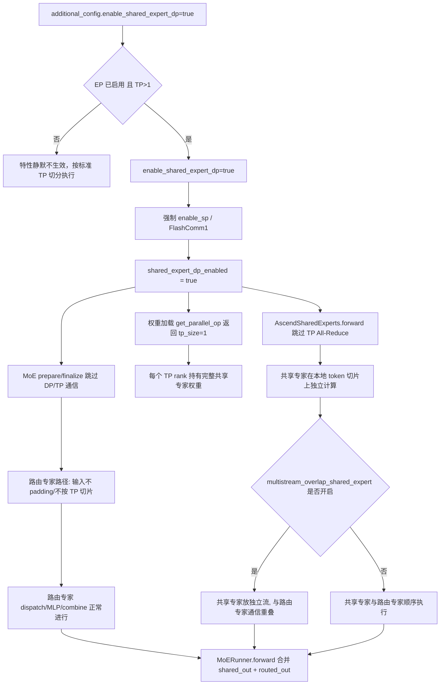

# vLLM-Ascend `enable_shared_expert_dp` 技术说明

> 分析基线：vLLM-Ascend commit `1475a92c3`（2026-08-07，分支 `rl-e2e`）。
>
> 本文基于当前仓库静态代码分析，重点说明 `additional_config.enable_shared_expert_dp` 的配置入口、触发条件、权重复制机制、通信免除机制、运行时流程、适用范围、限制和验证方法。随着 vLLM-Ascend 演进，实际部署前应结合目标版本重新核对。

## 1. 核心结论

`enable_shared_expert_dp` 是面向 **MoE 模型 + Expert Parallel（EP）+ Tensor Parallel（TP）** 场景的通信优化开关。它把 MoE 层中"共享专家"（shared expert，作用于全部 token 的稠密 MLP）的权重从"按 TP 切分"改为**在每个 TP rank 上完整复制一份**，从而：

- 省掉共享专家输出所需的 **TP All-Reduce**；
- 省掉共享专家输入侧的 **padding + 按 TP rank 切片**；
- 每个 rank 在各自本地的 TP token 切片上独立完成共享专家计算，数学结果与"TP 切分 + All-Reduce"完全一致。

官方配置文档的描述（`docs/source/user_guide/configuration/additional_config.md`）：

> `enable_shared_expert_dp` | bool | `False` | When the expert is shared in DP, it delivers better performance but consumes more memory.

即**用显存换通信**：共享专家权重占每 rank 一份完整拷贝（约 ×TP 显存），换取 decode 每步一次 TP All-Reduce 的通信与同步开销。对共享专家占比较小（DeepSeek 类约 1%）的模型，这个 trade-off 通常划算。

标准模式与共享专家 DP 模式对比：

| 维度 | 标准 TP 切分 | 共享专家 DP |
|------|--------------|-------------|
| 共享专家权重 | 每 rank 持 `1/TP` 份（列/行并行切分） | 每 rank 持**完整** 1 份（`tp_size=1`） |
| 输入 padding / TP 切片 | 需要 | 跳过 |
| 输出 TP All-Reduce | 需要（MC2/All2All 路径） | 跳过 |
| 与多流重叠组合 | 不支持 | 支持（共享专家计算可放独立流） |
| 通信量 | 大 | 小，decode 延迟更低 |
| 显存 | 小 | 大（约 ×TP） |

## 2. 配置入口与优先级

通过 `additional_config` 传入（`vllm_ascend/ascend_config.py:104-112`）：

```python
self.enable_shared_expert_dp = (
    additional_config.get("enable_shared_expert_dp", False)
    and vllm_config.parallel_config.enable_expert_parallel     # 必须 EP
    and vllm_config.parallel_config.tensor_parallel_size > 1   # 必须 TP>1
)
from vllm_ascend.utils import enable_sp
if self.enable_shared_expert_dp:
    assert enable_sp(vllm_config=vllm_config, enable_shared_expert_dp=True)
```

配置方式：

```bash
vllm serve MODEL \
  --enable-expert-parallel \
  --tensor-parallel-size 2 \
  --additional-config '{"enable_shared_expert_dp": true}'
```

要点：

1. **默认 `False`**，没有任何环境变量别名（与 `enable_flashcomm1` 不同，后者可用 `VLLM_ASCEND_ENABLE_FLASHCOMM1`）；
2. 即使配置里写了 `true`，只要 **EP 未开启或 TP==1**，`self.enable_shared_expert_dp` 仍为 `False`（静默降级，不报错）；
3. 一旦真正生效，会**强制开启 FlashComm1 / Sequence Parallel**：`enable_sp()`（`vllm_ascend/utils.py:859-885`）在 `enable_shared_expert_dp=True` 时把 `_ENABLE_SP` 置为 `True`，并打印：

   ```text
   shared_expert_dp requires enable_sp=True. enable_sp has been set to True.
   ```

## 3. 触发与运行时判定

真正决定共享专家是否走"复制 + 免通信"路径的不是单一配置，而是 `vllm_ascend/utils.py:889-890`：

```python
def shared_expert_dp_enabled() -> bool:
    return get_ascend_config().enable_shared_expert_dp or enable_sp() or enable_sp_by_pass()
```

即以下任一情况都会触发：

| 触发来源 | 含义 |
|---|---|
| `enable_shared_expert_dp` | 显式开启（EP + TP>1 + 强制 SP） |
| `enable_sp()` | `enable_flashcomm1` 开启（`additional_config` 或环境变量 `VLLM_ASCEND_ENABLE_FLASHCOMM1`） |
| `enable_sp_by_pass()` | 非 eager + 编译期 `pass_config.enable_sp`（`ascend_config.py:263-267`） |

**设计原因**：共享专家输入 `hidden_states` 一旦因 Sequence Parallel（FlashComm1 / SP by-pass）被按 TP 切分、且共享专家没有独立的 All-Reduce 归约时，其权重**必须**在每个 rank 全量复制才能独立计算。因此这三条路径共用同一套"复制 + 免通信"逻辑，三者取或。

代码中读取 `shared_expert_dp_enabled()` 的位置：

| 位置 | 作用 |
|---|---|
| `vllm_ascend/ops/linear_op.py:511-518` | 权重加载：共享专家层按 `tp_size=1` 复制 |
| `vllm_ascend/ops/fused_moe/shared_experts.py:233-241` | 共享专家前向：跳过 TP All-Reduce |
| `vllm_ascend/spec_decode/llm_base_proposer.py:148/2084` | MTP 草稿模型：恢复跨 TP 完整序列 |

## 4. 完整运行时流程



### 4.1 分层职责

```
AscendConfig.enable_shared_expert_dp        （配置解析, ascend_config.py）
        │
        ▼
shared_expert_dp_enabled()                  （运行时判定, utils.py）
   ┌──────┬──────────────┬──────────────┐
   ▼      ▼              ▼              ▼
①权重加载 ②prepare/finalize  ③共享专家前向    ④spec decode/MTP
linear_op prepare_finalize shared_experts llm_base_proposer
(tp_size=1)(跳过DP/TP通信)  (跳过AllReduce)(恢复完整序列)
```

## 5. 权重复制机制（核心）

共享专家的 `gate_up_proj`（列并行）与 `down_proj`（行并行）在构造时都会调用 `get_parallel_op()`（`vllm_ascend/ops/linear_op.py:511-518`）：

```python
def get_parallel_op(disable_tp, prefix, layer, direct):
    if (
        disable_tp
        or ("shared_experts" in prefix and shared_expert_dp_enabled())
        or ("shared_expert" in prefix and shared_expert_dp_enabled())
        or ("share_expert" in prefix and shared_expert_dp_enabled())  # Step3p5
    ):
        return None, 0, 1          # ← 无自定义 TP op，tp_rank=0，tp_size=1
```

返回 `(None, 0, 1)` 的三重含义：

1. `custom_op=None` → `forward` 走 `super().forward()`（`ops/linear.py:271-274`），不做任何 TP 自定义通信；
2. `tp_size=1` → `input_size_per_partition = divide(input_size, 1)` 即**完整权重**（`ops/linear.py:316`），列并行 `output_size // 1` 全保留；
3. `tp_rank=0` → 每个 rank 都把自己视为唯一的 TP rank，加载整份权重。

而普通层（attention 的 `qkv/o_proj`、路由专家）仍按 TP 正常切分。因此**只有共享专家被复制**，其余权重显存不受影响。

模型侧（以 DeepSeek V4 为例，`vllm_ascend/models/deepseek_v4.py:408-417`）用 `prefix=f"{prefix}.shared_experts"` 构造 `DeepseekV2MLP`，内部使用的正是上述 Linear，命中 `shared_experts` 前缀判断。

## 6. 通信免除机制

### 6.1 输入侧 prepare：跳过 padding 与 TP 切片

路由专家与共享专家共用 `MoECommMethod.prepare()`（`moe_comm_method.py:108-122`），`enable_shared_expert_dp` 由 `AscendRoutedExperts.forward_impl` 从 `ascend_config.enable_shared_expert_dp` 传入（`routed_experts.py:247/564`）。

**MC2 / All2All 路径**（`PrepareAndFinalizeWithMC2.prepare`，`prepare_finalize.py:274-298`）：

```python
# 输入 padding 跳过
if pad_size > 0 and not self.enable_shared_expert_dp:
    hidden_states = nn.functional.pad(...)
# TP 切片跳过（保留完整 token 集合，供每 rank 独立计算共享专家）
if self.tp_size > 1 and not self.enable_shared_expert_dp:
    hidden_states = split_hidden_states[self.tp_rank]
```

`pad_and_split_input_ids`（`prepare_finalize.py:312-321`）同理。

### 6.2 输出侧 finalize：跳过重建与归约

MC2/All2All 的 `finalize`（`prepare_finalize.py:212`）在 `enable_shared_expert_dp` 时跳过 TP all-gather 重建 + 裁剪：

```python
if not (self.enable_shared_expert_dp or self.replace_allreduce):
    if self.tp_size > 1:
        ... all_gather 重建 padded 张量 ...
    if self.num_tokens < hidden_states.shape[0]:
        hidden_states = hidden_states[: self.num_tokens]
```

AllGather 路径（非 EP）的 `_finalize_with_dp_group`（`prepare_finalize.py:550`）跳过 DP reduce-scatter：

```python
if self.moe_config.dp_size > 1 and not self.enable_shared_expert_dp:
    hidden_states = get_dp_group().reduce_scatter(hidden_states, 0)
    hidden_states = hidden_states[: self.num_tokens]
```

> 注意：对**路由专家本身**，`prepare` 的 padding/切片仍会进行（路由专家按 EP 切分，必须通信）；被跳过的只是"共享专家要用的那份 hidden_states"的额外复制。`enable_shared_expert_dp` 传参本质是告知 routed 路径"共享专家在别处独立计算"，避免为其做冗余通信。

### 6.3 共享专家前向：跳过 TP All-Reduce

`AscendSharedExperts.forward` 的最后一段（`shared_experts.py:233-241`）：

```python
moe_comm_type = _EXTRA_CTX.moe_comm_type
if (
    moe_comm_type in {MoECommType.ALLTOALL, MoECommType.MC2, MoECommType.FUSED_MC2}
    and not shared_expert_dp_enabled()          # ← 共享专家 DP 时不 All-Reduce
):
    shared_out = tensor_model_parallel_all_reduce(shared_out)
return shared_out
```

- 标准模式：MC2/All2All 下共享专家权重被切分，输出必须 TP All-Reduce；
- 共享专家 DP 模式：每 rank 有完整权重 + 自己的 token 切片，`shared_out` 已是该 rank 的完整结果，**直接返回**。

同时 `AscendMoERunner._fused_output_is_reduced`（`fused_moe.py:94-106`）告知上游：MC2/All2All/FusedMC2 及 FlashComm1 下的 AllGather 路径输出已完成 TP 归约，避免 `_maybe_reduce_final_output` 二次 All-Reduce。`_maybe_reduce_shared_expert_output` / `_maybe_reduce_final_output` 均被 Ascend 覆写为直通（`fused_moe.py:123-177`）。

### 6.4 事件驱动的计算重叠

共享专家不参与通信后，其计算可以拆到路由专家的通信间隙中执行。`AscendRoutedExperts` 在存在共享专家时开启 `return_with_event = True`（`fused_moe.py:72-79`），路由专家返回 `FusedExpertsResult` 携带三个事件：

| 事件 | 语义 |
|---|---|
| `before_dispatch_evt` | 路由专家 dispatch 通信开始前 |
| `before_gmm2_evt` | 路由专家 GMM2（down 投影）前 |
| `before_combine_evt` | 路由专家 combine 通信前 |

`AscendSharedExperts.forward`（`shared_experts.py:133-231`）按事件把共享专家的 gate_up、激活、down 三段分别插入路由专家的 dispatch、GMM2、combine 之间执行（非量化 `part1`/`part2`，见 `shared_experts.py:119-131`），实现共享专家计算与路由专家通信的重叠。

## 7. 共享专家 DP 与多流重叠（multistream_overlap_shared_expert）

两者关系密切：

- `multistream_overlap_shared_expert` 把共享专家整个计算放到独立流 `shared_experts_calculation_stream()`（`utils.py:510-516`）上执行，与主流的 dispatch/combine 通信真正并行；
- 官方文档（`docs/tutorials/models/DeepSeek-V3.1.md`）明确：**该多流重叠仅在 TP==1 或 `enable_shared_expert_dp=true` 时生效**。因为独立流上无法方便地做跨 TP 的 All-Reduce，必须先让共享专家在每个 rank 独立可算（即共享专家 DP 化的前提）。

因此实际部署常组合使用（如 DeepSeek-V3.1 / DeepSeek-V4-Pro 的推荐配置）：

```json
{
  "enable_shared_expert_dp": true,
  "multistream_overlap_shared_expert": true
}
```

### 7.1 与 Fused MC2 的冲突

`enable_fused_mc2==1` 与 `multistream_overlap_shared_expert` 互斥，配置初始化时后者被自动关闭并告警（`ascend_config.py:170-175`）。这不影响 `enable_shared_expert_dp` 本身。

## 8. 与 spec decode（MTP）的协同

`spec_decode/llm_base_proposer.py` 中：

- 构造时记录 `self.enable_shared_expert_dp = shared_expert_dp_enabled()`（line 148）；
- MTP 场景下（line 2084），因共享专家 DP 跳过了路由路径的 TP 归约，草稿模型的 `last_hidden_states` / `positions` 需要显式 `maybe_all_gather_and_maybe_unpad` 恢复完整序列，再交给下一层 / 验证器：

  ```python
  if self.enable_shared_expert_dp:
      last_hidden_states = torch.ops.vllm.maybe_all_gather_and_maybe_unpad(
          last_hidden_states.contiguous(), True
      )
      if not self.is_multimodal_model:
          positions = torch.ops.vllm.maybe_all_gather_and_maybe_unpad(positions.contiguous(), True)
  ```

## 9. 各通信路径下的行为差异

| 通信路径（`MoECommType`） | 关闭 shared_expert_dp | 开启 shared_expert_dp |
|---|---|---|
| MC2 / AllToAll | prepare 做 padding + TP 切片；共享专家输出在 `AscendSharedExperts` 内 TP All-Reduce | prepare 跳过 padding/切片；共享专家输出不 All-Reduce |
| Fused MC2 | 同上（融合算子路径） | 同上 |
| AllGather（无 EP） | 依赖 DP all-gather / reduce-scatter + 最终 TP All-Reduce | 跳过 DP reduce-scatter（`prepare_finalize.py:550`） |

注意：`enable_shared_expert_dp` 配置要求 EP 开启，故纯 AllGather（无 EP）路径只会在 `enable_sp()` / `enable_sp_by_pass()` 触发 `shared_expert_dp_enabled()` 时走复制逻辑（此时 `_prepare_with_ep_group`，`prepare_finalize.py:372-375`）。

## 10. 与其他特性的关系

| 特性 | 关系 |
|---|---|
| MoE | 必需；Dense 模型不适用 |
| Expert Parallel | 必需（配置层硬性条件） |
| Tensor Parallel > 1 | 必需（配置层硬性条件） |
| FlashComm1 / SP | 被自动强制开启；`enable_sp()` 也是独立触发源 |
| `multistream_overlap_shared_expert` | 推荐组合；多流重叠依赖共享专家可独立计算 |
| `enable_fused_mc2` | 与 `multistream_overlap_shared_expert` 互斥（不影响本开关） |
| `mix_placement` | **互斥**：同时开启直接抛 `ValueError`（见下） |
| MTP / spec decode | 需要草稿模型侧 `maybe_all_gather_and_maybe_unpad` 恢复完整序列 |
| PD 分离 | 适用；DeepSeek-V3.1T / V4 Pro 的 PD 配置中启用 |
| 量化（W8A8/W4A8） | 兼容；`AscendSharedExperts` 有独立的量化分支（`shared_experts.py:140-215`） |
| LoRA | 未发现显式限制，但 LoRA+EP 本身会走 AllToAll 路径 |

### 10.1 与 mix_placement 互斥

`ascend_config.py:370-373`：

```python
def _check_mix_placement(self):
    if self.mix_placement:
        if self.enable_shared_expert_dp or self.multistream_overlap_shared_expert:
            raise ValueError("Mix placement is not supported with shared expert DP or multistream overlap.")
```

`mix_placement` 把共享专家并入路由专家的物理专家槽位做混合 EP 放置，与"共享专家全量复制"的模型不兼容，必须二选一。

## 11. 适用与不适用场景

### 11.1 推荐尝试

- 带共享专家的 MoE 模型（DeepSeek V2/V3.1/V4、Kimi-K2.5/K2.6、GLM4.x/5.x、MiniMax-M3 等）；
- 已启用 EP 且 TP>1；
- decode 阶段通信占比较高、共享专家输出 All-Reduce 是热点；
- 打算组合 `multistream_overlap_shared_expert` 做计算通信重叠；
- 显存有富余（能接受共享专家权重 ×TP 拷贝）。

仓库中的典型使用案例：

- `tests/e2e/pull_request/two_card/test_shared_expert_dp.py`（DeepSeek-V2-Lite，TP2 + EP，eager 与 FULL_DECODE_ONLY 两种模式）；
- `tests/e2e/weekly/multi_node/external_dp/config/DeepSeek_V3.1T_*.yaml`、Kimi-K2.5、GLM-4.7 等 external/internal DP 配置；
- DeepSeek-V3.1 / DeepSeek-V4-Pro / DeepSeek-V4-Flash 教程文档的推荐参数。

### 11.2 不建议直接启用

- Dense 模型（无共享专家，开关无意义）；
- 未启用 Expert Parallel 或 TP==1（配置被静默降级为 False）；
- `mix_placement` 场景（直接报错）；
- 共享专家权重占比较高、显存紧张的模型（复制开销可能吃掉收益）；
- 只验证服务启动、没有对比关闭状态精度与性能的部署。

## 12. 验证方法

### 12.1 A/B 启动

实验组：

```bash
vllm serve MODEL \
  --enable-expert-parallel \
  --tensor-parallel-size 2 \
  --additional-config '{"enable_shared_expert_dp": true}'
```

对照组：

```bash
vllm serve MODEL \
  --enable-expert-parallel \
  --tensor-parallel-size 2 \
  --additional-config '{}'
```

两组应保持模型、TP/DP/EP、ACLGraph、batch、prompt 和采样参数完全一致。`tests/e2e/pull_request/two_card/test_shared_expert_dp.py` 中的 `compare_logprobs` 即采用此方法，对照组不含 `additional_config`。

### 12.2 确认特性真实生效

不能只检查启动参数，建议确认：

1. 日志出现：

   ```text
   shared_expert_dp requires enable_sp=True. enable_sp has been set to True.
   ```

2. 检查权重是否复制：对比各 TP rank 上共享专家 `gate_up_proj.weight` 的 shape 是否为完整尺寸（未按 TP 切分）；
3. profiler trace 中共享专家输出路径不再出现 TP All-Reduce / 跨 TP 通信节点；
4. MC2/All2All 路径下 `prepare` 不再对共享专家输入做 padding / 切片。

### 12.3 推荐测试矩阵

| 维度 | 建议取值 |
|---|---|
| 开关 | `false`、`true` |
| 执行模式 | eager、ACLGraph（FULL_DECODE_ONLY） |
| 工作负载 | 短输入 decode、长输入 prefill、混合长度 |
| 并发 | 1、16、32、64 或业务典型值 |
| 并行 | TP2/TP4/TP8 × 不同 EP size、单/多 DP |
| 组合 | 是否叠加 `multistream_overlap_shared_expert` |
| 指标 | 准确率、输出一致性、吞吐、TTFT、TPOT、显存 |

至少需要：

- `/v1/models` 返回成功；
- 一个真实权重文本请求返回非空输出；
- 多请求并发无 hang；
- 与关闭状态的结果满足预期精度阈值（数值一致是数学上保证的，应能对齐）；
- 显存增量符合预期（共享专家权重 ×TP 拷贝）。

## 13. 当前代码中的注意点

以下结论来自静态代码审查，建议后续结合 NPU 实机测试确认。

1. **配置静默降级**：`enable_shared_expert_dp: true` 但未开 EP 或 TP==1 时，开关被 AND 条件置为 `False`，无任何警告。建议部署时先确认并行配置。

2. **判定来源不止一个配置**：`shared_expert_dp_enabled()` 是 `enable_shared_expert_dp || enable_sp() || enable_sp_by_pass()` 三者取或。开启 FlashComm1（即使未显式开本开关）也会让共享专家走复制逻辑，权重布局随之改变，需留意显存变化。

3. **与 `mix_placement` 强互斥**：组合配置直接 `ValueError`，不是告警降级。

4. **与 `enable_fused_mc2` 的间接冲突**：Fused MC2 会关闭 `multistream_overlap_shared_expert`，若预期用"多流重叠"收益，需确认不会被 Fused MC2 自动关闭。

5. **MTP 依赖草稿侧恢复序列**：启用本开关后，MTP 场景依赖 `llm_base_proposer.maybe_all_gather_and_maybe_unpad` 正确恢复完整序列，改动 spec decode 流程时需同步验证。

6. **多 DP / PD 场景**：跳过 DP 通信后各 rank token 数可能不同，MC2 的 `global_bs` 逻辑依赖 `should_skip_allreduce_across_dp_group()`（`token_dispatcher.py:143-147`），跨 DP 的 token 数差异、padding 比例需结合 `recompute_scheduler` 等配置实测。

## 14. 建议配置策略

```text
带共享专家的 MoE + EP + TP>1 + 显存富余
    -> 推荐开启，并执行完整 A/B 验证

叠加多流重叠（multistream_overlap_shared_expert）
    -> 在已开启共享专家 DP 的基础上进一步追求延迟收益

mix_placement / Dense / 未开 EP / TP==1
    -> 不配置（前者报错，后者静默无效）

显存紧张的模型
    -> 先评估共享专家权重 ×TP 拷贝是否可接受
```

最重要的上线门槛是同时满足：

1. 确认 `enable_shared_expert_dp` 未被 AND 条件静默降级（EP + TP>1 已满足）；
2. 共享专家权重确为每 rank 完整拷贝；
3. 与关闭状态相比精度符合预期（数学上应一致）；
4. decode 延迟 / TPOT 确有收益，显存增量在预算内；
5. MTP（如启用）草稿侧序列恢复正确，无 hang。

## 15. 关键源码索引

| 主题 | 文件 |
|---|---|
| 配置解析与 EP/TP 条件、强制 SP | `vllm_ascend/ascend_config.py:104-112` |
| mix_placement 互斥校验 | `vllm_ascend/ascend_config.py:370-373` |
| 运行时判定 `shared_expert_dp_enabled` | `vllm_ascend/utils.py:889-890` |
| `enable_sp` 强制开启逻辑 | `vllm_ascend/utils.py:859-885` |
| 共享专家计算流 `shared_experts_calculation_stream` | `vllm_ascend/utils.py:510-516` |
| 权重复制（tp_size=1） | `vllm_ascend/ops/linear_op.py:511-518` |
| prepare/finalize 跳过通信 | `vllm_ascend/ops/fused_moe/prepare_finalize.py:151/212/274-298/550` |
| 共享专家前向与事件重叠 | `vllm_ascend/ops/fused_moe/shared_experts.py` |
| 执行编排 `AscendMoERunner._forward_impl` | `vllm_ascend/ops/fused_moe/fused_moe.py:182-231` |
| 路由专家参数传入 | `vllm_ascend/ops/fused_moe/routed_experts.py:247/564` |
| token dispatcher global_bs 逻辑 | `vllm_ascend/ops/fused_moe/token_dispatcher.py:143-147` |
| MTP / spec decode 协同 | `vllm_ascend/spec_decode/llm_base_proposer.py:148/2084` |
| 端到端测试 | `tests/e2e/pull_request/two_card/test_shared_expert_dp.py` |
