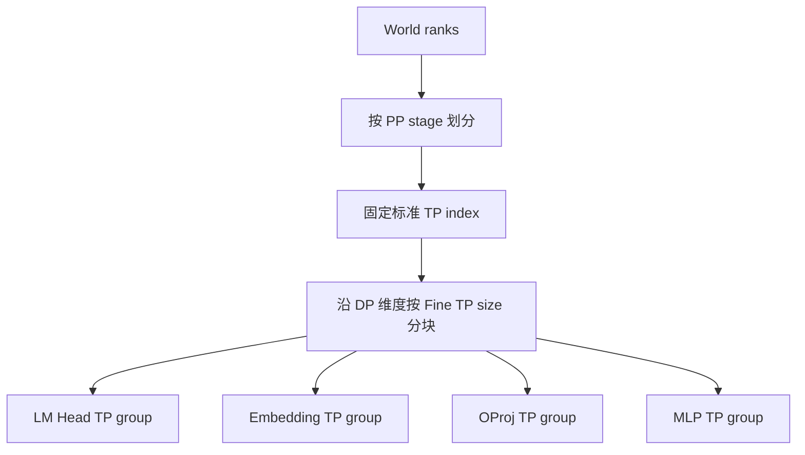
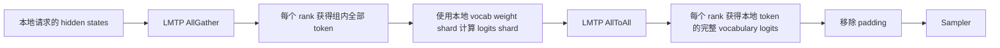
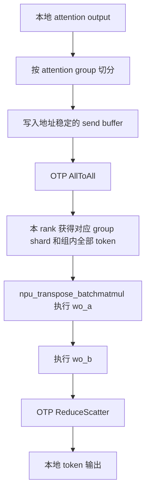

# vLLM-Ascend `finegrained_tp_config` 技术分析

> 分析基线：vLLM-Ascend commit `aa48bd687`（2026-08-12）。
>
> 本文基于当前仓库静态代码分析，介绍 `finegrained_tp_config` 的整体设计、五个配置项的核心逻辑、权重切分方式、主要通信流程、与普通 Tensor Parallelism 的区别，以及当前实现中的限制与不一致。实际部署前应结合目标版本和 NPU 实机重新验证。

## 1. 核心结论

`finegrained_tp_config` 的目标是让模型中的不同模块拥有独立的 Tensor Parallel（TP）大小，而不是所有模块统一使用全局 `tensor_parallel_size`。

但 vLLM-Ascend 当前实现有一个关键特点：

> Fine-grained TP 主要沿 Data Parallel（DP）维度重新建立模块专用 TP group，而不是在标准 TP group 内继续细分。

当前代码包含五个配置项：

```json
{
  "finegrained_tp_config": {
    "lmhead_tensor_parallel_size": 8,
    "embedding_tensor_parallel_size": 8,
    "oproj_tensor_parallel_size": 8,
    "mlp_tensor_parallel_size": 8,
    "olora_tensor_parallel_size": 8
  }
}
```

成熟度概览：

| 配置项 | 切分对象 | 主要通信 | 当前状态 |
|---|---|---|---|
| `lmhead_tensor_parallel_size` | LM Head vocabulary rows | hidden AllGather + logits AllToAll | 较完整 |
| `embedding_tensor_parallel_size` | Embedding vocabulary rows | token ID AllGather + embedding ReduceScatter | 较完整，调度约束强 |
| `mlp_tensor_parallel_size` | Dense MLP gate/up、down | token AllGather + output ReduceScatter | 较完整 |
| `oproj_tensor_parallel_size` | Attention o_proj 或 DSV4 `wo_a/wo_b` | AllToAll + ReduceScatter | 完整但限制最多 |
| `olora_tensor_parallel_size` | DeepSeek V4 O-LoRA 投影 | 当前无独立 Fine TP group | 实验性/实现不完整 |

## 2. 普通 TP 与 Fine-grained TP

### 2.1 普通 TP

普通 TP 由全局参数控制：

```bash
--tensor-parallel-size N
```

它不会机械地切分模型中所有 Parameter，而是由模块的数学语义决定：

| 模块 | 普通 TP 行为 |
|---|---|
| Token Embedding | 通常沿 vocabulary 维度切分 |
| LM Head | 通常沿 vocabulary 维度切分 |
| Q/K/V Projection | 沿 output/head 维度切分，Column Parallel |
| Attention O Projection | 沿 input/head 维度切分，Row Parallel |
| MLP Gate/Up | 沿 intermediate output 维度切分 |
| MLP Down | 沿 intermediate input 维度切分 |
| RMSNorm/LayerNorm | 通常每个 TP rank 完整复制 |
| MoE Router/Gate | 通常复制 |
| `ReplicatedLinear` | 不切分 |
| `disable_tp=True` | 不切分 |

不开启 Fine-grained TP 时，Ascend Linear 最终回退到标准 TP group：

```python
return None, get_tp_group().rank_in_group, get_tp_group().world_size
```

相关实现位于：

```text
vllm_ascend/ops/linear_op.py::get_parallel_op
```

### 2.2 Fine-grained TP

Fine-grained TP 会为指定模块重新选择：

```text
tp_rank
tp_size
communication group
weight shard
forward collective
```

它不是在标准 TP group 中再切一层，而是在固定 PP stage、固定标准 `tp_idx` 下，沿 DP rank 维度建立专用 group。



例如：

```text
PP=1
DP=8
标准 TP=1
Fine TP size=4
```

会形成：

```text
group 0: DP rank 0,1,2,3
group 1: DP rank 4,5,6,7
```

原本独立持有完整模型副本的 DP ranks，在指定模块上改为协同持有权重分片。

## 3. 配置解析与公共限制

配置类位于：

```text
vllm_ascend/ascend_config.py::FinegrainedTPConfig
```

默认值全部为 `0`，表示关闭：

```python
self.oproj_tensor_parallel_size = config.get("oproj_tensor_parallel_size", 0)
self.lmhead_tensor_parallel_size = config.get("lmhead_tensor_parallel_size", 0)
self.embedding_tensor_parallel_size = config.get("embedding_tensor_parallel_size", 0)
self.mlp_tensor_parallel_size = config.get("mlp_tensor_parallel_size", 0)
self.olora_tensor_parallel_size = config.get("olora_tensor_parallel_size", 0)
```

### 3.1 当前只允许 MoE 模型

当前代码对任意非零 Fine TP size 执行：

```python
if module_tp_size > 0 and not vllm_config.model_config.is_moe:
    raise AssertionError(
        "The finegrained tp sizes can be enabled only for MOE models."
    )
```

因此当前真实行为是：

| 模型类型 | 当前代码 |
|---|---|
| MoE 模型 | 允许 |
| MoE 模型中的 Dense 层 | MLP TP 可以作用 |
| 纯 Dense 模型 | 配置初始化失败 |

仓库文档中仍有“Fine-grained TP 支持所有 Dense Transformer”的描述，与当前代码不一致，应以代码为准。

### 3.2 Fine TP size 必须整除 DP size

所有非零 size 都要求：

```python
data_parallel_size % module_tp_size == 0
```

示例：

| DP size | Fine TP size | 结果 |
|---:|---:|---|
| 16 | 8 | 合法 |
| 16 | 4 | 合法 |
| 16 | 6 | 非法 |
| 8 | 16 | 非法 |

### 3.3 建议使用大于 1 的值

以下 helper 使用 `size > 0` 判断：

```text
lmhead_tp_enable
embedding_tp_enable
oproj_tp_enable
mlp_tp_enable
```

`size=1` 会进入特殊实现，但不会产生实际权重切分，通常只有额外代码路径而没有收益。

OLora 使用：

```python
olora_tensor_parallel_size > 1
```

所以 `olora_tensor_parallel_size=1` 会被配置类记录并打印为 enabled，但运行时 helper 返回 false。

### 3.4 配置类型校验不完整

当前没有统一验证：

- 配置值必须是整数；
- 配置值必须非负；
- group size 是否满足硬件和 HCCL 约束。

建议只传 `0` 或大于 1 的正整数。

## 4. 通信组建立

通信组初始化位于：

```text
vllm_ascend/distributed/parallel_state.py
```

rank grid 为：

```python
rank_grid = torch.arange(world_size).reshape(
    global_pp_size,
    global_dp_size,
    global_tp_size,
)
```

构组逻辑固定：

1. PP stage；
2. 标准 TP index；
3. 沿 DP 维度按 Fine TP size 切块。

当前 group：

| 配置 | 全局对象 | group name |
|---|---|---|
| OProj TP | `_OTP` | `otp` |
| LM Head TP | `_LMTP` | `lmheadtp` |
| Embedding TP | `_EMBED_TP` | `emtp` |
| MLP TP | `_MLP_TP` | `mlptp` |
| OLora TP | 无 | 无 |

相同 group size 会复用缓存：

```python
_group_cache[group_size] = pg
```

如果 LM Head、Embedding 和 MLP 都配置 size 8，它们会复用相同 rank 划分对应的 group coordinator，而不是创建三套完全相同的 HCCL group。

## 5. 权重切分的接入方式

Fine TP 并不是加载完整权重后再任意切块，而是在 Linear/Embedding 初始化阶段先选择专用 group：

```text
根据 prefix 和配置选择 custom op
    -> custom op 提供 tp_rank/tp_size
    -> Linear 构造 Parameter shard
    -> weight loader 加载对应 shard
    -> forward 使用相同 group 通信
```

Linear 接入依赖 prefix：

```text
head
embed_tokens
gate_up_proj
down_proj
o_proj
wo_a
wo_b
```

如果模型使用其他命名，即使配置非零，也可能没有进入对应 Fine TP 路径。

量化 RowParallelLinear 还需要使用专用 group rank 处理 bias、scale 和 offset，避免误用标准 TP rank：

```python
if "o_proj" in layer.prefix and oproj_tp_enable():
    tp_rank = get_otp_group().rank_in_group
elif "down_proj" in layer.prefix and mlp_tp_enable():
    tp_rank = get_mlp_tp_group().rank_in_group
```

## 6. LM Head TP

配置：

```json
{
  "lmhead_tensor_parallel_size": 8
}
```

### 6.1 核心目标

LM Head 通常具有大矩阵：

```text
[vocab_size, hidden_size]
```

LM Head TP 沿 vocabulary 维度切分，每个 rank 只持有一部分词表权重，从而降低：

- 单卡权重显存；
- decode 阶段 LM Head 权重读取量；
- 大词表投影的单卡计算量。

当 prefix 包含 `head` 时，`AscendParallelLMHead` 使用 LM Head TP group。

### 6.2 主要流程



核心逻辑：

```python
gathered_hidden_states = get_lmhead_tp_group().all_gather(
    hidden_states, dim=0
)
logits = lm_head(gathered_hidden_states)
logits = get_lmhead_tp_group().all_to_all(logits)
```

语义是：

1. 每个 DP rank 原本处理不同请求；
2. AllGather 后，每个 Fine TP rank 获得组内所有请求的 hidden states；
3. 每个 rank 使用自己的 vocabulary shard 计算所有 token 的 logits shard；
4. AllToAll 重新排列结果，使每个 rank 取回本地请求的完整词表 logits。

### 6.3 调度与采样适配

LM Head TP 会把 `logits_indices` padding 到静态大小，以保证组内 shape 一致。采样前再裁剪回真实请求数：

```python
logits = logits[:num_reqs]
```

Speculative Decoding/MTP 也包含额外的 logits AllToAll、padding 和裁剪路径。

### 6.4 限制

- 与 `enable_reduce_sample` 显式冲突；
- 大词表 logits AllToAll 可能抵消权重访存收益；
- Spec Decode 必须单独验证；
- 项目文档认为标准 TP>1 时无法形成额外有效切分，推荐标准 TP=1 的全 DP decode 部署。

## 7. Embedding TP

配置：

```json
{
  "embedding_tensor_parallel_size": 8
}
```

### 7.1 核心目标

Embedding 表也沿 vocabulary 维度切分：

```text
rank 0 -> token range 0
rank 1 -> token range 1
...
```

当前只匹配 prefix 中的 `embed_tokens`。

### 7.2 主要流程


具体步骤：

1. AllGather 组内 token IDs；
2. 判断每个 token 是否属于本地 vocabulary shard；
3. 本地执行 embedding lookup；
4. 非本地 token 的结果清零；
5. ReduceScatter 对各 vocabulary shard 的结果求和并重新分回原 DP rank。

### 7.3 ACLGraph 静态 buffer

Embedding TP 使用地址稳定的通信 buffer：

```text
_embed_ag_in_buf
_embed_ag_out_buf
_embed_rs_in_buf
_embed_rs_out_buf
```

目的包括：

- 保证 HCCL 输入输出地址稳定；
- 保证 graph capture/replay 的 shape 一致；
- 避免通信 wrapper 每次分配新 tensor 导致 graph replay 失配。

静态容量来自 `get_potential_max_tokens()`，由以下配置共同决定：

```text
max_cudagraph_capture_size
max_num_batched_tokens
max_num_seqs
num_speculative_tokens
```

实际 token 数超过容量时会直接报错。

### 7.4 调度约束

当前代码要求 Embedding TP 同时启用：

```json
{
  "scheduler_config": {
    "recompute_scheduler_enable": true
  }
}
```

原因是跨 DP AllGather/ReduceScatter 要求所有 rank 使用一致 token shape。普通 uneven-token 路径可能导致通信 shape 不匹配甚至 hang。

recompute scheduler 当前只支持 PD 分离 D 节点，所以 Embedding TP 也被间接限制到 D 节点。文档中“Embedding TP 支持所有 prefill/eager 场景”的范围比当前代码实际范围更宽。

## 8. MLP TP

配置：

```json
{
  "mlp_tensor_parallel_size": 8
}
```

### 8.1 作用范围

MLP TP 当前匹配：

```text
gate_up_proj
down_proj
```

并明确排除 MoE expert layer：

```python
not is_moe_layer(prefix)
```

所以它优化的是 MoE 模型中的 Dense MLP，例如部分模型前几层的 Dense FFN，而不是 routed expert 的 `w13/w2`。

### 8.2 Gate/Up Column Parallel


核心实现：

```python
input_parallel = mlp_group.all_gather(input_, dim=0)
output = quant_method.apply(layer, input_parallel, bias)
```

### 8.3 Down Row Parallel


核心实现：

```python
output_parallel = quant_method.apply(layer, input_parallel, bias)
output = mlp_group.reduce_scatter(output_parallel, dim=0)
```

### 8.4 限制

- 依赖固定 prefix；
- 不切分 routed expert；
- Shared Expert DP 开启时，shared expert 可能被 custom-op 选择器提前排除；
- 小 batch 下 AllGather/ReduceScatter 成本可能大于访存收益；
- 标准 TP>1 时不形成标准 TP×Fine TP 的二维切分，推荐标准 TP=1。

## 9. OProj TP

配置：

```json
{
  "oproj_tensor_parallel_size": 8
}
```

这是当前限制最多的一项。

### 9.1 硬性条件

配置加载时要求：

1. MoE 模型；
2. Fine TP size 整除 DP size；
3. 标准 `tensor_parallel_size == 1`；
4. graph mode，不能 `--enforce-eager`；
5. PD 分离 D 节点；
6. `recompute_scheduler_enable=true`。

标准 TP 必须为 1 的原因是：

- attention output 已按标准 TP 的 head/group 维度切分；
- OProj 权重又沿 DP 维度的 OTP group 切分；
- 当前实现无法正确组合两个正交 rank 轴。

### 9.2 通用 `o_proj` 路径

对于 prefix 包含 `o_proj` 的 RowParallelLinear，使用 `OProjRowParallelOp`：

```text
输入 hidden dimension 切分
    -> 按 [fine_tp, token, hidden_shard] 重排
    -> AllToAll
    -> 本地 o_proj MatMul
    -> ReduceScatter
    -> 恢复本地 token 输出
```

### 9.3 DeepSeek V4 DSA `wo_a/wo_b` 路径

DeepSeek V4 输出投影为：

```text
attention output
    -> wo_a
    -> o_lora hidden
    -> wo_b
    -> model hidden
```

Fine OProj TP 对 `wo_a` 使用 Column Parallel，对 `wo_b` 使用 Row Parallel。

完整流程：



DSA 路径预分配：

```text
_oproj_send_buf
_oproj_recv_buf
_oproj_rs_out_buf
```

并要求：

```python
n_local_groups % oproj_tp_size == 0
```

否则运行时报错。

### 9.4 性能特征

收益：

- 降低 o_proj/`wo_a`/`wo_b` 单卡权重显存；
- 减少每卡权重读取量。

成本：

- attention 后新增 AllToAll；
- 输出增加 ReduceScatter；
- 需要静态通信 buffer；
- 小 batch 时通信成本可能高于 GEMM 收益。

仓库历史测试中 OProj TP 能明显节省显存，但部分 batch 下 TPOT 会退化。因此它更偏向容量优化，不保证性能必然提升。

## 10. OLora TP

配置：

```json
{
  "olora_tensor_parallel_size": 8
}
```

这里的 OLora 指 DeepSeek V4 attention output projection 的低秩结构，不是 PEFT LoRA adapter。

### 10.1 当前行为

配置要求：

- graph mode；
- PD 分离 D 节点；
- MoE 模型；
- size 整除 DP size。

运行时 helper 使用：

```python
olora_tensor_parallel_size > 1
```

开启后，DSA 输出投影从手写 batched MatMul 切换为：

```python
o_proj_input = self.wo_a(o_proj_input)
output = self.wo_b(o_proj_input)
```

### 10.2 当前实现不完整

静态分析发现：

1. `parallel_state.py` 没有读取 `olora_tensor_parallel_size`；
2. 没有创建 `_OLORA_TP`；
3. 没有 `get_olora_tp_group()`；
4. Linear custom-op 选择器没有根据 OLora 配置选择专用 group；
5. 配置的具体 size 没有参与 `wo_a/wo_b` rank 或 size 计算；
6. 当前主要效果是切换 DSA O-LoRA 的计算实现。

因此当前不能把 OLora TP 视为与 LM Head/Embedding/MLP/OProj 等价的独立 DP 轴 Fine TP。它更像 DeepSeek V4 接入中的内部路径开关，或者尚未完成的实现。

DSA 分支优先级为：

```text
A5 特殊 FP8 路径
    >
OProj TP
    >
OLora TP
    >
普通 BMM
```

所以：

- A5 上 OLora 分支不会执行；
- 同时配置 OProj TP 和 OLora TP 时，OProj TP 优先。

## 11. Fine TP 与普通 TP 的组合关系

Fine TP group 建立在 DP 轴，标准 TP group 建立在 TP 轴，两者正交。

当前行为：

| 模块 | 标准 TP>1 时的情况 |
|---|---|
| OProj | 配置时直接禁止，要求标准 TP=1 |
| Embedding | 配置可通过，但文档认为不能形成额外有效切分 |
| LM Head | 配置可通过，但文档认为不能形成额外有效切分 |
| MLP | 配置可通过，但不是标准 TP×Fine TP 二维切分 |
| OLora | 没有独立 Fine TP group，组合语义不完整 |

最明确、最常见的部署方式是：

```text
标准 TP=1
较大 DP
开启 EP
在 DP ranks 内为大权重模块建立 Fine TP group
```

也就是 PD 分离 D 节点中的“全 DP/EP”部署。

## 12. 普通 TP 下哪些权重会切分

如果不配置 `finegrained_tp_config`，普通 TP 仍然会切分大多数 Transformer 大矩阵，但不会切分所有权重。

### 12.1 Attention

```text
完整 hidden states
    -> QKV Column Parallel
    -> 每 rank 计算部分 attention heads
    -> O Projection Row Parallel
    -> AllReduce/ReduceScatter
    -> 输出
```

Q heads 通常切分；当 KV heads 少于 TP size 时，KV heads 可能复制。

### 12.2 Dense MLP

```text
hidden states
    -> Gate/Up Column Parallel
    -> local intermediate shard
    -> Down Row Parallel
    -> AllReduce/ReduceScatter
    -> hidden states
```

### 12.3 MoE

只开启普通 TP、不启用 EP 时，通常每个 TP group 都拥有相同专家集合，但每个专家内部权重按 TP 切分。

启用 EP 后，专家还会沿 EP 维度分配：

```text
TP：切专家内部矩阵
EP：切专家集合
```

Router、Norm、部分 bias、显式 replicated 层和 `disable_tp=True` 的层仍会复制。

## 13. 推荐配置与验证顺序

典型 PD 分离 D 节点配置：

```bash
vllm serve MODEL \
  --data-parallel-size 16 \
  --tensor-parallel-size 1 \
  --enable-expert-parallel \
  --additional-config '{
    "scheduler_config": {
      "recompute_scheduler_enable": true
    },
    "finegrained_tp_config": {
      "embedding_tensor_parallel_size": 8,
      "lmhead_tensor_parallel_size": 8,
      "oproj_tensor_parallel_size": 8,
      "mlp_tensor_parallel_size": 8
    }
  }'
```

建议不要一次打开全部配置，而是：

1. 全部关闭，建立精度、显存、TTFT、TPOT 和吞吐基线；
2. 单独开启 LM Head TP；
3. 单独开启 Embedding TP；
4. 单独开启 MLP TP；
5. 最后验证限制最多的 OProj TP；
6. 验证两两组合；
7. 再验证全部组合；
8. 检查 profiler 中的 AllGather、AllToAll、ReduceScatter 和 GEMM 时间；
9. 验证真实权重请求、并发、ACLGraph replay 和 Spec Decode。

推荐测试矩阵：

| 维度 | 建议 |
|---|---|
| 标准 TP | 1，以及必要时对照 TP>1 |
| Fine TP size | 2、4、8 或业务目标值 |
| 执行模式 | eager、ACLGraph，按特性限制选择 |
| 请求 | decode、长输入 prefill、混合请求 |
| 并发 | 1、16、32、64 或业务典型值 |
| 指标 | 精度、显存、TTFT、TPOT、吞吐 |
| 稳定性 | HCCL hang、graph replay、静态容量溢出 |

## 14. 当前实现中的主要风险

### 14.1 文档与代码的模型范围不一致

文档称支持 Dense 模型，但当前配置类明确禁止非 MoE 模型。

### 14.2 Embedding 文档范围偏宽

文档称 Embedding TP 支持 eager/prefill，但当前代码要求 recompute scheduler，而 recompute scheduler 当前限定 PD 分离 D 节点。

### 14.3 OProj 存在两套实现

- 通用 `o_proj`：`OProjRowParallelOp`；
- DeepSeek V4 DSA：静态 buffer + AllToAll + `wo_a/wo_b` + ReduceScatter。

排查问题时必须确认模型进入哪条路径。

### 14.4 OLora size 未参与通信组建立

这是当前最明显的配置与实现不一致，不能只根据配置日志判断 OLora Fine TP 已实际生效。

### 14.5 Prefix 驱动存在漏匹配风险

模型层命名变化可能导致配置非零但没有选中对应 custom op。

### 14.6 静态 token capacity

Embedding/OProj 的 graph-safe buffer 依赖 `potential_max_tokens`。实际 decode token 数超过容量会直接失败；容量过大则增加常驻显存。

### 14.7 Cross-DP collective shape

Fine TP 本质上跨 DP ranks 通信。若调度器未保证 token shape 一致，AllGather/AllToAll/ReduceScatter 可能发生 shape mismatch 或 HCCL hang。

## 15. 各特性的一句话流程

```text
LM Head TP:
本地 hidden
-> 聚合组内 token
-> 各 rank 计算 vocab shard
-> 交换 logits
-> 本地 token 得到完整词表

Embedding TP:
聚合组内 token IDs
-> 各 rank 查询本地 vocab shard
-> 非本地结果置零
-> ReduceScatter
-> 本地 token 得到完整 embedding

MLP TP:
聚合组内 token
-> 各 rank 计算 gate/up shard
-> 本地 down projection
-> ReduceScatter
-> 本地 token 得到完整 hidden

OProj TP:
attention output 按 group/hidden 重排
-> AllToAll
-> 本地 o_proj/wo_a shard
-> wo_b
-> ReduceScatter
-> 本地 token 输出

OLora TP:
当前主要切换 DeepSeek V4 wo_a/wo_b Linear 路径，
尚未看到独立 Fine TP group 和 size 驱动的通信实现
```

## 16. 关键源码索引

| 主题 | 文件 |
|---|---|
| Fine TP 配置解析与校验 | `vllm_ascend/ascend_config.py` |
| Fine TP enable helper | `vllm_ascend/utils.py` |
| Fine TP process group | `vllm_ascend/distributed/parallel_state.py` |
| Linear custom group 与 forward | `vllm_ascend/ops/linear_op.py` |
| Linear 权重创建与切分 | `vllm_ascend/ops/linear.py` |
| Embedding/LM Head TP | `vllm_ascend/ops/vocab_parallel_embedding.py` |
| 量化 Linear TP rank 适配 | `vllm_ascend/quantization/method_adapters.py` |
| DSA OProj/OLora 路径 | `vllm_ascend/attention/dsa_v1.py` |
| DSA Context Parallel 路径 | `vllm_ascend/attention/context_parallel/dsa_cp.py` |
| DP token shape 同步 | `vllm_ascend/worker/model_runner_v1.py` |
| Spec Decode LM Head TP | `vllm_ascend/spec_decode/` |
| 功能文档 | `docs/source/user_guide/feature_guide/Fine_grained_TP.md` |

