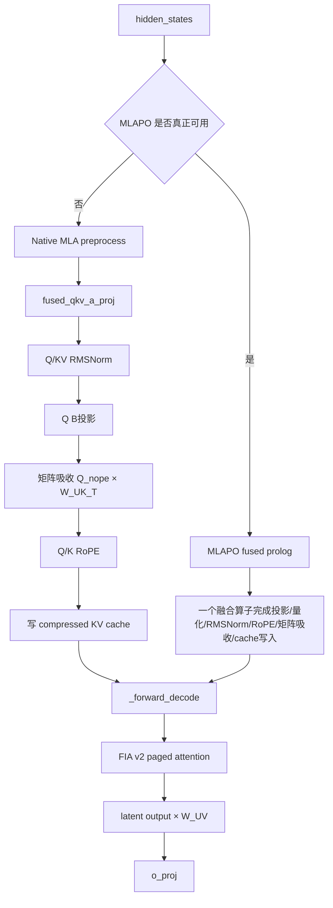
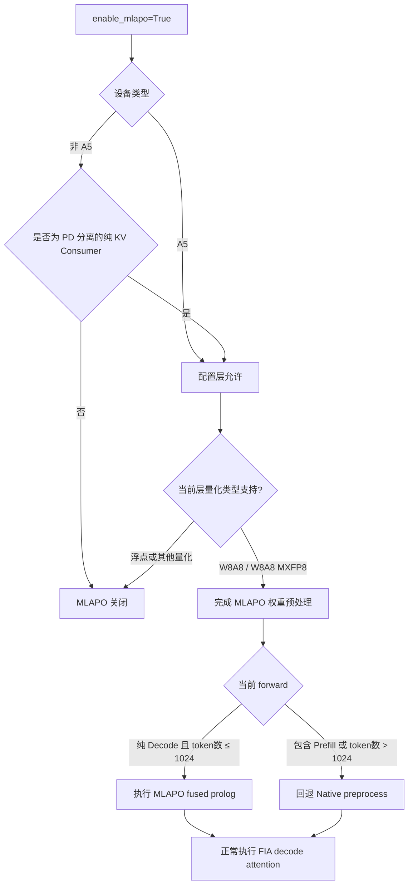
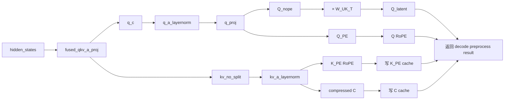
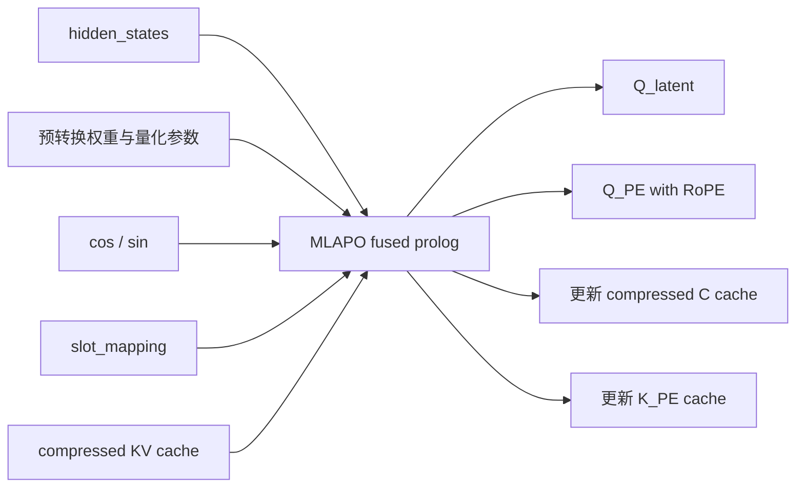
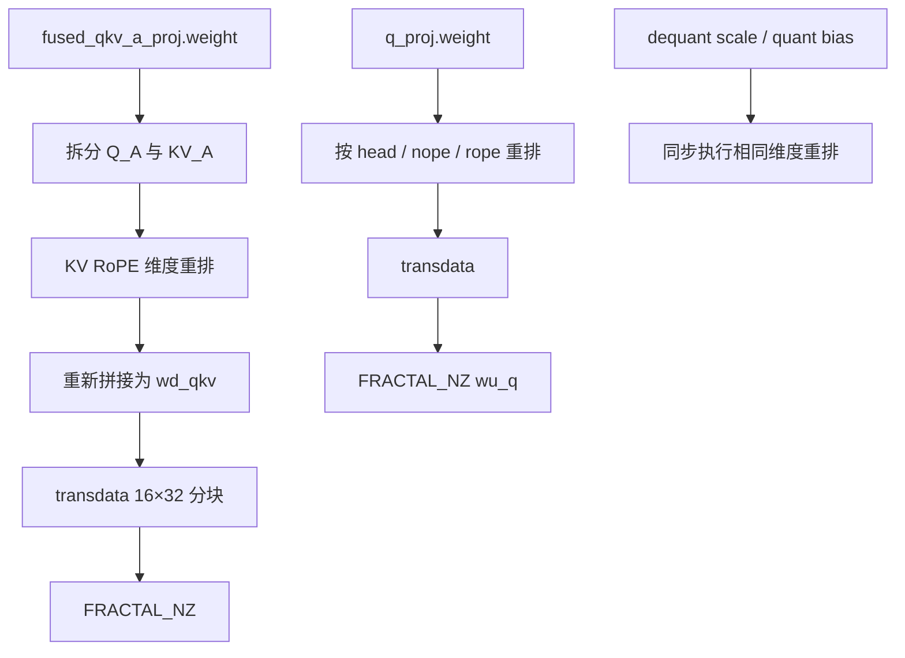

`enable_mlapo` 的核心作用是：把 MLA/SFA decode 前的多段预处理融合成一个 NPU Prolog 算子，减少 kernel launch 和中间张量读写。

它不是新的 attention 算法，也不是“打开矩阵吸收”的开关。矩阵吸收在普通 MLA decode 路径中本来就存在；MLAPO 是进一步把投影、量化、RMSNorm、RoPE、矩阵吸收和 KV cache 写入融合起来。

## 1. 总体位置



也就是说，MLAPO 优化的是下面这段：

```text
hidden_states
    ↓
生成 decode_q_nope / decode_q_pe
    +
写入 decode_k_nope / decode_k_pe cache
```

后续 `_forward_decode()`、FIA attention、`W_UV` 上投影和 `o_proj` 基本不变。

运行入口见 [mla_v1.py:1726](C:/Users/liurong/Desktop/PythonProject/vllm-ascend/vllm_ascend/attention/mla_v1.py:1726)。

## 2. 配置打开不等于运行时一定使用

完整的有效条件如下：



### 第一层：配置条件

默认值为 `True`：

```python
"VLLM_ASCEND_ENABLE_MLAPO": lambda: bool(
    int(os.getenv("VLLM_ASCEND_ENABLE_MLAPO", "1"))
)
```

见 [envs.py:75](C:/Users/liurong/Desktop/PythonProject/vllm-ascend/vllm_ascend/envs.py:75)。

推荐配置方式是：

```bash
--additional-config '{"enable_mlapo": true}'
```

旧环境变量仍然有效：

```bash
VLLM_ASCEND_ENABLE_MLAPO=1
```

但代码已经提示环境变量后续会移除，应优先使用 `additional_config.enable_mlapo`，见 [ascend_config.py:331](C:/Users/liurong/Desktop/PythonProject/vllm-ascend/vllm_ascend/ascend_config.py:331)。

### 第二层：设备与部署拓扑

`enabling_mlapo()` 的判断是：

```python
if device_type == A5:
    return config_val

return config_val and is_decode_instance
```

其中非 A5 的 `is_decode_instance` 要求：

```text
有 kv_transfer_config
且 is_kv_consumer=True
且 is_kv_producer=False
```

见 [utils.py:514](C:/Users/liurong/Desktop/PythonProject/vllm-ascend/vllm_ascend/attention/utils.py:514)。

因此：

| 场景 | 非 A5 | A5 |
|---|---:|---:|
| 普通非 PD 部署 | 不启用 | 可启用 |
| PD 的 Prefill 节点 | 不启用 | 配置层可启用，但 prefill forward 不走快路径 |
| PD 的纯 Decode 节点 | 可启用 | 可启用 |
| 同时 producer + consumer | 不启用 | 可启用 |

### 第三层：量化模型限制

MLA 当前逐层检查：

- `fused_qkv_a_proj` 必须存在。
- 量化方法必须是 `AscendW8A8LinearMethod` 或 `AscendW8A8MXFP8DynamicLinearMethod`。
- 不支持的层会把该层的 `self.enable_mlapo` 改成 `False` 并输出 warning。

见 [mla_v1.py:945](C:/Users/liurong/Desktop/PythonProject/vllm-ascend/vllm_ascend/attention/mla_v1.py:945)。

因此 MLAPO 是逐层生效的：即使全局配置为 `True`，不符合量化条件的层仍然走 native 路径。

### 第四层：运行时限制

MLA fast path 要求：

```python
num_prefills == 0
and num_decode_tokens <= 1024
```

即：

- 必须是纯 decode batch；
- 混合 prefill/decode batch 不走；
- decode token 总数不能超过 1024；
- speculative decoding 可以走，只要总 decode token 数不超过限制。

常量定义见 [mla_v1.py:68](C:/Users/liurong/Desktop/PythonProject/vllm-ascend/vllm_ascend/attention/mla_v1.py:68)。

## 3. Native 与 MLAPO 的具体差别

### Native decode preprocess



对应普通路径中的：

- `_mla_preprocess()`
- `mla_preprocess_decode()`
- `_q_proj_and_k_up_proj()`
- `exec_kv_decode()`

这些步骤由多个 PyTorch/NPU 算子组成。

### MLAPO decode preprocess



融合算子内部整合了：

1. 输入量化。
2. Q/KV A 投影。
3. Q/KV RMSNorm。
4. Q 的 B 投影。
5. `Q_nope × W_UK_T` 矩阵吸收。
6. Q/K 的 RoPE。
7. KV cache 写入。
8. 部分量化/反量化 scale 处理。

因此主要收益来自：

```text
更少的 kernel launch
+ 更少的中间 tensor 落地
+ 更少的 HBM/NPU 显存读写
+ decode 关键路径延迟降低
```

## 4. MLAPO 与矩阵吸收的关系

矩阵吸收公式仍然是：

```text
K_nope = C × W_UK
V      = C × W_UV
```

普通 attention：

```text
score  = Q_nope × K_nope^T
       = Q_nope × (C × W_UK)^T
```

吸收后：

```text
Q_latent = Q_nope × W_UK^T
score    = Q_latent × C^T
```

输出侧：

```text
latent_output = softmax(score) × C
output        = latent_output × W_UV
```

这里需要区分：

```text
矩阵吸收：
改变 MLA decode 的数学计算顺序，避免展开历史 K/V。

MLAPO：
把生成 Q_latent、Q_PE 和写 compressed KV cache 的一系列操作
融合成一个硬件算子。
```

因此：

```text
enable_mlapo=False
    仍然有矩阵吸收
    只是 Q_nope × W_UK_T 由独立算子执行

enable_mlapo=True
    矩阵吸收被融合进 MLAPO Prolog
    减少中间结果和算子调度开销
```

矩阵吸收的独立实现位于 [_q_proj_and_k_up_proj():893](C:/Users/liurong/Desktop/PythonProject/vllm-ascend/vllm_ascend/attention/mla_v1.py:893)。

## 5. 不同硬件的实现

### 非 A5 路径

非 A5 的静态 W8A8 MLAPO 主要使用：

```python
torch.ops._C_ascend.mla_preprocess(...)
```

见 [device_op.py:350](C:/Users/liurong/Desktop/PythonProject/vllm-ascend/vllm_ascend/device/device_op.py:350)。

它使用提前转换好的：

```text
wd_qkv
wu_q
W_UK_T
deq_scale_qkv
quant_bias_qkv
qb_deq_scl
qb_qt_bias
gamma1 / beta1 / gamma2
```

FA quant 分支则调用：

```python
torch_npu.npu_mla_prolog_v2(...)
```

见 [device_op.py:318](C:/Users/liurong/Desktop/PythonProject/vllm-ascend/vllm_ascend/device/device_op.py:318)。

### A5 路径

A5 使用：

```python
torch_npu.npu_mla_prolog_v3(...)
```

见 [device_op.py:1405](C:/Users/liurong/Desktop/PythonProject/vllm-ascend/vllm_ascend/device/device_op.py:1405)。

其特点包括：

- 输入先做 MXFP8 动态量化；
- 权重使用 A5 对应的量化格式；
- 支持 query/KV cache 的量化模式参数；
- cache mode 为 `PA_BSND`；
- 直接返回 `decode_q_nope`、`decode_q_pe` 和量化 scale；
- 同时写入 compressed KV cache。

## 6. 权重预处理

MLAPO 要求权重提前转换成融合算子需要的布局。非 A5 路径会：



见 [_process_weights_for_fused_mlapo():997](C:/Users/liurong/Desktop/PythonProject/vllm-ascend/vllm_ascend/attention/mla_v1.py:997)。

A5 则准备：

```text
weight_dq
weight_uq_qr
weight_dkv_kr
weight_dq_scale
weight_uq_qr_scale
weight_dkv_kr_scale
```

见 [_process_weights_for_fused_mlapo_a5():1069](C:/Users/liurong/Desktop/PythonProject/vllm-ascend/vllm_ascend/attention/mla_v1.py:1069)。

## 7. 显存特性

MLAPO 会额外保存融合算子专用的权重副本、量化 scale 和 bias，因此默认说明明确指出：

```text
MLAPO 可以提高性能，但会消耗更多 NPU 内存。
```

这也是为什么它虽然默认开启，但允许用户在显存优先时关闭。

非 A5 的 PD decode consumer 有一个补偿优化：

```text
如果 max_num_batched_tokens <= 1024：
    删除原始 fused_qkv_a_proj 权重/scale/bias
    删除原始 q_proj 权重/scale/bias
    只保留转换后的 MLAPO 权重
```

见 [mla_v1.py:1053](C:/Users/liurong/Desktop/PythonProject/vllm-ascend/vllm_ascend/attention/mla_v1.py:1053)。

这样做是安全的，因为该节点是 decode consumer，并且调度上限保证不会超过 MLAPO 的 1024-token 限制，不需要再回退到依赖原始权重的路径。

当前 A5 权重处理函数没有同样的原始权重释放逻辑，所以其额外显存开销更直接。

## 8. SFA 中的 enable_mlapo

`enable_mlapo` 也影响 `sfa_v1.py`，但限制更明确：

```text
AscendW8A8LinearMethod
+ enable_mlapo=True
+ 无 sparse C8
+ DecodeOnly/SpecDecoding
+ input tokens <= 1024
→ PreprocessType.MLAPO
```

否则回退 `NATIVE` 或选择 `PROLOG_V3`。选择逻辑见 [sfa_v1.py:643](C:/Users/liurong/Desktop/PythonProject/vllm-ascend/vllm_ascend/attention/sfa_v1.py:643)，运行时回退见 [sfa_v1.py:1498](C:/Users/liurong/Desktop/PythonProject/vllm-ascend/vllm_ascend/attention/sfa_v1.py:1498)。

特别是：

- SFA MLAPO 不支持 sparse C8。
- sparse C8 应走 `PROLOG_V3`。
- SFA 的 MLAPO 注释明确标为 A3、W8A8、最多 1024 tokens。

## 结论

`enable_mlapo` 的主要特性可以归纳为：

| 特性 | 说明 |
|---|---|
| 优化对象 | MLA/SFA decode 前处理 |
| 核心技术 | 多算子融合、预转换权重、量化融合 |
| 是否负责矩阵吸收 | 融合执行矩阵吸收，但矩阵吸收并非由该开关引入 |
| 是否替换 attention | 否，后续仍执行 FIA decode attention |
| 适用阶段 | 纯 decode / speculative decode |
| token 限制 | 总 decode token 数不超过 1024 |
| 量化限制 | MLA 当前层门控接受 W8A8、W8A8 MXFP8；SFA MLAPO 为静态 W8A8 |
| 非 A5 限制 | 仅 PD 分离的纯 KV consumer |
| A5 | 使用 `npu_mla_prolog_v3`，配置层不要求纯 consumer |
| 性能收益 | 减少 kernel launch 和中间张量显存访问，降低 decode 延迟 |
| 代价 | 需要额外的融合格式权重和量化参数，可能增加 NPU 显存占用 |
| 回退策略 | 不满足阶段、token、量化或硬件条件时走 native preprocess |