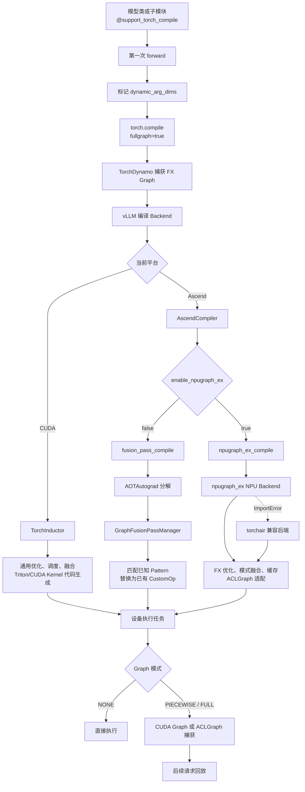

# vLLM-Ascend `npugraph_ex` 编译、融合与 ACLGraph 技术说明

> 分析基线：vLLM-Ascend commit `aa48bd687`，上游 vLLM commit
> `11ba93f36`（2026-08-15）。
>
> 本文基于当前代码的静态分析，说明上游 vLLM 的 `torch.compile` 模型准入、
> TorchInductor 自动融合、vLLM-Ascend 的 `AscendCompiler`、
> `GraphFusionPassManager`、`npugraph_ex` 与 ACLGraph 之间的关系。
> 不同 PyTorch、torch-npu、CANN 和 npugraph_ex 版本可能改变实际优化能力，
> 最终性能和融合结果应通过编译日志、FX Graph、Profiler 和 A/B 测试确认。

## 1. 核心结论

1. 上游 vLLM V1 默认使用 `VLLM_COMPILE` 编译模式。模型通常通过
   `@support_torch_compile` 声明其 `forward` 可以交给 TorchDynamo 捕获。
2. CUDA 平台上的默认编译后端通常是 TorchInductor。Inductor 不仅执行预定义
   Pattern Pass，还会进行依赖分析、调度、通用算子融合和 Triton/CUDA Kernel
   代码生成。
3. vLLM-Ascend 仍然使用上游 `torch.compile` 和 TorchDynamo 作为前端，但明确设置
   `use_inductor=False`，将真正的编译后端替换为 `AscendCompiler`。
4. `enable_npugraph_ex=False` 时，`AscendCompiler` 主要执行 AOTAutograd 分解和
   `GraphFusionPassManager`。它只能将已注册、已匹配的模式替换为已有 NPU
   融合算子，不具备 Inductor 式通用跨算子分析和自动 Kernel 代码生成能力。
5. `enable_npugraph_ex=True` 时，FX Graph 进入 npugraph_ex；不可用时兼容回退到
   torchair。该路径增加默认 FX 优化、已注册融合、图编译适配和缓存能力。
6. 当前 vLLM-Ascend 为 npugraph_ex 配置了 `force_eager=True`、
   `jit_compile=False`；torchair 兼容路径使用 `reduce-overhead` 和
   `run_eagerly=True`。因此默认方案更接近“FX 图优化 + 已有 ACLNN/CustomOp +
   ACLGraph”，不能简单等同于 NPU 版 TorchInductor。
7. ACLGraph 本身主要负责捕获和回放 NPU Task，降低 Python、Dispatcher 和
   Kernel Launch 开销。算子融合主要发生在 ACLGraph 捕获之前。

最简化的能力边界如下：

```text
TorchInductor：
发现融合机会 -> 调度和代价分析 -> 自动生成融合 Kernel

AscendCompiler（enable_npugraph_ex=False）：
预定义融合机会 -> Pattern 命中 -> 替换为已有融合 CustomOp

AscendCompiler（enable_npugraph_ex=True）：
更丰富的 FX 图优化和模式融合 -> 组织已有 NPU Kernel -> ACLGraph 捕获回放
```

## 2. 必须区分的四层能力

“入图”“编译”“融合”和“回放”经常被混为一谈，实际至少包含四层：

| 层次 | 主要组件 | 作用 |
|---|---|---|
| Python 图捕获 | TorchDynamo | 将模型 `forward` 转换为 FX Graph |
| 图结构优化 | Inductor Pass、Ascend Pass、npugraph_ex | 分解、消除、模式替换、图改写 |
| Kernel 编译 | Inductor/Triton 或特定 NPU 编译能力 | 调度计算并生成新的设备 Kernel |
| 任务捕获回放 | CUDA Graph、ACLGraph | 捕获已生成的设备任务并低开销重复执行 |

因此：

- 使用 `torch.compile` 不等于一定完成了算子融合；
- FX Graph 被改写不等于生成了新的融合 Kernel；
- 使用 ACLGraph 不等于 ACLGraph 自动融合了算子；
- 一个图可以由大量已经手工融合好的 CustomOp 组成，即使后端没有通用代码生成；
- 一个模型可以支持 `torch.compile`，但关闭 ACLGraph；也可以只捕获部分执行区间。

## 3. 总体调用链



## 4. 上游 vLLM 如何决定哪些模型可以入图

### 4.1 默认不是中心化模型白名单

在默认 `VLLM_COMPILE` 模式下，上游主要通过模型类上的
`@support_torch_compile` 装饰器声明编译能力。例如 Qwen2 显式声明输入动态维度：

```python
@support_torch_compile(
    dynamic_arg_dims={
        "input_ids": {0: "b"},
        "positions": {-1: "b"},
        "intermediate_tensors": {0: "b"},
        "inputs_embeds": {0: "b"},
    }
)
class Qwen2Model(nn.Module):
    ...
```

DeepSeek 等模型也可以使用无参数形式，由 vLLM 根据 `forward` 类型标注推断动态维度：

```python
@support_torch_compile
class DeepseekV2Model(nn.Module):
    ...
```

装饰器通常位于内部 Transformer backbone，而不一定放在最外层
`ForCausalLM` 上。子类可能继承父类能力，Transformers Backend 也可能在初始化时
动态添加装饰器。

### 4.2 装饰器的作用

`support_torch_compile()` 会把 `TorchCompileWithNoGuardsWrapper` 注入模型类，
在第一次调用时完成：

1. 检查全局编译模式和条件开关；
2. 根据 `dynamic_arg_dims` 调用 `mark_dynamic` 或 `mark_unbacked`；
3. 初始化 vLLM 编译 Backend；
4. 对被装饰的 `forward` 调用 `torch.compile`；
5. 缓存编译 callable，后续请求不再重复执行普通 Python `forward`。

实际调用形式为：

```python
self._compiled_callable = torch.compile(
    self.forward,
    fullgraph=True,
    dynamic=False,
    backend=backend,
    options=options,
)
```

这里 `dynamic=False` 不代表所有输入维度静态。vLLM 已经提前显式标记动态维度，
避免完全依赖 PyTorch 的自动动态 Shape 推断。

### 4.3 阻止入图的条件

即使模型有装饰器，也可能因为以下条件执行 eager：

- `--enforce-eager`；
- `TORCH_COMPILE_DISABLE=1`；
- `CompilationMode.NONE`；
- 类使用 `@ignore_torch_compile`；
- 装饰器的 `enable_if(vllm_config)` 返回 `False`；
- 当前请求设置 `forward_context.skip_compiled`；
- 动态 Python 控制流、Tensor `.item()` 分支或其他不可追踪代码导致
  `fullgraph=True` 捕获失败。

模型没有装饰器时，默认 `VLLM_COMPILE` 不会自动把任意模型强制编译，vLLM 会记录
“模型不支持 `torch.compile`”警告。被单独装饰的内部子模块仍可独立编译。

### 4.4 `fullgraph=True` 与 piecewise 并不冲突

`fullgraph=True` 要求 TorchDynamo 不要因不支持的 Python 代码被动 graph break。
Dynamo 得到完整 FX Graph 后，vLLM Backend 仍可根据 `splitting_ops` 主动切图：

```text
完整模型 forward
  -> Dynamo 捕获完整 FX Graph
  -> vLLM 按 Attention、KV Cache 更新或通信节点切分
  -> 编译多个子图
  -> 对适合的子图进行 Graph 捕获
```

因此“模型可以入图”只表示入口满足 Dynamo 编译约束，不表示最后只有一个 Kernel，
也不表示运行时一定使用一个完整静态 Graph。

### 4.5 `STOCK_TORCH_COMPILE` 是例外

`STOCK_TORCH_COMPILE` 模式下，ModelRunner 直接对顶层模型执行：

```python
self.model.compile(fullgraph=True, backend=backend)
```

该入口不依赖模型装饰器。当前 vLLM V1 默认通常使用 `VLLM_COMPILE`，因此日常模型
适配中最重要的仍是 `@support_torch_compile` 及其动态图声明。

## 5. 上游 TorchInductor 为什么能够自动融合

CUDA 平台使用 Inductor 时，编译流程通常包括：

```text
ATen FX Graph
  -> decomposition / functionalization
  -> graph passes
  -> layout、Shape 和依赖分析
  -> scheduler 与代价判断
  -> vertical / horizontal fusion
  -> Triton/CUDA Kernel codegen
```

例如源图：

```python
x = a * scale
y = x + bias
z = torch.sigmoid(y)
```

可能在满足数据依赖、Shape、别名和资源约束时被自动生成一个融合 Kernel。这个过程
不要求 vLLM 为每一种 `mul + add + sigmoid` 组合单独编写 Pattern。

但自动融合仍有边界：

- CustomOp 对编译器通常是不透明节点；
- Attention、MoE 等复杂路径经常直接使用专用 Kernel；
- 动态控制流、别名、设备同步和 graph break 会限制融合；
- vLLM 的模型专用融合仍然需要显式 Pass 或专用算子。

因此“上游默认自动融合”的准确含义是：进入 Inductor 后，通用优化和 Kernel
代码生成默认由编译器尝试完成，而不是保证所有相邻算子都会被融合。

## 6. vLLM-Ascend 如何接入上游 `torch.compile`

Ascend 没有绕过上游 Dynamo 前端，而是替换编译后端：

```python
@classmethod
def get_pass_manager_cls(cls) -> str:
    return "vllm_ascend.compilation.graph_fusion_pass_manager.GraphFusionPassManager"

@classmethod
def get_compile_backend(cls) -> str:
    return "vllm_ascend.compilation.compiler_interface.AscendCompiler"
```

平台配置还会明确执行：

```python
compilation_config.use_inductor = False
```

所以 Ascend 的关系是：

```text
torch.compile 不是被 enable_npugraph_ex 替代

torch.compile / Dynamo：负责捕获 FX Graph
AscendCompiler：作为 torch.compile 的后端
npugraph_ex：AscendCompiler 内部的一条后端实现路径
ACLGraph：对最终 NPU Task 进行捕获和回放
```

`enable_npugraph_ex` 是编译后端内部选路开关，不是 `torch.compile` 的总开关，
也不是“是否使用 ACLGraph”的唯一开关。

## 7. `enable_npugraph_ex=False`：Pass Manager 路径

关闭 npugraph_ex 后，`AscendCompiler.compile()` 调用
`fusion_pass_compile()`。其核心逻辑可以简化为：

```python
def compile_inner(graph, example_inputs):
    pass_manager = compiler_config[COMPILATION_PASS_KEY]
    graph = pass_manager(graph)
    return graph

compiled_fn = aot_autograd(fw_compiler=compile_inner)(graph, example_inputs)
```

这里最终返回的是改写后的 `GraphModule`，没有继续进入类似 Inductor 的通用：

- Kernel Scheduler；
- 任意 pointwise/reduction 组合分析；
- 访存代价搜索；
- Triton NPU Kernel 代码生成；
- 自动产生全新的融合算子实现。

### 7.1 默认注册的 Ascend Pass

当前 `GraphFusionPassManager` 根据配置注册：

| Pass | 默认开关 | 目标模式 |
|---|---:|---|
| `AddRMSNormQuantFusionPass` | `fuse_norm_quant=True` | RMSNorm 与 Quant 融合 |
| `QKNormRopeFusionPass` | `fuse_qknorm_rope=True` | Q/K Norm 与 RoPE 融合 |
| `MulsAddFusionPass` | `fuse_muls_add=True` | 标量乘法与 Add 融合 |
| Sequence Parallel Pass | 取决于 `enable_sp` | 插入或改写序列并行路径 |
| Sequence Parallel MoE Pass | 取决于 `enable_sp` | 改写 MoE 序列并行路径 |

开关为 `True` 只表示尝试运行 Pass，不表示实际一定融合。Pass 还会检查：

- FX Graph 节点是否严格匹配；
- dtype 和 Shape 是否满足约束；
- 模型结构和 Attention 类型是否适用；
- 当前硬件是否支持对应融合算子；
- 量化方式或并行配置是否兼容。

例如没有注册 `mul -> add -> sigmoid` 的 Pattern 时，Pass Manager 不会像
Inductor 那样自动为其生成一个新 Kernel。

### 7.2 为什么仍不能说“Ascend 完全没有优化”

该路径还有两种重要优化来源：

1. 模型代码直接调用 FlashAttention、RMSNorm、RoPE、MoE、Quant 等已经融合好的
   NPU CustomOp。FX Graph 从一开始就可能只有一个高层融合节点。
2. ACLNN/CANN 在单个算子内部仍可能执行 Tiling、多核调度、Cube/Vector 流水和
   内存搬运优化，但这不等于跨 FX 节点的通用自动融合。

因此准确表述是：该路径缺少 Inductor 式通用跨算子自动代码生成，不是完全没有
任何设备优化。

## 8. `enable_npugraph_ex=True`：npugraph_ex 路径

默认 `AscendCompilationConfig` 中：

```python
enable_npugraph_ex = True
enable_static_kernel = False
fuse_norm_quant = True
fuse_qknorm_rope = True
fuse_muls_add = True
```

`AscendCompiler` 的选择逻辑为：

```python
if ascend_compilation_config.enable_npugraph_ex:
    return npugraph_ex_compile(...)
else:
    return fusion_pass_compile(...)
```

### 8.1 后端选择与兼容回退

`npugraph_ex_compile()` 优先导入 npugraph_ex：

```python
config = npugraph_ex.CompilerConfig()
backend = npugraph_ex.get_npu_backend(compiler_config=config)
compiled_fn = backend(graph, example_inputs)
```

如果环境中没有 npugraph_ex，则因 `ImportError` 回退到：

```python
config = torchair.CompilerConfig()
backend = torchair.get_npu_backend(compiler_config=config)
```

### 8.2 当前 vLLM-Ascend 的默认后端配置

npugraph_ex 路径设置：

```python
torch.npu.set_compile_mode(jit_compile=False)
options = {
    "force_eager": True,
    "inplace_pass": False,
    "clone_input": False,
    "clone_output": False,
}
```

torchair 兼容路径设置：

```python
config.mode = "reduce-overhead"
config.debug.run_eagerly = True
```

代码注释说明 `reduce-overhead` 的目标是使用 ACLGraph 模式，并避免把 FX Graph
完整转换为 Ascend IR。由此可见，默认 npugraph_ex 的主要目标是：

- 在 FX 层执行图结构优化和已注册融合；
- 处理 ACLGraph 所需的输入、输出和 inplace 语义；
- 组织已有 ACLNN、CustomOp 和可能的 Triton NPU Kernel；
- 缓存可序列化的编译 Graph 代码；
- 降低 ACLGraph 捕获和回放路径的框架开销。

它比单纯 Pass Manager 路径更完整，但在当前默认配置下仍不应直接描述为
“任意 ATen 图自动生成融合 NPU Kernel”的 Inductor 等价物。

### 8.3 静态 Kernel

`enable_static_kernel=True` 时，npugraph_ex 会根据 decode ACLGraph capture sizes
配置静态 Kernel 编译的符号值范围。该能力可以进一步减少动态调度开销，但：

- 当前默认关闭；
- 依赖 npugraph_ex、torch-npu 和 CANN 版本；
- 需要为静态 Shape 范围付出编译时间和缓存成本；
- 不代表所有相邻算子都会自动融合。

### 8.4 编译缓存

npugraph_ex 路径可以保存 `compiled_gm.get_code()`。如果 Graph 含有
`triton_kernel_wrapper`，当前代码会跳过跨进程缓存，因为 Triton
`kernel_side_table` 的索引只在当前进程有效。缓存缺失时会重新编译，而不是加载
不可用产物。

## 9. Graph 模式如何影响 `enable_npugraph_ex`

Ascend 平台在 `check_and_update_config()` 中会根据上游 `cudagraph_mode` 归一化配置：

| 最终 Graph 模式 | `torch.compile` | `enable_npugraph_ex` | 主要行为 |
|---|---:|---:|---|
| `NONE` / enforce eager | 关闭 | 强制关闭 | 原始 eager；可能仍直接调用手工融合 CustomOp |
| `PIECEWISE` | `VLLM_COMPILE` | 强制关闭 | vLLM 主动切图；子图走 Pass Manager；ACLGraph 分段捕获 |
| `FULL` | `VLLM_COMPILE` | 默认保留为 `True` | npugraph_ex 优化后执行完整 ACLGraph 捕获 |
| `FULL_DECODE_ONLY` | `VLLM_COMPILE` | 默认保留为 `True` | decode 使用完整图，其他阶段根据运行时模式执行 |
| `FULL_AND_PIECEWISE` | `VLLM_COMPILE` | 当前归一化逻辑会因包含 piecewise 而关闭 | 使用兼容 piecewise 的 Pass Manager 路径 |

具体组合会随上游 `CUDAGraphMode` 演进，判断时应查看最终归一化后的
`compilation_config`，不能只看用户传入值。

一个重要结论是：

> `enable_npugraph_ex=False` 不等于 `torch.compile=False`。

piecewise 模式中，TorchDynamo 和 vLLM Backend 仍然参与，只是 Ascend 后端从
npugraph_ex 切换为 `fusion_pass_compile()`。

## 10. ACLGraph 与算子融合的关系

ACLGraph 负责捕获 NPU Stream 上已经生成的任务序列，例如：

```text
aclnnRmsNorm
aclnnQuant
aclnnMatmul
aclnnAdd
```

如果捕获前没有图优化，上述任务通常仍以原有边界被回放。ACLGraph 的主要收益是：

- 减少 Python 调用；
- 减少 PyTorch Dispatcher 开销；
- 减少 Host 到 Device 的逐算子下发；
- 固化任务拓扑和地址关系；
- 对稳定 decode Shape 重复低开销执行。

如果 Pass 在捕获前把：

```text
RMSNorm -> Quant
```

替换为：

```text
FusedRMSNormQuant
```

那么 ACLGraph 捕获的是已经融合后的任务。正确顺序是：

```text
FX 捕获
  -> 图改写/融合
  -> NPU Kernel 或 ACLNN Task 生成
  -> ACLGraph 捕获
  -> ACLGraph 回放
```

因此不能把“ACLGraph 回放更快”解释为“ACLGraph 自动进行了算子融合”。

## 11. 能力对比

| 能力 | 上游 Inductor | Ascend Pass Manager | npugraph_ex 默认路径 | ACLGraph |
|---|---:|---:|---:|---:|
| Dynamo FX 捕获 | 依赖 | 依赖 | 依赖 | 否 |
| 预定义 Pattern 融合 | 是 | 是 | 是 | 否 |
| 通用 pointwise/reduction 分析 | 是 | 很有限 | 取决于版本，默认不等同 Inductor | 否 |
| 自动生成新融合 Kernel | 是 | 否 | 当前默认路径有限 | 否 |
| 调用已有融合 CustomOp | 是 | 是 | 是 | 仅回放调用结果 |
| 图结构优化 | 是 | 特定 Pass | 是 | 否 |
| 静态 Kernel | Inductor Shape 特化 | 否 | 可选 | 否 |
| 任务捕获与回放 | 配合 CUDA Graph | 配合 ACLGraph | 重点支持 ACLGraph | 是 |
| 降低 Kernel Launch 开销 | 间接 | 间接 | 是 | 是 |

## 12. 常见误区

### 12.1 `enable_npugraph_ex=True` 就会自动融合所有算子

不成立。实际融合仍受到 Pattern、dtype、Shape、CustomOp 边界、后端版本和硬件能力
限制。默认配置还使用 eager ACLNN/ACLGraph 优先的 reduce-overhead 路径。

### 12.2 `enable_npugraph_ex=False` 就是纯 eager

不成立。只要 `CompilationMode` 仍为 `VLLM_COMPILE`，Dynamo 仍捕获 FX Graph，
AOTAutograd 和 `GraphFusionPassManager` 仍会运行，只是没有 npugraph_ex 后端优化。

### 12.3 ACLGraph 会把连续算子自动合并成一个 Kernel

不成立。ACLGraph主要捕获和回放既有任务。跨算子融合通常应在捕获之前由
Inductor、npugraph_ex、Pass Manager 或模型 CustomOp 完成。

### 12.4 Pass开关为 `True` 就代表已经融合

不成立。开关只是允许 Pass 尝试匹配。是否命中必须检查 FX Graph、编译日志或
Profiler 中的实际算子序列。

### 12.5 Ascend没有Inductor，所以没有任何编译优化

不成立。Ascend仍有 FX Graph 改写、模式融合、已有融合 CustomOp、ACLNN/CANN
单算子优化、可选静态 Kernel 和 ACLGraph。但它缺少的是 Inductor 式通用跨算子
自动调度与代码生成，而不是所有优化能力。

## 13. 如何验证实际是否发生融合

仅凭配置推断不够，建议按以下层次验证。

### 13.1 检查最终配置

确认日志或运行时对象中的：

- `compilation_config.mode`；
- `cudagraph_mode`；
- `use_inductor`；
- `enable_npugraph_ex`；
- `enable_static_kernel`；
- `fuse_norm_quant`、`fuse_qknorm_rope`、`fuse_muls_add`；
- `splitting_ops` 和实际 compile ranges。

必须检查平台归一化后的最终值，而不是只检查 CLI 输入。

### 13.2 对比Pass前后FX Graph

重点确认：

- 原始节点组合是否存在；
- Pattern Pass 是否命中；
- 是否替换为目标融合 CustomOp；
- 是否被未预期的 graph break 或 CustomOp 边界隔断。

### 13.3 检查Profiler任务序列

例如验证：

```text
RMSNorm + Quant
```

是否变为单个融合算子，以及 replay 阶段是否仍出现原有两个 Kernel。

### 13.4 做分层A/B测试

建议至少比较：

| 组别 | 编译与图配置 | 验证目的 |
|---|---|---|
| A | eager | 建立正确性和性能基线 |
| B | Pass Manager，ACLGraph关闭 | 单独评估模式融合 |
| C | Pass Manager + piecewise ACLGraph | 评估回放收益 |
| D | npugraph_ex + full ACLGraph | 评估完整图优化和回放 |
| E | npugraph_ex + static kernel | 评估静态Kernel额外收益 |

所有组应保持模型、dtype、量化、TP/DP/EP、batch、prompt、decode长度、采样参数和
CANN版本一致，并同时检查：

- 首次编译和 warmup 时间；
- TTFT、TPOT、吞吐；
- HBM占用和 Graph资源；
- 实际Kernel数量和Device时间；
- 精度一致性；
- 动态Shape、混合prefill/decode和异常回退行为。

## 14. 代码索引

### 上游 vLLM

| 主题 | 文件 |
|---|---|
| 编译模式、PassConfig、Graph模式 | `vllm/config/compilation.py` |
| 平台和模型配置归一化 | `vllm/config/vllm.py` |
| `support_torch_compile` 装饰器 | `vllm/compilation/decorators.py` |
| `torch.compile(fullgraph=True)` 包装 | `vllm/compilation/wrapper.py` |
| vLLM分图与编译Backend | `vllm/compilation/backends.py` |
| STOCK编译入口 | `vllm/v1/worker/gpu_model_runner.py` |
| Qwen2编译声明示例 | `vllm/model_executor/models/qwen2.py` |
| DeepSeek编译声明示例 | `vllm/model_executor/models/deepseek_v2.py` |

### vLLM-Ascend

| 主题 | 文件 |
|---|---|
| `use_inductor=False`、后端注册和模式归一化 | `vllm_ascend/platform.py` |
| `AscendCompilationConfig` 默认值 | `vllm_ascend/ascend_config.py` |
| `AscendCompiler`、两条编译路径和缓存 | `vllm_ascend/compilation/compiler_interface.py` |
| 默认图融合Pass注册 | `vllm_ascend/compilation/graph_fusion_pass_manager.py` |
| Norm与Quant融合 | `vllm_ascend/compilation/passes/norm_quant_fusion_pass.py` |
| QK Norm与RoPE融合 | `vllm_ascend/compilation/passes/qknorm_rope_fusion_pass.py` |
| Muls与Add融合 | `vllm_ascend/compilation/passes/muls_add_pass.py` |
| Pattern向Pass和npugraph_ex注册 | `vllm_ascend/compilation/passes/base_pattern.py` |
| ACLGraph捕获和回放 | `vllm_ascend/compilation/acl_graph.py` |

## 15. 总结

上游 vLLM 与 vLLM-Ascend 共享 `torch.compile -> Dynamo -> FX Graph` 的前端，
差异主要在编译后端：

- CUDA/Inductor具备更通用的算子分析、调度、融合和Kernel代码生成能力；
- Ascend关闭npugraph_ex时，主要依赖已注册Pattern和已有融合CustomOp；
- npugraph_ex增强了FX图优化、模式融合、缓存和ACLGraph适配，但当前默认配置更偏向
  reduce-overhead，而不是完整的Ascend IR自动代码生成；
- ACLGraph解决的是低开销重复执行，不能替代编译期算子融合。

因此，对 vLLM-Ascend 性能路径最准确的描述是：

```text
模型显式使用高性能NPU算子
  + Pass/npugraph_ex在捕获前改写FX Graph
  + ACLGraph在运行时低开销回放
```

三者是相互配合的不同层次，不应将其中任意一个单独等同于完整的自动编译优化。
