# vLLM-Ascend 量化机制与代码流程汇总

> 本文基于当前 `vllm-ascend` 源码，集中整理以下问题：
>
> - MLA Attention 的量化流程，以及 `fa_quant_layer` 与普通 Linear 量化的区别；
> - 一般模型如何确定哪些 MatMul 适合量化；
> - 权重量化是否属于静态量化，以及权重从 checkpoint 到 NPU 算子的完整生命周期；
> - vLLM-Ascend 不同 `QuantMethod`/Scheme 的适配职责；
> - MoE 非量化与量化的 `permute → dispatch → GMM → combine` 流程；
> - MoE 量化中激活、权重和 Scale 如何随路由、通信和 GMM 流动。

## 1. 核心结论

vLLM-Ascend 中通常采用：

```text
权重：离线静态量化
激活：运行时静态或动态量化
KV Cache：在 Attention backend 中按写入/读取路径量化和反量化
通信数据：部分 MoE dispatch/combine 路径可额外量化
```

“模型量化”不是简单地把所有 MatMul 都换成 INT8/FP8。一个计算是否量化，需要同时考虑：

1. 是否是计算量或权重访存占比较高的 MatMul；
2. NPU 是否有对应量化算子；
3. 输入、权重、Scale、bias 和输出 dtype 是否能匹配算子接口；
4. 量化误差是否可接受；
5. 动态量化、反量化和格式转换开销能否被计算收益覆盖；
6. TP、EP、QKV/gate-up 融合、MoE 路由等分片语义是否能正确适配。

量化权重通常已经由 ModelSlim、LLM Compressor 等离线工具生成。vLLM-Ascend 的主要职责不是重新决定权重量化参数，而是：

```text
识别量化格式
→ 创建匹配 checkpoint 的 Parameter
→ 完成 TP/EP shard 和 fused-weight 映射
→ 转置、打包、NZ 格式转换
→ 整理 Scale/Offset/Bias
→ 在 forward 中调用 Ascend 量化算子
```

## 2. vLLM-Ascend 量化架构

### 2.1 Adapter 与 Scheme 两层结构

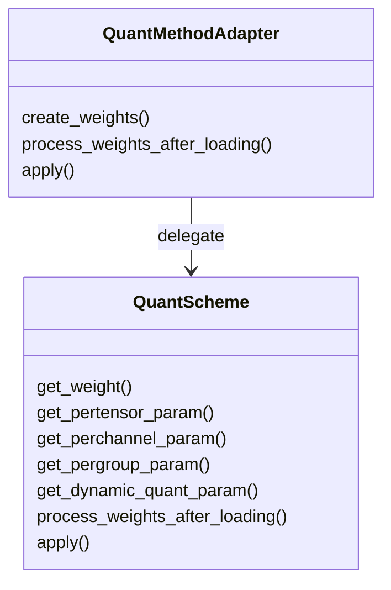

外层 Adapter 位于 `vllm_ascend/quantization/method_adapters.py`：

- `AscendLinearMethod`：适配普通 Linear、Row/Column Parallel Linear；
- `AscendFusedMoEMethod`：适配 Fused MoE 权重和专家 Scale；
- `AscendKVCacheMethod`：适配 Attention、FA 和 KV Cache 量化；
- `AscendEmbeddingMethod`：复用 Linear 的参数注册规则。

内层 Scheme 位于 `vllm_ascend/quantization/methods/`，负责具体量化格式。例如：

```text
AscendW8A8LinearMethod
AscendW8A8DynamicLinearMethod
AscendW8A16LinearMethod
AscendW4A4MXFP4DynamicLinearMethod
AscendW8A8DynamicFusedMoEMethod
AscendW4A8DynamicFusedMoEMethod
AscendW4A16FusedMoEMethod
```

可以把职责概括为：

```text
Adapter：如何接入 vLLM 的 Parameter、TP loader 和统一 QuantMethod 接口
Scheme：该量化格式有哪些张量、如何后处理、forward 调用哪个 NPU 算子
```

### 2.2 QuantMethod 选择

ModelSlim 配置入口主要位于 `vllm_ascend/quantization/modelslim_config.py`，Compressed-Tensors 入口位于 `compressed_tensors_config.py`。

```mermaid
flowchart TD
    A["layer + prefix + quant config"] --> B{"Layer 类型"}
    B -->|"Linear"| C["解析 Linear Scheme"]
    B -->|"FusedMoE"| D["解析 MoE Scheme"]
    B -->|"Attention"| E["解析 Attention/KV Scheme"]
    B -->|"Embedding"| F["解析 Embedding Scheme"]
    C --> G{"该层是否 FLOAT/skipped"}
    D --> G
    G -->|"是"| H["UnquantizedMethod"]
    G -->|"否"| I["get_scheme_class(quant_type, layer_type)"]
    I --> J["Adapter(Scheme)"]
```

同一个模型可以逐层选择不同 Scheme。被量化配置标为 `FLOAT` 的层会回退到非量化 Method。

## 3. 如何判断哪些 MatMul 应量化

### 3.1 优先量化的计算

一般优先考虑：

- Attention 的 Q/K/V/O projection；
- MLP 的 gate/up/down projection；
- MoE 的专家 `W13` 和 `W2` GMM；
- 大词表 LM Head（硬件和精度允许时）；
- Decode 中频繁读取、权重带宽占比较高的矩阵乘。

这些计算通常满足至少一项：计算量大、权重体积大、HBM 带宽压力高、量化算子成熟。

### 3.2 通常不直接量化的计算

- RMSNorm/LayerNorm；
- Softmax；
- RoPE；
- 小尺寸逐元素算子；
- 对误差敏感但计算占比很小的 projection；
- 没有匹配 NPU kernel、量化前后需要频繁转换的算子。

### 3.3 决策流程

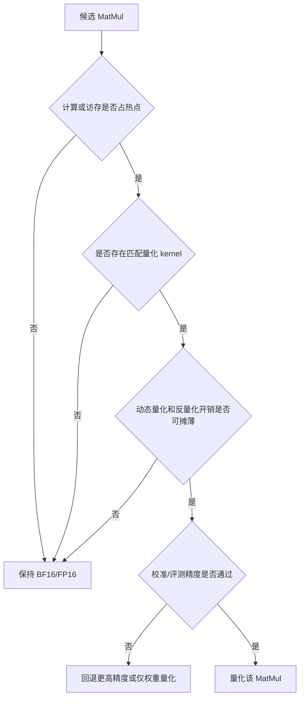

因此实际量化配置通常是混合精度：部分层 W8A8、部分层 W4A16/MXFP，敏感层保留 BF16。

## 4. 权重加载与处理的完整生命周期

### 4.1 总体流程

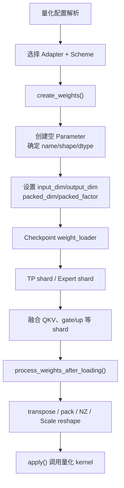

### 4.2 `create_weights()` 只创建接收容器

以 W8A8 Dynamic Linear 为例：

```python
def get_weight(input_size, output_size, params_dtype):
    return {
        "weight": torch.empty(
            output_size,
            input_size,
            dtype=torch.int8,
        )
    }
```

这里没有把浮点权重量化成 INT8，只是创建一个与 checkpoint 匹配的目标 Parameter。

Linear Adapter 将参数分成四类：

| 参数类别 | Scheme 接口 | 常见参数 |
|---|---|---|
| 主权重 | `get_weight()` | `weight`、`weight_packed` |
| Per-tensor | `get_pertensor_param()` | `input_scale`、`input_offset` |
| Per-channel | `get_perchannel_param()` | `weight_scale`、`weight_offset`、`deq_scale` |
| Per-group | `get_pergroup_param()` | MXFP/group-wise `weight_scale` |

MoE Scheme 使用：

```text
get_weight()
get_dynamic_quant_param()
```

这里 `dynamic_quant_param` 中的 `w13_weight_scale` 等通常仍然是 checkpoint 加载的静态权重参数。“动态”主要指 forward 的激活动态量化。

### 4.3 TP 和 packed loader 元数据

Linear 主权重通常设置：

```python
input_dim = 1
output_dim = 0
```

它告诉 loader：

- Column Parallel 通常按输出维切；
- Row Parallel 通常按输入维切；
- fused QKV/gate-up 根据 `shard_id` 写入目标 Parameter 的不同区域。

INT4 packed 权重还需要：

```text
packed_dim
packed_factor
```

例如一个 INT32 保存 8 个 INT4 时，逻辑 K 维切片必须除以 8，不能直接按物理 Tensor shape 处理。

### 4.4 Linear fused-weight 加载

checkpoint 可能分别保存：

```text
gate_proj.weight
up_proj.weight
```

模型内部则注册：

```text
gate_up_proj.weight
```

loader 根据 `shard_id` 把 gate 写入前半、up 写入后半。`weight_scale`、`weight_offset` 也必须执行完全相同的融合和 TP 切分。

### 4.5 MoE expert 权重加载

checkpoint 通常按专家保存：

```text
experts.E.gate_proj.weight
experts.E.up_proj.weight
experts.E.down_proj.weight
```

Ascend MoE 注册的是：

```text
w13_weight[E, ...]
w2_weight[E, ...]
```

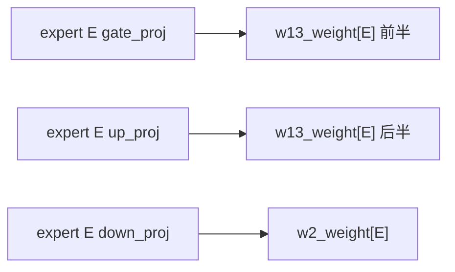

Scale、offset、scale_bias 必须使用相同的 Expert/projection 映射。EP/EPLB 场景还可能执行逻辑 Expert ID 到本地物理 Expert ID 的映射。

### 4.6 `process_weights_after_loading()`

所有 checkpoint 数据加载完后，`patch/worker/patch_process_weights_after_loading.py` 遍历模块并调用 QuantMethod 后处理。

这一阶段可以：

- 转置权重；
- 转 NZ/Fractal 物理格式；
- INT4 unpack、转置后重新 pack；
- flatten/reshape Scale；
- 生成 reciprocal scale、FP32 Scale view；
- 生成 `deq_scale`、`scale_bias`、全零 offset；
- 拆出 per-expert tensor list；
- 删除不再需要的原始 Parameter。

CPU offload 场景通过 `device_loading_context` 暂时把参数移到目标 NPU 上处理。

## 5. 典型 Linear QuantMethod 的权重处理

### 5.1 W8A8 Dynamic

加载布局：

```text
weight        [N,K] INT8
weight_scale  [N,1]
weight_offset [N,1]
```

后处理：

```text
weight [N,K]
→ transpose [K,N]
→ maybe_trans_nz

weight_scale [N,1]  → flatten [N]
weight_offset [N,1] → flatten [N]
→ 额外生成 weight_scale_fp32
```

运行时：

```text
BF16 activation
→ npu_dynamic_quant
→ INT8/FP8 activation + per-token scale
→ npu_quant_matmul
```

### 5.2 W8A8 Static

除权重参数外还加载：

```text
input_scale
input_offset
quant_bias
deq_scale
```

后处理将标量输入 Scale/Offset 沿 K 维展开，并生成 reciprocal：

```text
input_scale → aclnn_input_scale
            → aclnn_input_scale_reciprocal
input_offset → aclnn_input_offset
```

Compressed-Tensors 路径可计算：

```text
deq_scale = input_scale × weight_scale
```

### 5.3 W8A16

```text
Weight INT8
Activation BF16/FP16
```

后处理仍是 transpose、NZ、Scale/Offset flatten；forward 使用 `npu_weight_quant_batchmatmul`，通过 `antiquant_scale/offset` 在 kernel 内解释低精度权重，不量化激活。

### 5.4 W4A4 LAOS/FlatQuant

LAOS 路径将权重转为 NPU INT4 pack 格式，再转置。FlatQuant 除权重外还加载：

```text
left_trans
right_trans
clip_ratio
```

后处理可能：

- 注册 `weight_packed` 并删除原 `weight`；
- 转置变换矩阵；
- Row Parallel 下提取当前 TP Rank 对应的对角块；
- 将 `clip_ratio` 转为算子使用的标量。

## 6. INT4 与 MXFP 权重后处理

### 6.1 为什么 packed INT4 不能直接 transpose

若一个 INT32 保存 8 个 INT4：

```text
逻辑矩阵 [N,K]
物理矩阵 [N,K/8]
```

直接对物理矩阵 transpose 得到 `[K/8,N]`，并不等价于所需逻辑布局 `[K,N/8]`。因此 W4A16 MoE 必须：

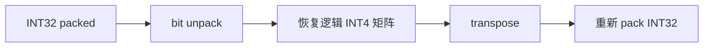

### 6.2 W4A8 的 ModelSlim 与 Compressed-Tensors 差异

ModelSlim 格式通常已经把两个 INT4 打包进一个 INT8，并提供 `scale_bias`。

Compressed-Tensors 路径可能以一个 INT8 暂存一个 INT4 值，因此后处理需要：

1. 计算 Ascend 表示需要的补偿 `scale_bias`；
2. 把两个 INT4 pack 到一个 INT8；
3. 再转置、转 NZ，并按算子接口整理 Scale。

代码中的补偿近似为：

```text
scale_bias = 8 × sum(weight × scale, dim=K)
```

它用于补偿 INT4 表示域/零点变换带来的常数项。

### 6.3 MXFP

MXFP 权重通常采用 FP8 或 packed FP4，Scale 使用 E8M0，并常以 `uint8` 保存。

典型布局变化：

```text
weight [N,K] → [K,N]

weight_scale [N,K/group]
→ [N,K/group/2,2]
→ [K/group/2,N,2]
```

最后的维度 `2` 表示两个相邻 E8M0 Scale 的物理组合。

W4A8/W4A4 MXFP 的 FP4 权重通常以一个 `uint8` 保存两个 FP4，通过 `npu_format_cast` 的自定义 dtype/format 让 NPU kernel 按 packed FP4 解释底层数据。

W4A16 MXFP4 MoE 的特殊路径为：

```text
UINT8 packed FP4
→ 拆高低 4 bit
→ 映射为 FP4 E2M1 数值
→ 临时 Float32
→ transpose
→ NPU format cast
→ 重新 INT4 pack
```

临时 Float32 只是为了正确完成逻辑转置和格式编码，最终推理权重仍为低比特打包格式。

## 7. Attention/MLA 量化流程

### 7.1 普通 Linear 量化与 FA Quant 的区别

普通 Linear QuantMethod 的目标是：

```text
X × W → Y
```

它管理：

- 量化权重；
- weight scale/offset；
- 激活动态或静态量化；
- `npu_quant_matmul`/`npu_weight_quant_batchmatmul`。

`fa_quant_layer` 则属于 Attention 数据通路量化，目标不是替换某一个普通 Linear，而是为 Flash Attention/MLA 准备量化 Q/K/V 或 KV Cache 所需的 Scale、Offset 和描述参数。

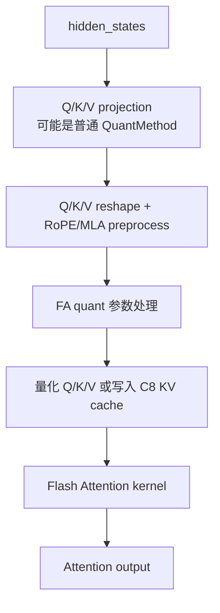

区别可以概括为：

| 对比项 | 普通 Linear 量化 | FA/KV 量化 |
|---|---|---|
| 作用对象 | Linear MatMul | Attention 输入或 KV Cache |
| 权重 | 主要管理量化矩阵权重 | 可能没有大矩阵权重 |
| 参数 | weight/input scale、offset | Q/K/V scale、KV cache scale/offset |
| 调用位置 | Linear `apply()` | Attention backend/preprocess |
| 生命周期 | 每次 Linear forward | KV 写入、Attention 计算和 cache 读取 |

### 7.2 FA/KV 参数加载

FA Quant 会创建类似：

```text
fa_q.scale / fa_q.offset
fa_k.scale / fa_k.offset
fa_v.scale / fa_v.offset
```

其自定义 loader 按 Head/TP Rank 切分。后处理再生成：

```text
fak_descale
fak_descale_reciprocal
fak_offset
quant_kscale
```

C8 KV Cache 创建：

```text
k_cache_scale / k_cache_offset
v_cache_scale / v_cache_offset
```

真正的 KV 量化通常由 Attention backend 完成，而不是普通 Linear QuantMethod 的 `apply()`。

### 7.3 MLA 中的量化数据流

MLA 通常包含多个投影和 Attention 专用预处理：

```text
hidden_states
→ Q/KV projection
→ RMSNorm
→ Q B projection
→ RoPE
→ compressed KV cache
→ Attention
→ latent output projection
→ o_proj
```

其中 projection 可使用普通 Linear QuantMethod；FA/KV Cache 量化则位于 MLA preprocess/Attention backend。MLAPO 可以进一步把部分 projection、RMSNorm、量化、RoPE、矩阵吸收和 cache 写入融合进 prolog 算子，但 MLAPO 本身不是一种新的量化格式。

## 8. MoE 非量化代码流程

MoE 外层统一框架为：

```text
prepare
→ router top-k
→ quant_method.apply
→ token_dispatch
→ unified_apply_mlp
→ token_combine
→ finalize
```

不同通信后端的融合边界不同。

### 8.1 AllToAll：完整的双 Permute 流程

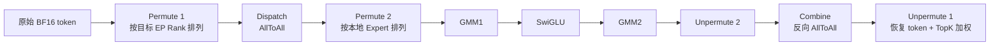

各阶段含义：

1. `Permute 1`：一个 token 按 TopK 复制 K 份，按目标 Rank/Expert 排序；
2. `Dispatch`：把 token 发到持有目标专家的 Rank；
3. `Permute 2`：接收后按本地 Expert 再排序，使同一专家的 token 连续；
4. GMM：根据 `group_list` 一次处理多个专家；
5. `Unpermute 2`：撤销本地 Expert 排列；
6. `Combine`：反向 AllToAll，把专家输出发回 token 原 Rank；
7. `Unpermute 1`：恢复原 token 顺序，并按 `topk_weights` 加权求和。

非量化 GMM：

```text
Y1[e] = X[e] × W13[e]
A[e]  = SwiGLU(Y1[e])
Y2[e] = A[e] × W2[e]
```

`group_list` 指明每个专家对应多少行，因此不需要 Python 逐专家循环。

### 8.2 AllGather

AllGather 不是定向 dispatch，而是先收集 token，再由各 Rank 筛选本地专家：

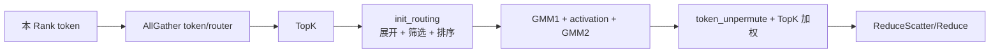

### 8.3 MC2/Fused MC2

MC2 把 expand、permute、AllToAll 和可选通信量化融合到 `npu_moe_distribute_dispatch`；combine 端融合反向通信、unpermute 和 TopK 合并。

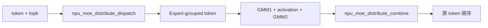

Fused MC2/mega_moe 可以继续把 dispatch、FFN 和 combine 合为一个算子。Python 中看不到显式 permute，不代表逻辑不存在，而是已经进入融合 kernel。

## 9. MoE 量化流程

### 9.1 AllToAll 量化数据流

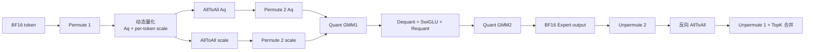

关键约束：

```text
token 进行任何 permute/dispatch
对应 per-token scale 必须执行完全相同的 permute/dispatch
```

否则 token A 会错误使用 token B 的 Scale。

### 9.2 Quant GMM

典型 W8A8/W4A8/MXFP MoE MLP：

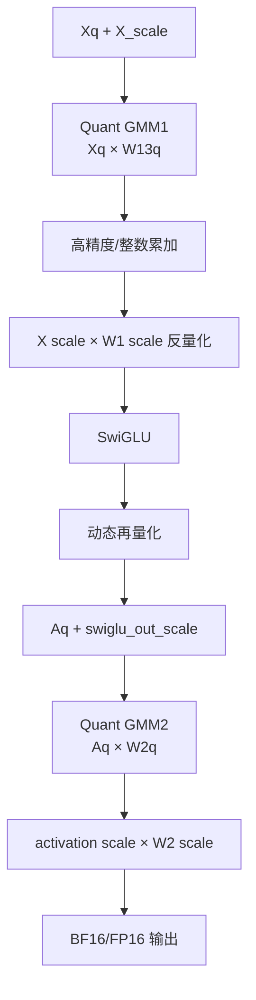

抽象计算：

```text
Zq = Xq × W13q
Z  ≈ Zq × Sx × Sw13
A  = SwiGLU(Z)
Aq = Quant(A / Sa)
Yq = Aq × W2q
Y  ≈ Yq × Sa × Sw2
```

部分路径使用 `npu_dequant_swiglu_quant` 或 GMM+SwiGLU+Requant 融合算子，减少 BF16 中间结果写回 HBM。

### 9.3 哪些 MoE 类型会量化 dispatch 数据

| 类型 | Dispatch 激活量化 | 常见通信 dtype |
|---|---:|---|
| W8A8 | 是 | INT8 |
| W4A8 | 是 | INT8 |
| W8A8 MXFP | 是 | FP8 |
| W4A8 MXFP | 是 | FP8 |
| W4A4 MXFP | 是 | packed FP4 |
| W8A8 FP | 是 | FP8 |
| W4A16 | 否 | BF16/FP16 |
| W4A16 MXFP | 否 | BF16/FP16 |
| 非量化 | 否 | BF16/FP16 |

所以：

```text
模型使用量化权重 ≠ dispatch 一定使用量化通信
```

W4A16 只量化权重，激活保持 BF16，因此 dispatch 不需要携带 activation per-token scale。

### 9.4 MC2 通信量化

MC2 中通信量化由融合算子的 `quant_mode/comm_quant_mode` 控制。典型语义为：

```text
0：不做通信量化
2：传统 INT 通信量化
4：A5 MXFP 通信量化
```

这属于“通信数据量化”，与专家权重采用 W8/W4 是两个不同维度。

## 10. 权重参数来源总结

| 参数 | 通常来源 | 典型例外 |
|---|---|---|
| `weight`/`weight_packed` | checkpoint | 无 |
| `weight_scale` | checkpoint | 某些格式可能创建默认值 |
| `weight_offset` | checkpoint | 对称量化可创建全零 offset |
| 静态 `input_scale` | checkpoint/calibration | 动态量化运行时生成 |
| `pertoken_scale` | forward 动态生成 | 不属于模型 Parameter |
| `deq_scale` | checkpoint 或派生 | 可由 input scale × weight scale 计算 |
| `quant_bias` | checkpoint 或派生 | 视量化格式而定 |
| `scale_bias` | ModelSlim checkpoint | W4A8 CT 路径后处理计算 |
| `fused_w*_scale` | 后处理生成 | Fused MC2 专用编码 |
| `*_scale_fp32` | 后处理生成 | kernel/精度适配 view |

## 11. 量化收益和代价

### 收益来源

1. **权重容量下降**：W8/W4 显著减少 MoE/MLP 大权重占用；
2. **HBM 带宽下降**：Decode 常受权重读取带宽限制；
3. **MatMul/GMM 吞吐提高**：利用 INT8、FP8、FP4 Cube 能力；
4. **MoE 通信量下降**：dispatch 采用 INT8/FP8 时，token payload 通常约为 BF16 的一半；
5. **融合减少中间张量**：dequant、activation、requant 融合可减少 HBM 读写和 kernel launch。

### 额外代价

- 动态量化和 Scale 计算；
- Scale 的存储、permute 和通信；
- INT4 unpack/repack 和格式转换的加载期开销；
- 低 batch/小矩阵下量化开销可能无法摊薄；
- 精度损失以及敏感层回退；
- TP/EP/fused-weight loader 的复杂性；
- reload 权重前可能需要恢复原 checkpoint layout。

## 12. 最终统一理解

vLLM-Ascend 的量化应从三个独立维度理解：

```text
1. 权重量化
   checkpoint 中保存 W8/W4/FP8/FP4 + weight scale

2. 计算量化
   Linear/GMM forward 中对 activation 动态或静态量化
   调用 npu_quant_matmul、quant GMM 等算子

3. 数据通路量化
   FA/KV Cache 量化
   MoE dispatch/combine 通信量化
```

完整链路为：

```text
离线量化工具生成 checkpoint
→ QuantConfig 选择 Scheme
→ Adapter 创建 Parameter 和 loader 元数据
→ loader 完成 TP/EP shard 与 fused-weight 映射
→ process_weights_after_loading 转换为 NPU kernel 布局
→ forward 动态/静态量化 activation
→ Quant Linear / Quant GMM / Attention kernel
→ 必要位置反量化或继续以低精度通信、缓存
```

这也是理解 vLLM-Ascend 各种 `QuantMethod` 的关键：它们不仅决定“用多少 bit”，更重要的是在 checkpoint 表示、vLLM 分片语义和 Ascend kernel 物理布局之间建立正确映射。

## 13. 主要代码索引

- `vllm_ascend/quantization/method_adapters.py`：Linear/MoE/KV Adapter；
- `vllm_ascend/quantization/methods/base.py`：Scheme 抽象接口；
- `vllm_ascend/quantization/modelslim_config.py`：ModelSlim QuantMethod 选择；
- `vllm_ascend/quantization/compressed_tensors_config.py`：Compressed-Tensors Scheme 选择；
- `vllm_ascend/quantization/methods/w8a8_static.py`：静态 W8A8；
- `vllm_ascend/quantization/methods/w8a8_dynamic.py`：动态 W8A8 Linear/MoE；
- `vllm_ascend/quantization/methods/w8a16.py`：W8A16 权重量化；
- `vllm_ascend/quantization/methods/w4a8.py`：W4A8 MoE 与两种 checkpoint 格式；
- `vllm_ascend/quantization/methods/w4a16.py`：INT32 packed W4A16 MoE；
- `vllm_ascend/quantization/methods/w8a8_mxfp8.py`：MXFP8 Linear/MoE；
- `vllm_ascend/quantization/methods/w4a4_mxfp4.py`：MXFP4 Linear/MoE；
- `vllm_ascend/quantization/methods/w4a8_mxfp4.py`：W4A8 MXFP；
- `vllm_ascend/quantization/methods/w4a16_mxfp4.py`：W4A16 MXFP；
- `vllm_ascend/quantization/methods/kv_c8.py`：FA/KV Cache C8 参数；
- `vllm_ascend/patch/worker/patch_process_weights_after_loading.py`：统一加载后处理入口；
- `vllm_ascend/ops/fused_moe/routed_experts.py`：MoE 外层 forward；
- `vllm_ascend/ops/fused_moe/moe_comm_method.py`：dispatch → MLP → combine 统一框架；
- `vllm_ascend/ops/fused_moe/token_dispatcher.py`：AllGather/AllToAll/MC2 路由通信；
- `vllm_ascend/ops/fused_moe/moe_mlp.py`：量化与非量化 GMM；
- `vllm_ascend/attention/mla_v1.py`：MLA Attention、矩阵吸收及量化相关处理。
