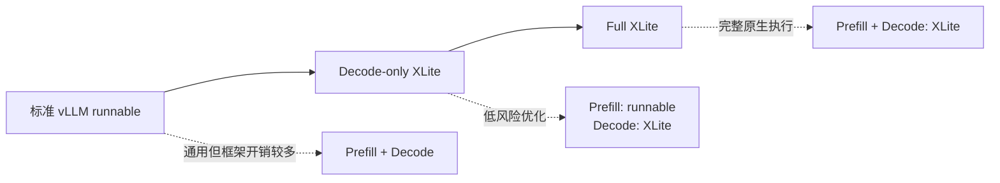
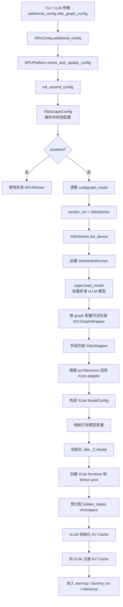
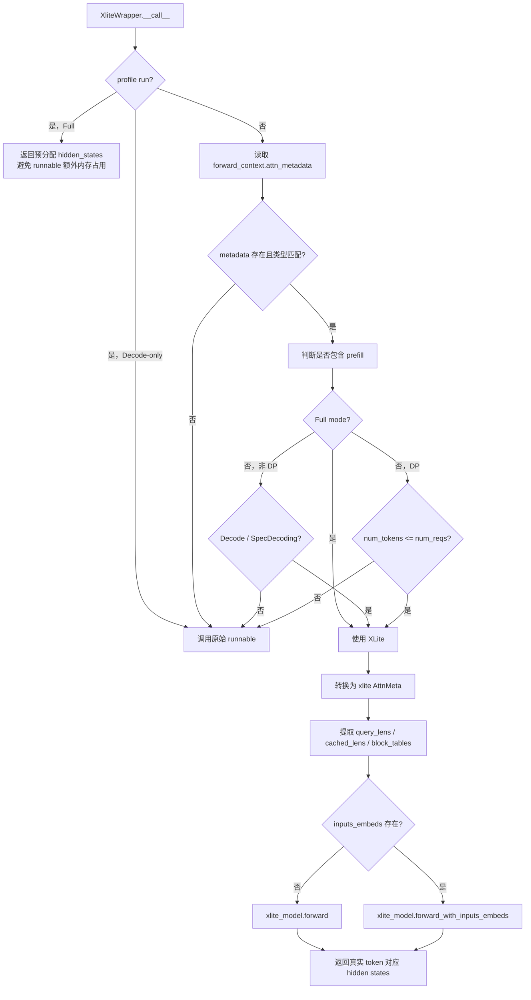

# vLLM-Ascend `xlite_graph_config` 技术分析

> 分析基线：vLLM-Ascend commit `aa48bd687`（2026-08-15）。
>
> 本文基于当前仓库静态代码分析，总结 XLite 的方案定位、`xlite_graph_config` 配置语义、初始化与运行时流程、相对 ACLGraph 的优势、现有限制及改进建议。性能收益属于架构层面的预期，实际部署仍需结合模型、硬件、并行策略和流量特征进行 A/B 测试。

## 1. 核心结论

`xlite_graph_config` 不是普通的 ACLGraph 参数，而是一个**模型执行后端切换配置**。启用后，vLLM-Ascend 仍先通过标准 vLLM 路径加载模型和权重，然后用 `XliteWrapper` 包装模型，在每次 forward 时选择：

- 调用 XLite 原生 Runtime；
- 或回退到原始 vLLM runnable。

XLite 与 ACLGraph 的本质区别是：

```text
ACLGraph：捕获并重放已有的 PyTorch/NPU 执行过程
XLite：把模型配置、权重和 KV Cache 映射到专用原生 Runtime 后直接执行
```

XLite 提供两种运行模式：

| 模式 | `full_mode` | Prefill | Decode | 主要目标 |
|---|---:|---|---|---|
| Decode-only | `False` | 标准 vLLM runnable | XLite Runtime | 以较低接入风险优化高频 decode |
| Full | `True` | XLite Runtime | XLite Runtime | 让 XLite 接管完整模型 forward |

Decode-only 是默认方案，因为 decode 的 shape 更稳定、调用频率更高、框架调度开销占比更大，通常最适合原生图 Runtime；prefill 则更加动态，保留标准 runnable 可以获得更好的兼容性。

## 2. XLite 是什么方案

XLite 是面向 Ascend NPU 的模型感知型原生推理 Runtime。在 vLLM-Ascend 中，它作为模型执行后端接入，而不是另一套独立的调度器或服务框架。

XLite 复用 vLLM 的能力包括：

- 模型 checkpoint 加载；
- 请求调度和 batching；
- KV Cache 分配；
- tokenizer、API server；
- logits、sampling 和请求结果管理。

XLite 接管的主要部分是 Transformer 模型 forward：

1. 根据 Hugging Face `architectures` 选择 XLite adapter；
2. 从已经加载的 vLLM 模型中提取或引用权重 tensor；
3. 构造 XLite 原生 `ModelConfig`；
4. 初始化 `xlite._C.Model` 和 `xlite._C.Runtime`；
5. 初始化 tensor pool 和 hidden-state workspace；
6. 注册 vLLM 已分配的 KV Cache；
7. 推理时调用一次原生 `xlite_model.forward()`。

因此，XLite 不是简单替换某个 attention 算子，而是让原生 Runtime 统一组织 embedding、attention、MLP/MoE、通信、RoPE 和 KV Cache 访问等模型计算。

## 3. 为什么需要 XLite 模式

大模型推理的 prefill 和 decode 具有不同的执行特征。

### 3.1 Prefill

Prefill 一次处理整个 prompt，通常具有以下特点：

- token 数量变化较大；
- 可能启用 chunked prefill；
- 可能出现 prefill/decode mixed batch；
- 多模态模型可能传入 `inputs_embeds`、mRoPE 或 deepstack 数据；
- 单次计算量较大，算子本身耗时占主导；
- 对动态 shape 和功能兼容性的要求更高。

### 3.2 Decode

Decode 通常每个请求每步只生成一个 token：

- shape 相对稳定；
- 相同 forward 被高频重复调用；
- 单步计算量小；
- Python、框架和算子 launch 的固定开销占比更高；
- 更适合固定执行计划、预分配 workspace 和原生图执行。

所以 XLite 首先接管 decode，形成兼容性更强的 Decode-only 模式；当模型适配和功能覆盖成熟后，再通过 Full 模式接管 prefill 与 decode。



## 4. 配置入口和约束

在线服务示例：

```bash
vllm serve MODEL \
  --block-size 128 \
  --additional-config \
  '{"xlite_graph_config":{"enabled":true,"full_mode":false}}'
```

Full 模式示例：

```bash
vllm serve MODEL \
  --block-size 128 \
  --enforce-eager \
  --additional-config \
  '{"xlite_graph_config":{"enabled":true,"full_mode":true}}'
```

配置由 `vllm_ascend/ascend_config.py` 中的 `AscendConfig` 读取：

```python
xlite_graph_config = additional_config.get("xlite_graph_config", {})
self.xlite_graph_config = XliteGraphConfig(
    xlite_graph_config, vllm_config
)
```

`XliteGraphConfig` 当前只有两个字段：

| 字段 | 类型 | 默认值 | 含义 |
|---|---|---:|---|
| `enabled` | bool | `False` | 是否启用 XLite worker、runner 和运行时路径 |
| `full_mode` | bool | `False` | XLite 是否同时处理 prefill 和 decode |

启用后执行以下检查：

- 投机解码只允许 `num_speculative_tokens == 1`；
- `pipeline_parallel_size` 必须为 1；
- `block_size != 128` 时记录告警；
- 后续 `refresh_block_size()` 会将大于 128 的 block size 缩小到 128；小于 128 的值不会被强制改成 128。

当前配置解析没有严格验证字段类型，也不会拒绝未知字段。比如字符串 `"false"` 在 Python 中可能被作为真值使用，部署时应传入真正的 JSON boolean。

## 5. 完整初始化流程



### 5.1 平台层改写

`NPUPlatform.check_and_update_config()` 读取 `xlite_graph_config` 后会同时改写 graph 配置和 worker 类型。

Decode-only：

```python
compilation_config.cudagraph_mode = (
    CUDAGraphMode.FULL_DECODE_ONLY
)
```

Full 模式且没有投机解码：

```python
model_config.enforce_eager = True
compilation_config.cudagraph_mode = CUDAGraphMode.NONE
```

Worker 自动选择时：

```python
parallel_config.worker_cls = (
    "vllm_ascend.xlite.xlite_worker.XliteWorker"
)
```

Full 模式没有投机解码时禁用 ACLGraph，是为了避免 XLite 已接管完整 forward 后，标准 runnable 仍进行重复的图捕获和显存预留。

Full 模式配置单 token speculation 时保留 `FULL_DECODE_ONLY`。历史实现说明，此时 ACLGraph 主要服务于小型 draft model；XLite 的目标模型仍走原生 Runtime。

### 5.2 Worker 与 Runner

`XliteWorker` 继承 `NPUWorker`，只重写设备初始化并创建 `XliteModelRunner`。

`XliteModelRunner` 继承 `NPUModelRunner`，主要扩展点为：

1. 调用父类加载标准模型；
2. 使用 `XliteWrapper` 包装模型；
3. KV Cache 初始化完成后注册给 XLite；
4. `get_model()` 返回 unwrap 后的原始模型；
5. DP dummy run 中强制构造 attention metadata，使空闲 rank 和有请求 rank 保持一致。

`get_model()` 返回原始模型非常重要，它让模型接口检查、LoRA、权重管理等依赖标准 `nn.Module` 的逻辑不会直接面对 XLite wrapper。

## 6. 模型适配器方案

XLite adapter 使用 architecture registry：

```python
_architecture_strategy_map: dict[
    str, type[XliteModelBase]
] = {}
```

每个 `XliteModelBase` 子类通过 `_supported_architectures` 自动注册。运行时读取：

```python
architecture = vllm_config.model_config.architectures[0]
strategy_class = _architecture_strategy_map.get(architecture)
```

当前主要适配关系如下：

| Architecture | Attention/模型类型 | Adapter |
|---|---|---|
| `LlamaForCausalLM` | MHA Dense | `StandardXliteModel` |
| `Qwen2ForCausalLM` | MHA Dense | `StandardXliteModel` |
| `Qwen3ForCausalLM` | MHA Dense | `StandardXliteModel` |
| `Qwen3VLForConditionalGeneration` | MHA Multimodal | `StandardXliteModel` |
| `Qwen3MoeForCausalLM` | MHA MoE | `QwenMoeXliteModel` |
| `Qwen3VLMoeForConditionalGeneration` | MHA Multimodal MoE | `QwenMoeXliteModel` |
| `Glm4MoeForCausalLM` | MHA MoE | `Glm4MoeXliteModel` |
| `DeepseekV3ForCausalLM` | MLA MoE | `DeepseekV3XliteModel` |
| `DeepseekV32ForCausalLM` | DSA MoE | `DeepseekV32XliteModel` |
| `GlmMoeDsaForCausalLM` | DSA MoE | `DeepseekV32XliteModel` |
| `MiniMaxM2ForCausalLM` | MHA MoE | `MiniMaxM2XliteModel` |

初始化顺序：

```text
_build_model_config()
    ↓
_build_model()：从标准 vLLM 模型获取权重
    ↓
xlite_model.init()
    ↓
预计算 RoPE cache
    ↓
创建 Runtime 和 tensor pool
```

这是一种“标准 vLLM 模型作为权重与接口来源，XLite Runtime 作为 forward 执行后端”的组合方案。

## 7. 容量与内存设计

XLite adapter 会向原生 `ModelConfig` 写入：

- `max_m`；
- `max_batch_size`；
- `max_seq_len`；
- `block_size`；
- TP/DP/EP size；
- Attention、MoE、RoPE 和量化相关信息。

其中 `max_m` 根据模式区别处理：

```python
xlite_config.max_m = (
    ceil(max_num_batched_tokens / tp_size) * tp_size
    if full_mode
    else max_num_seqs
)
```

原因是：

- Full 模式需要处理 prefill，工作空间必须覆盖最大 batched token 数；
- Decode-only 中一个请求通常只贡献一个 query token，按 `max_num_seqs` 建池可以显著减小 tensor pool；
- Full 模式按 TP size 向上对齐，保证各 TP rank 工作空间形状一致。

XLite 还预分配：

```python
self.hidden_states = torch.empty(
    max_num_batched_tokens,
    hidden_size,
    device=device,
    dtype=dtype,
)
```

Full 模式 profile run 中直接返回该 workspace，不执行原始模型 forward，目的是避免标准 runnable/ACLGraph 在 profiling 阶段额外预留内存，从而影响 KV Cache 容量。

## 8. 运行时 Forward 路由



### 8.1 基本路由条件

Attention 状态不属于以下状态时，认为 batch 包含 prefill：

```python
with_prefill = attn_metadata.attn_state not in (
    AscendAttentionState.DecodeOnly,
    AscendAttentionState.SpecDecoding,
)
```

普通场景的选择逻辑为：

```python
use_xlite_graph = not with_prefill or self.full_mode
```

### 8.2 DP 特殊处理

Decode-only 且 DP size 大于 1 时，代码使用：

```python
use_xlite_graph = (
    num_reqs is not None
    and num_tokens <= num_reqs
)
```

这是为了适配 DP rank 对齐和空闲 rank dummy batch。纯 decode 中每个请求通常最多贡献一个 query token，`num_tokens <= num_reqs` 比单纯依赖 attention state 更能覆盖无请求 rank 的对齐场景。

### 8.3 Metadata 转换

进入 XLite 后，wrapper 将 vLLM-Ascend attention metadata 转换为 XLite `AttnMeta`：

- `lens`：本轮 query length；
- `cached_lens`：已有 KV Cache 长度；
- `block_tables_cpu`：逻辑请求到 KV block 的映射；
- `positions`：当前位置；
- `num_actual_tokens`：去除 DP padding 后的真实 token 数。

XLite forward 写入预分配的 hidden-state buffer，最后只返回真实 token 对应的切片。模型 forward 之后的 logits 和 sampling 仍由 vLLM 执行。

## 9. Decode-only 与 Full 模式对比

### 9.1 Decode-only

执行策略：

```text
Prefill / mixed batch -> 原始 vLLM runnable
Decode              -> XLite Runtime
```

优势：

- 优先优化固定开销占比最高的 decode；
- prefill、chunked prefill 和复杂动态场景仍由标准模型处理；
- XLite `max_m` 只需按 `max_num_seqs` 建池；
- 新模型可渐进适配，风险较低。

### 9.2 Full

执行策略：

```text
Prefill -> XLite Runtime
Decode  -> XLite Runtime
```

优势：

- 目标模型完整 forward 由同一 Runtime 管理；
- 避免 prefill/decode 后端切换；
- 无投机解码时可以关闭目标模型 ACLGraph；
- 避免 XLite 与 ACLGraph 重复捕获和资源预留；
- 为跨层、Attention/MoE 和通信整体优化提供更大空间。

代价：

- tensor pool 需要覆盖 `max_num_batched_tokens`；
- 动态 prefill、多模态和输出结构契约更复杂；
- 模型 adapter 必须完整覆盖 prefill 和 decode。

## 10. XLite 与 ACLGraph 对比

| 维度 | ACLGraph | XLite |
|---|---|---|
| 本质 | 捕获/重放 PyTorch/NPU 执行图 | 模型感知型原生推理 Runtime |
| 接入方式 | 包装已有 runnable | 映射模型配置、权重和 KV Cache |
| 模型认知 | 主要看到执行任务和算子图 | 明确知道层、Attention、MoE 和并行结构 |
| Python 调度 | replay 后明显减少 | Python 侧一次原生 forward 调用 |
| Shape 管理 | 通常按 capture size 建立 graph entry | 按 `max_m` 等容量参数预规划 |
| 中间内存 | 图 entry、静态 buffer、workspace | Runtime 统一 tensor pool |
| 跨层优化 | 较难改变原始模型组织 | 更容易做模型语义级优化 |
| TP/DP/EP | 捕获原有通信调用 | Runtime 可结合模型结构整体组织 |
| 模型兼容性 | 较广 | 仅限已完成 XLite adapter 的模型 |
| 动态场景 | 相对灵活 | 约束更多 |
| 维护成本 | 较低 | 需要持续跟随模型和 vLLM 接口演进 |

### 10.1 XLite 的潜在优势

#### 更低的 decode 固定开销

Decode 每步计算量较小且重复次数多。XLite 通过单个原生 Runtime 调用执行模型，有机会进一步降低 Python、框架和算子调度的固定开销。

#### 更主动的内存规划

XLite 在初始化时计算并分配 tensor pool，而不是主要依赖多个 shape 对应的 graph entry。Decode-only 又可按 `max_num_seqs` 缩小池容量。

#### 减少多 gear 捕获成本

ACLGraph 覆盖更多 batch size 时通常需要更多 capture entry，增加启动时间和图资源。XLite 更偏向容量式初始化，不完全依赖“一种 shape 一个 graph”。

#### 模型语义级优化

XLite adapter 明确传递 MHA/MLA/DSA、Dense/MoE、RoPE、量化、TP/DP/EP 等信息，因此原生 Runtime 有机会改变计算组织，而 ACLGraph 更侧重高效重放已有计算。

#### MoE 与通信协同

XLite `ModelConfig` 包含 `def_tp_size`、`def_dp_size`、`moe_tp_size` 和 `moe_ep_size`，为 expert routing、dispatch/combine、专家 FFN 与通信整体优化提供条件。

### 10.2 ACLGraph 的优势

- 不要求每个 architecture 编写专用 adapter；
- 直接复用标准 vLLM 模型实现；
- 对模型演进和新功能更容易兼容；
- 动态 prefill、混合 batch 等场景更通用；
- 出现问题时更容易切换 eager 定位；
- 工程维护成本通常低于专用原生 Runtime。

因此不能简单认为 XLite 一定快于 ACLGraph。以下场景更可能体现 XLite 优势：

- 模型已经完整适配；
- decode 占比高、输出较长；
- 高并发在线推理；
- MoE/EP 通信开销明显；
- ACLGraph gear 较多、捕获慢或图资源占用高。

以下场景通常优先考虑 ACLGraph 或标准 runnable：

- 新模型或 architecture 经常变化；
- prefill 占比高且 shape 高度动态；
- chunked prefill/mixed batch 复杂；
- 多模态或投机解码功能组合较新；
- XLite 尚未支持目标模型。

## 11. 当前实现中的关键问题

### 11.1 `FULL_DECODE_ONLY` 与实际路由存在语义错位

Decode-only 启用后，平台将 cudagraph mode 设置为 `FULL_DECODE_ONLY`：

```text
Decode runtime mode：FULL
Prefill/mixed runtime mode：NONE
```

但 `XliteWrapper` 又会执行：

```text
Decode -> XLite，绕过内层 ACLGraphWrapper
Prefill/mixed -> runnable，此时 runtime mode 为 NONE
```

因此从当前调用链推导，目标模型的 full ACLGraph wrapper 在实际请求中可能基本不参与 replay：decode 被 XLite 接管，prefill/mixed 又以 `NONE` 回退 runnable。

`FULL_DECODE_ONLY` 在这里更像是在借用上游 graph mode 来获得 decode 静态输入、padding、batch descriptor 和 dummy metadata 行为，而不只是表达“需要 ACLGraph replay”。

### 11.2 文档与代码语义不完全一致

当前文档描述 Decode-only 的 prefill 会回退到 runnable/ACLGraph，但根据 `FULL_DECODE_ONLY` 的定义，prefill/mixed runtime mode 是 `NONE`。更精确的描述应是：

```text
Prefill 回退到标准 runnable；
是否由 ACLGraph 执行取决于最终 compilation/runtime mode，
当前 FULL_DECODE_ONLY 配置下通常不会进行 prefill graph replay。
```

### 11.3 自定义 worker 可能导致配置启用但 XLite 未生效

只有 `parallel_config.worker_cls == "auto"` 时才会替换为 `XliteWorker`。如果用户指定自定义 worker，平台仍可能修改 graph 配置，但 XLite runner 不会被创建，容易出现配置与实际执行不一致。

### 11.4 不支持的 architecture 报错较晚

当前先执行 `super().load_model()`，然后创建 `XliteWrapper` 并查找 adapter。不支持的 architecture 可能在标准模型和权重加载完成后才报错，增加失败时间和资源消耗。

### 11.5 Full-mode profile 输出契约风险

Full 模式 profile run 直接返回单个 hidden-state tensor。代码注释已经指出：如果模型在投机解码等场景要求 `(hidden_states, aux_hidden_states)`，该行为可能破坏输出结构契约。

### 11.6 测试覆盖仍有限

当前直接 E2E 主要覆盖单卡 Qwen dense 的 Decode-only/Full logprob 对比。建议补充：

- 配置类型和未知字段校验；
- PP 拒绝逻辑；
- unsupported architecture 早期失败；
- DP 空 rank/dummy batch；
- mixed prefill/decode；
- 单 token speculation；
- Full profile 的 aux hidden-state 输出契约；
- 多模态 `inputs_embeds` 和 deepstack；
- MoE TP/EP 组合。

## 12. 建议的演进方案

### 12.1 显式定义 XLite 执行模式

不要继续完全借用 `CUDAGraphMode` 表达 XLite 语义，可以引入：

```python
class XliteExecutionMode(Enum):
    DECODE_ONLY = "decode_only"
    FULL = "full"
```

`CUDAGraphMode` 只描述 runnable/ACLGraph 的行为，`XliteExecutionMode` 描述哪个 batch 由 XLite 接管。

### 12.2 明确 Prefill 回退方案

Decode-only 下应明确选择：

- Prefill eager：目标 runnable 使用 `NONE`，避免创建无效 full wrapper；
- Prefill piecewise ACLGraph：显式配置 `PIECEWISE`，而不是通过 `FULL_DECODE_ONLY` 间接表达。

### 12.3 将 draft ACLGraph 与 target XLite 解耦

投机解码中，小型 draft model 的 ACLGraph 配置应尽量独立于 target model 的 XLite 配置，避免为了 draft model 保留目标模型不需要的 graph 资源。

### 12.4 提前执行能力校验

平台初始化阶段可提前检查：

- `xlite` 包是否安装；
- architecture 是否有 adapter；
- 设备类型是否支持；
- worker class 是否兼容；
- PP、speculation 和 block size 是否满足约束。

### 12.5 抽取纯路由函数

将路由逻辑抽成易测试的纯函数：

```python
should_use_xlite(
    execution_mode,
    data_parallel_size,
    batch_descriptor,
    attn_metadata,
) -> bool
```

这样可以单独覆盖 DP、空 rank、mixed batch 和 speculative decoding，而不必依赖完整 NPU E2E 环境。

### 12.6 增加可观测性

建议增加以下指标或 debug 日志：

- XLite forward 次数；
- runnable fallback 次数及原因；
- prefill/decode/mixed 分类；
- tensor pool 大小；
- 实际 `max_m`；
- adapter 名称和 architecture；
- ACLGraph capture/replay 次数。

这样才能确认“启用了 XLite”是否等于请求实际走了 XLite。

## 13. 推荐验证方法

XLite 不能只验证服务启动成功，至少应执行真实请求并与基线比较。

### 13.1 功能和精度

建议比较三组配置：

```text
A：标准 vLLM eager
B：标准 vLLM + ACLGraph
C：XLite Decode-only 或 Full
```

验证内容：

- `/v1/models` 返回 200；
- 文本请求返回 200 且输出非空；
- 多模态模型执行文本+图片请求；
- greedy 输出一致性；
- 前若干 token 的 logprob 误差；
- 真实权重加载无缺失或错误映射；
- KV Cache、长上下文和 prefix cache 正确性。

### 13.2 性能

分别测试：

- TTFT：主要观察 prefill；
- TPOT/ITL：主要观察 decode；
- output tokens/s；
- request throughput；
- P50/P90/P99 latency；
- 启动和 graph capture 时间；
- 峰值显存和 KV Cache 容量；
- 并发 1、16、32、64；
- 短输出和长输出；
- Dense 与 MoE/EP。

只有当 C 在目标业务流量上相对 B 获得稳定收益，并且精度、功能和资源占用满足要求时，才能确认 XLite 相对 ACLGraph 的实际优势。

## 14. 关键代码索引

| 功能 | 文件/位置 |
|---|---|
| 读取 `xlite_graph_config` | `vllm_ascend/ascend_config.py::AscendConfig.__init__` |
| 配置字段和约束 | `vllm_ascend/ascend_config.py::XliteGraphConfig` |
| graph mode 和 worker 改写 | `vllm_ascend/platform.py::NPUPlatform.check_and_update_config` |
| block size 调整 | `vllm_ascend/utils.py::refresh_block_size` |
| XLite Worker | `vllm_ascend/xlite/xlite_worker.py::XliteWorker` |
| XLite ModelRunner | `vllm_ascend/xlite/xlite_model_runner.py::XliteModelRunner` |
| adapter registry | `vllm_ascend/xlite/xlite.py::_architecture_strategy_map` |
| 模型配置和权重映射 | `vllm_ascend/xlite/xlite.py::XliteModelBase` 及其子类 |
| Runtime 初始化 | `vllm_ascend/xlite/xlite.py::XliteWrapper.__init__` |
| forward 路由 | `vllm_ascend/xlite/xlite.py::XliteWrapper.__call__` |
| XLite E2E | `tests/e2e/pull_request/one_card/test_xlite.py` |
| 使用文档 | `docs/source/user_guide/feature_guide/graph_mode.md` |
| 配置文档 | `docs/source/user_guide/configuration/additional_config.md` |

## 15. 最终判断

XLite 的价值不是简单地“换一种图”，而是把模型 forward 从通用 PyTorch/ACLGraph 执行提升为模型感知的 Ascend 原生 Runtime：

```text
ACLGraph 优化的是：如何更高效地重放已有计算
XLite 优化的是：模型计算、内存和通信本身应如何组织
```

Decode-only 是兼容性与性能之间的渐进方案；Full 是模型适配成熟后追求完整原生执行的方案。XLite 的理论优势主要体现在低 decode 固定开销、集中式内存规划、减少多 gear 捕获，以及模型/通信语义级优化；ACLGraph 则在通用性、动态场景兼容性和维护成本上占优。

最终选型不应只看开关是否可用，而应以目标模型、真实权重、实际 TP/DP/EP 配置和业务输入输出分布下的精度、吞吐、时延及显存 A/B 数据为准。
