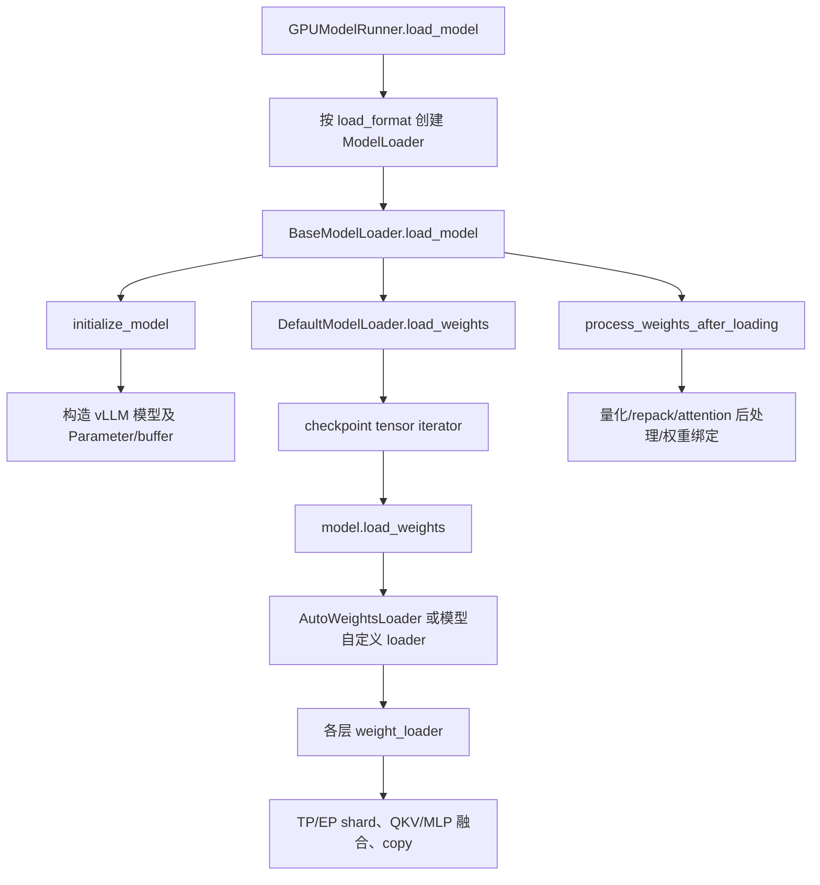

# vLLM 权重加载与重载机制

> 本文基于 vLLM PR #53344 的代码快照（`3662a8f279`）整理，描述 GPU 路径中 checkpoint 权重如何进入模型、如何转换为推理 kernel 所需布局，以及 `reload_weights` 如何在保持 CUDA Graph 指针稳定的前提下更新权重。

## 1. 核心结论

vLLM 的“加载权重”并非简单调用 PyTorch 的 `load_state_dict`。它需要同时处理：

```text
checkpoint 格式
  → 名称映射与过滤
  → TP / EP 分片
  → QKV、gate-up 等融合
  → 量化权重、scale、zero point 的装载
  → 量化、pack、repack、kernel 格式转换
  → 推理时的最终 Parameter / buffer
```

首次加载可以直接创建最终 tensor；重载还要额外满足：已捕获 CUDA Graph 和 kernel helper 继续使用原有存储地址。因此重载采用“临时重建、原地回填”的策略：

```text
旧 kernel storage  ───────────┐
                              │  保留对象与 data_ptr
checkpoint → 临时 model tensor → 分片 / 融合 / 量化 / repack
                              │
                              └→ old_tensor.copy_(new_tensor)
```

## 2. 首次加载路径

标准 GPU 路径如下：



### 2.1 模型构造

`initialize_model` 根据 `ModelConfig` 选择 vLLM 模型类，并在目标 device 和模型 dtype 下构造模块。模型构造阶段会创建权重 Parameter、量化 Parameter 和必要 buffer；此时不少权重尚未填入 checkpoint 值。

同时，vLLM 记录用于未来重载的模型格式元数据：每一层的 parameter 与 buffer 会被保存为 meta tensor 描述，作为后续恢复结构的蓝图。

### 2.2 checkpoint 读取

默认 loader 选择并读取 `.safetensors`、`.bin` 或 `.pt` 文件。读取方式可为普通流式读取、预取、多线程、`fastsafetensors`、`instanttensor` 或 `npcache`。

读取接口统一产生：

```python
Iterable[tuple[str, torch.Tensor]]
```

也就是逐项产出 checkpoint 名称与 tensor，而不是一次性构造完整 `state_dict`。这有助于降低主机内存峰值。

MoE 开启 expert parallelism 时，loader 可在读取阶段过滤非本 rank 的 expert 权重，避免无意义的 I/O 和设备复制。

### 2.3 名称映射与递归分发

`AutoWeightsLoader` 将 checkpoint 名称映射到 vLLM 的 module/parameter：

- 删除无推理用途的 checkpoint tensor，例如部分 rotary cache；
- 将 HF 名称改写为 vLLM 模块名；
- 为 Q/K/V、gate/up 等拆分权重附加 `shard_id`；
- 定位对应子模块、Parameter 或 persistent buffer；
- 跳过 tied weight 的别名，避免重复写同一 storage；
- 调用 module 自定义 `load_weights` 或 parameter 自定义 `weight_loader`。

一般 Parameter 的默认 loader 会检查 shape 后执行：

```python
param.data.copy_(loaded_weight)
```

但线性层、embedding、量化参数和 MoE 专家通常有自己的 loader。

### 2.4 分片与融合

典型权重操作包括：

| 类型 | checkpoint 形式 | vLLM 中的写入方式 |
|---|---|---|
| Tensor Parallel | 全量 tensor | 根据 rank 用 `narrow` 截取局部 shard |
| QKV | `q_proj/k_proj/v_proj` 分离 | 按 offset 写入融合 QKV tensor |
| MLP | `gate_proj/up_proj` 分离 | 按 offset 写入 fused gate-up tensor |
| 已融合 checkpoint | 单个 qkv 或 gate-up tensor | 再按内部区段拆分或直接写入 |
| MoE / EP | 多 expert tensor | 仅装载本地 expert，或按 expert 映射写入 |
| 量化 | weight + scale + zero point | 按 packed/block/group 规则写入各自 Parameter |

对量化层，分片 offset 还需要按 packed dimension、block size 或 scale 布局换算，不能直接按 FP16/BF16 权重维度切分。

### 2.5 加载后处理

所有 checkpoint 项装入后，`process_weights_after_loading` 负责转换为 kernel 可执行格式，例如：

- 在线量化；
- FP8/INT4/NVFP4 权重重排与 pack；
- scale、zero point、activation scale 整理；
- Attention/KV scale 的延迟初始化；
- Mamba、HPC 等层的模型专属处理；
- 恢复 tied embedding 与 `lm_head` 的共享 storage。

因此 checkpoint 中的 tensor 布局并不等同于最终推理 kernel 读取的布局。

## 3. `reload_weights` 的两条路径

`GPUModelRunner.reload_weights` 支持两种输入语义：

| `is_checkpoint_format` | 输入 tensor | 执行方式 |
|---|---|---|
| `True`（默认） | 原始 checkpoint 格式 | 完整走名称映射、分片、融合、量化与重排 |
| `False` | 已完成 kernel 格式、且已分片 | 按参数名直接 `copy_` |

第二条路径快，但调用者必须自己保证名称、dtype、shape、TP/EP shard 和 kernel layout 全部正确；当前实现也主要面向 Parameter，而不是任意 buffer。

本文重点讨论默认的 checkpoint-format 重载：

```text
initialize_layerwise_reload(model)
→ model.load_weights(weights_iterator)
→ finalize_layerwise_reload(model, model_config)
```

## 4. 为什么 reload 需要 meta tensor

meta tensor 是 PyTorch 中只有结构元信息、没有真实 storage 的 tensor。它包含 shape、dtype、stride、`requires_grad` 等，但没有 CPU/GPU 数据，不能进行真实数值计算。

重载不能直接将 checkpoint 覆盖进当前 `layer.weight`，因为当前权重可能已经：

- 被 QKV 或 MLP 融合；
- 被 TP/EP 分片；
- 被量化或重排；
- 被替换为 kernel 专用 Parameter；
- 被 CUDA Graph 或外部 kernel helper 持有指针。

meta tensor 允许 vLLM 先以近乎零显存恢复“模型格式”的结构，然后只在当前层的 checkpoint 权重到齐时 materialize 临时真实 tensor。这样避免同时维持完整旧权重和完整新模型权重，同时允许复用首次加载时正确的 `weight_loader` 逻辑。

## 5. `initialize_layerwise_reload`

该阶段为每一层建立 reload 上下文。

### 5.1 保存旧 kernel tensor

先保存 layer 当前直接注册的 Parameter 和 buffer 引用：

```text
layer.weight = W_old
layer.scale  = S_old

info.kernel_tensors = {weight: W_old, scale: S_old}
```

这里不 clone；必须保留原对象，因为 `W_old.data_ptr()` 可能已被 CUDA Graph 捕获。

同时保存 non-persistent buffer 集合，防止临时拆装 layer 时丢失 `persistent=False` 语义。

### 5.2 恢复为 meta 上的 model-format layer

接着从首次建模时记录的 `restore_metadata` 中重建本层：

```text
layer.weight = W_meta
layer.scale  = S_meta
```

旧的 `W_old/S_old` 并未释放，只是不再挂在 layer 属性上，而是保存在 `info.kernel_tensors`。

### 5.3 安装延迟 loader

每个临时 Parameter 的 `weight_loader` 被包装为 `online_process_loader`。它接到 checkpoint tensor 后不会立即完成最终写入，而是：

1. 保存原 loader 的完整调用参数；
2. 统计该次调用实际写入的元素数；
3. 累计本层已加载元素数；
4. 当该层权重到齐时，再统一 materialize 和处理。

需要统计“实际 copy 的元素数”，因为一个 loader 调用可能只写 QKV 的一段、TP 的一个 shard，或量化参数的一部分。

## 6. `model.load_weights`：缓存 checkpoint 写入

这一步仍走模型的常规加载协议：`AutoWeightsLoader`/模型自定义 loader 完成名称映射和模块定位；目标参数收到权重后进入代理 `online_process_loader`。

对普通层，当累计写入数达到该层 `load_numel_total` 时，会立刻触发 `_layerwise_process`。因此不必等整个 checkpoint 读完才处理所有层，降低暂存权重的峰值内存。

但 attention 相关层会延迟到 finalize 阶段处理，因为其 K/V scale、量化状态和后处理依赖完整的模型状态。

## 7. `_layerwise_process`：临时处理新权重

某一普通层权重到齐后，执行顺序为：

```text
W_meta
→ materialize
→ W_tmp
→ 用原始 weight_loader 装入 checkpoint
→ quant_method.process_weights_after_loading
→ W_tmp_processed
→ copy_ 到 W_old
→ layer.weight 重新指向 W_old
```

具体步骤：

1. `materialize_layer`：为 meta tensor 分配临时真实 device storage；
2. 去掉代理 loader，恢复原始 `weight_loader`；
3. 重放缓存的 loader 调用，将 checkpoint 写入临时 tensor；
4. 执行量化、repack、参数替换等后处理；
5. 对每个旧 Parameter 执行 `old_param.data.copy_(new_value)`；
6. 对应 buffer 也按需要原地 copy；
7. 删除临时 tensor，并将旧 Parameter/buffer 重新注册回 layer。

最终 `layer.weight is W_old` 且 `W_old.data_ptr()` 不变，但内容已经是新 checkpoint 对应的最终 kernel 格式。

### non-persistent buffer 的规则

`persistent=False` 且未由 checkpoint 显式加载的 buffer，不会在临时 reload 结束时被临时值覆盖回旧 storage。这类对象往往是运行时常量、恢复后的 sleep buffer、lock 或 workspace；其正确值应来自专门的恢复/重建逻辑，而非 checkpoint loader。

## 8. `finalize_layerwise_reload`

`finalize_layerwise_reload` 是收尾阶段，处理 checkpoint 遍历结束后仍未完成的 layer：

- 因 padding 或特殊 loader 导致只装入部分 tensor 的普通层；
- checkpoint 没有命中任何权重的层；
- 所有 deferred attention layer。

对于 attention 层，流程略有不同：先恢复旧 kernel tensor，再按需要重新创建 scale 参数，重放缓存的 scale loader，运行 attention/quant 后处理，最后将最终结果 copy 回旧 storage。这样可避免过早处理 K/V scale 或依赖其它层最终状态的 attention 参数。

## 9. Sleep mode 与 `register_buffer`

PR #53344 处理的核心问题是：sleep allocator 的标签由分配时所在 memory pool 决定，而不是 tensor 的业务语义。

在 level-2 sleep 中，weights 与 KV cache storage 都会被释放。Parameter 可以随后由 `reload_weights` 从 checkpoint 恢复，但普通 Python tensor attribute 不属于 Parameter，也不属于 buffer：它既不会由 checkpoint loader 重载，也不会被 sleep worker 备份。

因此，模型拥有的静态 device tensor 应注册为：

```python
layer.register_buffer(name, tensor, persistent=False)
```

其语义是：

- 会出现在 `named_buffers()`，worker 可在 level-2 sleep 前 clone 到 CPU，并在 weights wake 后原地 copy 回来；
- 不进入 `state_dict()`，checkpoint 无需包含它；
- 不应被误认为可由 `model.load_weights()` 装载的模型参数。

### 为什么 worker clone 不够

worker 的 clone/restore 只修复“已注册 buffer 的字节内容”。它不处理下面三类问题：

1. **layerwise reload 会临时替换 layer buffer 对象。**
   MoE kernel helper 并非 `nn.Module`，会单独缓存 tensor 引用。reload 最终将旧 buffer 重新注册到 layer 后，helper 可能仍引用临时 tensor，必须执行 `post_weights_reload` 将 helper 重新绑定到 `layer._buffers[...]`。

2. **CUDA Graph 要求 storage 地址稳定。**
   不能在 reload 后以新 tensor 替换旧 buffer；只能对已有 buffer `copy_` 新内容并复用原对象，否则已捕获 graph 仍会读取旧地址。

3. **某些 tensor 是状态机，而不是静态常量。**
   Humming lock、Lamport workspace 等不能简单恢复 sleep 前字节；它们需要在 wake 后显式清零、恢复 sentinel/layout，或根据当前稳定地址重建 pointer array。PR 通过 `post_weights_wake_up` hook 完成这类协议级恢复。

因此完整恢复顺序应理解为：

```text
level-2 wake weights
→ allocator remap
→ worker 将已保存 buffer copy_ 回原 storage
→ reload checkpoint parameters
→ layerwise 量化/repack，并 copy_ 回旧 kernel storage
→ post_weights_reload：重绑 helper alias / 恢复派生对象关系
→ post_weights_wake_up：重置 lock、workspace 等状态机
→ 允许 CUDA Graph / 推理继续执行
```

## 10. 排查建议

当出现 reload 后输出错误、sleep/wake 后静默精度异常或 CUDA Graph 复用问题时，按以下顺序检查：

1. 该 tensor 是 Parameter、registered buffer，还是普通 Python 属性；
2. 是否属于 checkpoint，还是由权重/配置派生的 runtime tensor；
3. 是否被 `persistent=False` buffer 的非覆盖规则跳过；
4. 是否被量化后处理替换、pack 或重排；
5. 是否存在非 Module helper 缓存旧/临时 tensor 引用；
6. 是否有 CUDA Graph 或 kernel 保存 `data_ptr()`；
7. 是否需要 `post_weights_reload` 重绑，或 `post_weights_wake_up` 重置；
8. 是否错误地在 `kv_cache` memory pool 内创建了实际不可丢弃的常量或 metadata。

## 11. 关键不变量

```text
1. checkpoint-format reload 必须重新走模型的分片、融合与量化逻辑。
2. 最终 kernel tensor 的对象与 storage 地址应保持稳定。
3. 新值应通过 copy_ 回填旧 storage，而非替换对象。
4. 静态非 checkpoint tensor 应由 module buffer 或可重建的 host/Python 状态拥有。
5. helper、CUDA Graph、workspace 的外部引用必须在 reload/wake 后重新一致。
6. sleep 模式中，恢复字节内容不等于恢复正确语义；状态机需要显式 reset。
```
